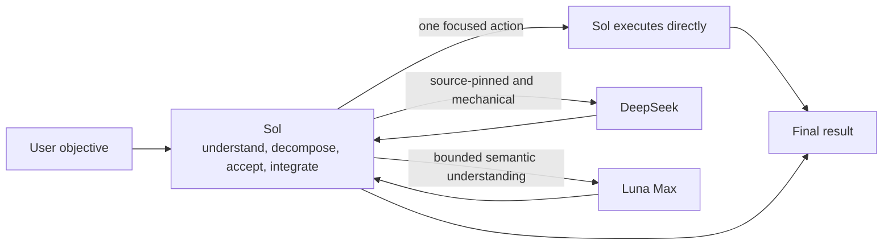

<div align="center">
  <h1>Sol Worker Routing for Codex</h1>
  <p><strong>Send each task to the Worker that fits it.</strong></p>
  <p>Reduce the problem from first principles, route by work shape, and keep only the process and evidence needed to decide.</p>
  <p>
    <a href="README.md">简体中文</a> ·
    <strong>English</strong> ·
    <a href="CHANGELOG.md">Changelog</a>
  </p>
  <p>
    <a href="https://github.com/liuyejinghong/sol-worker-routing-codex/tags"></a>
    <a href="https://github.com/liuyejinghong/sol-worker-routing-codex/stargazers"></a>
  </p>
</div>

## What problem does it solve?

`Sol Worker Routing` does more than add two subagents to Codex. It combines three ideas in one working method:

- **First principles**: establish the final objective, invariant facts, minimum acceptance, and authorization boundary first. When patches, abstractions, or unrelated process accumulate, return to the root cause and simplify.
- **Route by work shape**: Sol keeps the objective and final judgment; DeepSeek handles source-pinned, mechanically checkable work; Luna Max handles bounded tasks that need semantic understanding. Simple tasks stop consuming excess time and tokens, while ambiguous problems are not scattered across subagents too early.
- **Less process, more useful evidence**: TDD, spec-first work, fixed review rounds, and extra tooling are never goals by themselves. The default is one focused contract check plus one real-path result check. Add validation only when it protects a concrete risk and failure would change a decision.

Sol stays in the lead to understand the goal, decompose the work, inspect evidence, and deliver the result. Both Workers receive only bounded tasks they can complete and verify independently.

| Executor | Best fit | Typical examples |
|---|---|---|
| **Sol** | Tiny tasks, ambiguity, architecture, and final decisions | Decide whether to change something, integrate results, make a one-step edit |
| **DeepSeek** | Source-pinned, read-heavy, mechanically checkable work | Find code facts, collect evidence, make a one-file mechanical patch |
| **Luna Max** | Bounded work that still needs semantic understanding | Code review, module analysis, isolated implementation, focused diagnosis |

## What does the same work cost?

We gave DeepSeek and Luna Max the same two evidence/mechanical tasks. Objectives, scope, acceptance commands, and stop conditions were identical. Both Workers passed **2/2** tasks.

[](benchmarks/report-2026-08-09.md)

| Worker | Tasks passed | Total time | Generated tokens |
|---|---:|---:|---:|
| **DeepSeek** | 2 / 2 | **88 seconds** | **5,081** |
| Luna Max | 2 / 2 | 235 seconds | 16,708 |

For the same accepted results, DeepSeek used **147 fewer seconds** and **11,627 fewer generated tokens** - a **62.6%** reduction in time and a **69.6%** reduction in generated tokens. That is the practical benefit of routing source-pinned, mechanically checkable work away from Luna Max.

> This is a measured result from two paired tasks, not a general model ranking. Generated tokens are `output tokens + reasoning tokens`, a workload comparison within the same client rather than a dollar bill or total-token count. See the [full report](benchmarks/report-2026-08-09.md) for methods, task-level results, and limitations, or inspect the raw [CSV](benchmarks/pilot-2026-08-09.csv). [`render_readme_chart.py`](benchmarks/render_readme_chart.py) generates the chart directly from that CSV.

## How routing works



DeepSeek and Luna Max are peer leaf Workers, not stages in a hierarchy. Sol runs tasks in parallel only when they are independent and have non-overlapping scope. Shared state, ordered dependencies, or overlapping writes stay sequential.

The workflow also follows one deliberately simple rule: if Sol can finish the task in one focused action, it does not delegate merely to use a subagent. Handoffs cost time and tokens too.

## Install

The easiest path is to give this prompt directly to Codex:

```text
Install https://github.com/liuyejinghong/sol-worker-routing-codex for my Codex user profile.
Read and follow the repository AGENTS.md first. Preserve my existing Codex configuration
and do not overwrite conflicts. Have the installer inspect the existing DeepSeek provider
and run a real read-only route first. Preserve it when it works; only repair a proven failure
with a mechanism supported by the current Codex client and host. Do not send me away to discover the schema.
```

Or install from a terminal:

```bash
git clone https://github.com/liuyejinghong/sol-worker-routing-codex.git
cd sol-worker-routing-codex
bash scripts/install.sh
```

DeepSeek Worker supports two upstreams. The default is the official DeepSeek API. OpenCode Go subscribers can have the installation Agent connect only **DeepSeek V4 Flash**. The two commands below select the Go Worker and start the local bridge; the installation Agent still owns safe Codex provider setup and verification:

```bash
bash scripts/install.sh --deepseek-provider opencode-go
bash scripts/run-opencode-go-bridge.sh
```

This uses the API included with the OpenCode Go subscription; it does not install or configure the OpenCode application. Go exposes V4 Flash through `chat/completions`, while current Codex custom providers accept only the Responses API. The repository therefore uses a local LiteLLM protocol bridge: Codex keeps calling `/v1/responses`, and the bridge forwards only `deepseek-v4-flash` to Go while normalizing Codex tool history into the adjacent `tool_calls → tool results` order Go accepts. The API key is supplied through a secure process prompt or `OPENCODE_API_KEY`, never written to the repository or Codex TOML. The bridge script pins its LiteLLM version instead of accepting dependency drift. The installation Agent owns profile selection, bridge startup, provider setup, and one real route probe, so users do not need to discover the OpenCode schema.

The installation flow handles all of the following:

1. Install `deepseek_worker`, `luna_worker`, and the `sol-worker-routing` Skill.
2. Inspect the selected DeepSeek upstream and verify it with an obvious read-only task.
3. Preserve a working setup instead of reinstalling it because one environment variable or credential backend is not visible.
4. Only after a real invocation fails, repair the provider and authentication using mechanisms supported by the current Codex client and operating system.

Users do not need to learn the provider schema or edit TOML. If a service credential is truly missing, the installation Agent guides the secure input supported by the current environment instead of prescribing Keychain, an environment variable, or another platform-specific backend. If the current task cannot see a newly installed Worker, the Agent asks only for a new task; the Skill then runs the route probe automatically.

Account-level personalization is the one step the repository cannot perform: paste one complete language block from [`personalization.md`](personalization.md) into Codex App **Settings → Personalization → Custom Instructions**.

## What using it looks like

You do not need to select a Worker manually. Describe the objective normally and Sol first decides whether a handoff is worthwhile:

```text
At this pinned commit, find the setting's default and every call site. Cite a line for each claim.
```

With fixed sources and acceptance, this fits DeepSeek.

```text
Review cancellation and resource cleanup in this module. Report only issues you can locate and reproduce.
```

This fits Luna Max when the scope is clear but cross-file semantic understanding is required.

```text
Decide whether this requirement justifies changing the architecture, then recommend the final approach.
```

This stays with Sol because a Worker must not redefine the parent objective or own the final decision.

<details>
<summary>See the task contract Sol gives a Worker</summary>

```text
Worker and mode:
Objective:
Scope and owned paths:
Relevant facts / source pins:
Non-goals:
Acceptance criteria:
Verification:
Stop condition:
Return format:
```

This is not another user-facing process. It is the minimum context Sol provides behind the scenes. When the packet is insufficient, a Worker returns an exact blocker instead of widening its own scope.

</details>

## Installation boundaries and project files

The repository installer writes only two Agent profiles and one Skill. It can safely upgrade the known previous Skill release; any other different content stops the install before it is overwritten:

```text
~/.codex/agents/deepseek-worker.toml
~/.codex/agents/luna-worker.toml
~/.agents/skills/sol-worker-routing/SKILL.md
```

| File | Purpose |
|---|---|
| [`personalization.md`](personalization.md) | Global routing preference that you paste manually |
| [`skills/sol-worker-routing/SKILL.md`](skills/sol-worker-routing/SKILL.md) | Sol's routing, acceptance, and integration rules |
| [`agents/`](agents/) | DeepSeek API, OpenCode Go, and Luna Max Worker profiles |
| [`providers/`](providers/) | Single-model OpenCode Go bridge and Codex provider template |
| [`scripts/install.sh`](scripts/install.sh) | Conflict checks, minimal install, and old-name migration |
| [`benchmarks/`](benchmarks/) | Benchmark cases, raw data, and the full report |

The provider is not a fixed repository-installer output. The installation Agent judges the existing setup by a real route first and only repairs a confirmed failure using mechanisms supported by the current client and host. OpenCode Go mode adds only a local Responses bridge and its provider; it does not modify the OpenCode application or write the key to the repository, chat, or `config.toml`. A known `sol-luna-workflow` installation is also migrated only when its content matches a prior release and the path is not a symbolic link. Unknown content is never overwritten or removed.

This is a community workflow, not an OpenAI preset. A profile file or Worker self-report is not route proof by itself; use client-exposed subagent information and the accepted task result.

## References

- [Codex subagents and custom agents](https://developers.openai.com/codex/agent-configuration/subagents)
- [Codex Skills and discovery paths](https://developers.openai.com/codex/skills)
- [Codex instruction discovery](https://developers.openai.com/codex/guides/agents-md)
- [OpenCode Go models and API endpoints](https://opencode.ai/docs/zh-cn/go/)
- [LiteLLM Responses API bridge](https://docs.litellm.ai/docs/response_api)
- [Oh My OpenAgent orchestration reference](https://github.com/code-yeongyu/oh-my-openagent)
