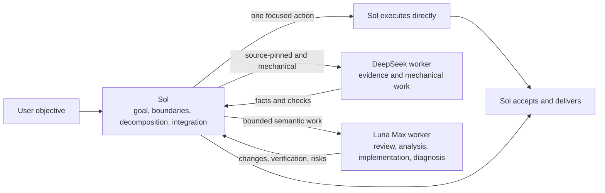

<div align="center">
  <h1>Sol Worker Routing for Codex</h1>
  <p><strong>Sol owns goals and judgment. DeepSeek handles mechanically checkable evidence. Luna Max handles bounded semantic execution.</strong></p>
  <p>An agent-deployable dual-worker workflow for Codex, with first-principles limits on over-programming, over-testing, and performative parallelism.</p>
  <p>
    <a href="README.md">简体中文</a> ·
    <strong>English</strong> ·
    <a href="CHANGELOG.md">Changelog</a>
  </p>
  <p>
    <a href="https://github.com/liuyejinghong/sol-worker-routing-codex/tags"></a>
    <a href="https://github.com/liuyejinghong/sol-worker-routing-codex/stargazers"></a>
  </p>
</div>

## Install in three steps

This repository is written for both people and agents. Its [`AGENTS.md`](AGENTS.md) grants an installer permission to write only two custom-agent files and one Skill; the installer checks every destination first and stops before overwriting different content.

```text
Install https://github.com/liuyejinghong/sol-worker-routing-codex for my Codex user profile.
Read and follow the repository AGENTS.md first. Preserve my existing Codex configuration
and do not overwrite conflicts. Verify deepseek_worker, luna_worker, and the
sol-worker-routing Skill after installation, then tell me which manual steps remain.
```

Or install it locally:

```bash
git clone https://github.com/liuyejinghong/sol-worker-routing-codex.git
cd sol-worker-routing-codex
bash scripts/install.sh
```

The installer writes only:

```text
~/.codex/agents/deepseek-worker.toml
~/.codex/agents/luna-worker.toml
~/.agents/skills/sol-worker-routing/SKILL.md
```

Then paste one complete language block from [`personalization.md`](personalization.md) into Codex App **Settings → Personalization → Custom Instructions**. Repository files and `AGENTS.md` cannot replace account-level personalization. A restart is normally unnecessary; start a new task to verify routing.

The DeepSeek lane also requires an existing Codex provider named `deepseek` and usable credentials. The installer never edits `config.toml`, imports credentials, or enables a provider. If the provider is unavailable, Sol must not claim that DeepSeek ran.

## One lead, three execution paths

The task card is not a Codex UI feature. It is the compact execution contract that Sol gives a Worker after reducing ambiguity to an observable outcome.



| Work shape | Route | Reason |
|---|---|---|
| Tiny task that finishes in one focused action | Sol directly | Handoff costs more tokens and waiting than execution |
| Source-pinned, read-heavy, mechanically verifiable evidence | `deepseek_worker` | A compact evidence chain and fixed command can decide acceptance |
| Code review, module analysis, isolated implementation, focused diagnosis | `luna_worker` | The bounded result still needs non-trivial code understanding |
| Ambiguity, coupling, shared state, architecture, final decision | Sol | A Worker must not make the parent judgment |

DeepSeek and Luna are peer leaf workers, not a hierarchy. Only an evidence-then-implementation flow is ordered as `DeepSeek → Sol → Luna`. Shared state, ordered dependencies, or overlapping writes are sequential. The default is at most two workers at depth one, and workers never delegate again.

## What a Worker receives

Sol owns decomposition; a Worker does not discover its own scope. Each packet includes only the facts needed to complete one outcome:

```text
Worker and mode:
Objective:
Scope and owned paths:
Relevant facts / source pins:
Non-goals:
Acceptance criteria:
Verification:
Stop condition:
Return format:
```

DeepSeek is read-only by default. It may make a minimal patch only when writable paths, mechanical acceptance, and approval are explicit. Luna may implement or diagnose an isolated change, but it cannot alter the parent objective, architecture, priorities, or authorization boundary. An insufficient packet must return an exact blocker rather than widen the investigation.

A complete DeepSeek packet can look like this:

```text
Worker and mode: deepseek_worker | read-only evidence
Objective: Explain a setting's default and call site at the named commit.
Scope and owned paths: README.md, src/options.ts; no writes.
Relevant facts / source pins: repository@<immutable-sha>.
Non-goals: No architecture advice, dependency install, or other branches.
Acceptance criteria: file:line for every claim; run the named read-only command.
Verification: git status --short and the supplied assertion command.
Stop condition: Return a blocker if the commit or fact is absent locally.
Return format: Facts; command result; files changed; risks.
```

## Route by work shape

This workflow does not make a fixed assignment based on “the cheaper model” or “the stronger model.” DeepSeek receives evidence or mechanical work only when sources, scope, and acceptance are fixed. Luna receives bounded work that needs cross-file semantic understanding. Ambiguity, coupling, shared state, and final judgment remain with Sol.

Tiny tasks do not need a Worker merely to use one. The task contract decides whether routing is appropriate - not a one-off comparison, personal-account usage, or an external price leaderboard.

## Benchmark result

DeepSeek and Luna Max both passed two same-contract comparisons: a source-pinned read-only evidence task and a one-file mechanical patch. The objective, scope, acceptance, and verification were identical for each comparison.

| Metric | DeepSeek evidence lane | Luna Max |
|---|---:|---:|
| Same-contract tasks passed | 2 / 2 | 2 / 2 |
| Worker wall time | **88 seconds** | 235 seconds |
| Generated tokens | **5,081** | 16,708 |

On these two tasks, the DeepSeek Worker used **62.6%** less wall time and **69.6%** fewer generated tokens. This is the practical benefit of separating fixed evidence and mechanical work from semantic execution.

[](benchmarks/report-2026-08-09.md)

The result covers only these two source-pinned, mechanically verifiable tasks. `Generated tokens = output_tokens + reasoning_tokens`; it is a workload and cost proxy within the same client, not a dollar bill, input or total-token accounting, or a general quality ranking. The case catalog, rerun protocol, raw [CSV](benchmarks/pilot-2026-08-09.csv), and [full report](benchmarks/report-2026-08-09.md) are in [`benchmarks/`](benchmarks/).

## Constrain the working method, not the development process

TDD, spec-first work, and fixed review rounds can be useful, but they should not become the model's objective. As model capability rises, a heavy process can lead the agent to create more abstractions, tests, reviewers, and tools until effort no longer serves the original problem.

This repository does not prescribe a development process. It requires a final objective, invariant facts, minimum acceptance criteria, and authorization boundary before choosing the shortest direct path that can be verified. Before adding any test, gate, dry run, review, or tool, the agent must answer what irreversible risk it protects, what decision changes on failure, and why cheaper existing evidence is insufficient.

The default is one focused contract check plus one real-path result check. Do not repeat validation when the candidate and facts have not changed. If verification costs more than implementation, or two consecutive steps repair only the validation layer without adding facts about the original objective, stop expanding the toolchain and return to the root problem.

## Configuration and safety boundaries

| File | Responsibility |
|---|---|
| [`personalization.md`](personalization.md) | App-level routing preference; manually pasted |
| [`skills/sol-worker-routing/SKILL.md`](skills/sol-worker-routing/SKILL.md) | Sol's direct gate, routing, packet, verification, and integration rules |
| [`agents/deepseek-worker.toml`](agents/deepseek-worker.toml) | DeepSeek evidence/mechanical worker profile and boundary |
| [`agents/luna-worker.toml`](agents/luna-worker.toml) | Luna Max semantic-execution worker profile and boundary |
| [`scripts/install.sh`](scripts/install.sh) | Conflict-first, minimal installation and legacy Skill migration |
| [`AGENTS.md`](AGENTS.md) | Authorization contract for an Agent installing this repository |
| [`benchmarks/`](benchmarks/) | Reproducible cases, data, and pilot report |

The installer does not edit `config.toml`, other agents, other Skills, global or project `AGENTS.md`, or Codex App settings. It moves `sol-luna-workflow` from `~/.agents/skills/` or the legacy `~/.codex/skills/` path only when its content is verified as a known prior release and no path is a symbolic link. Unknown legacy content stops the install rather than being overwritten or removed. Agents use `${CODEX_HOME:-~/.codex}`; the Skill uses the official user path `~/.agents/skills`.

This is a community workflow, not an OpenAI preset. After installation, delegate one obvious read-only task and use the client-exposed subagent data plus acceptance evidence to determine whether a route is available. A configuration file or a Worker's self-reported model name is not route proof. Treat a provider or invocation error as an unavailable lane.

## References

| Topic | Source |
|---|---|
| Codex subagents and custom agents | [OpenAI Developers](https://developers.openai.com/codex/agent-configuration/subagents) |
| Codex Skills and discovery paths | [OpenAI Developers](https://developers.openai.com/codex/skills) |
| Codex instruction discovery | [OpenAI Developers](https://developers.openai.com/codex/guides/agents-md) |
| Orchestration reference | [code-yeongyu/oh-my-openagent](https://github.com/code-yeongyu/oh-my-openagent) |
