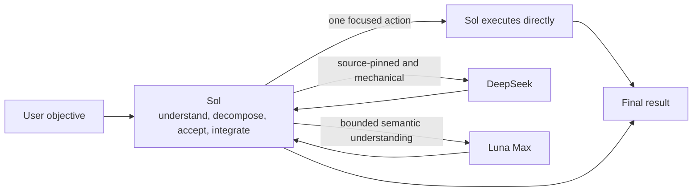

<div align="center">
  <h1>Sol Worker Routing for Codex</h1>
  <p><strong>Send each task to the Worker that fits it.</strong></p>
  <p>Sol owns the goal and judgment. DeepSeek handles evidence and mechanical work. Luna Max handles bounded work that needs semantic understanding.</p>
  <p>
    <a href="README.md">简体中文</a> ·
    <strong>English</strong> ·
    <a href="CHANGELOG.md">Changelog</a>
  </p>
  <p>
    <a href="https://github.com/liuyejinghong/sol-worker-routing-codex/tags"></a>
    <a href="https://github.com/liuyejinghong/sol-worker-routing-codex/stargazers"></a>
  </p>
</div>

## What problem does it solve?

Using one model for every kind of work creates two predictable problems: simple tasks consume more time and tokens than they need, while difficult tasks may be handed too early to a Worker suited only to mechanical execution.

Sol Worker Routing chooses a lane by the understanding and acceptance a task requires - not by a simple price or capability ranking. Sol stays in the lead with the full objective, authorization boundary, and final judgment. Each Worker receives only a bounded task that can be accepted independently.

| Executor | Best fit | Typical examples |
|---|---|---|
| **Sol** | Tiny tasks, ambiguity, architecture, and final decisions | Decide whether to change something, integrate results, make a one-step edit |
| **DeepSeek** | Source-pinned, read-heavy, mechanically checkable work | Find code facts, collect evidence, make a one-file mechanical patch |
| **Luna Max** | Bounded work that still needs semantic understanding | Code review, module analysis, isolated implementation, focused diagnosis |

## What does the same work cost?

We gave DeepSeek and Luna Max the same two evidence/mechanical tasks. Objectives, scope, acceptance commands, and stop conditions were identical. Both Workers passed **2/2** tasks.

[](benchmarks/report-2026-08-09.md)

| Worker | Tasks passed | Total time | Generated tokens |
|---|---:|---:|---:|
| **DeepSeek** | 2 / 2 | **88 seconds** | **5,081** |
| Luna Max | 2 / 2 | 235 seconds | 16,708 |

For the same accepted results, DeepSeek used **147 fewer seconds** and **11,627 fewer generated tokens** - a **62.6%** reduction in time and a **69.6%** reduction in generated tokens. That is the practical benefit of routing source-pinned, mechanically checkable work away from Luna Max.

> This is a measured result from two paired tasks, not a general model ranking. Generated tokens are `output tokens + reasoning tokens`, a workload comparison within the same client rather than a dollar bill or total-token count. See the [full report](benchmarks/report-2026-08-09.md) for methods, task-level results, and limitations, or inspect the raw [CSV](benchmarks/pilot-2026-08-09.csv). [`render_readme_chart.py`](benchmarks/render_readme_chart.py) generates the chart directly from that CSV.

## How routing works



DeepSeek and Luna Max are peer leaf Workers, not stages in a hierarchy. Sol runs tasks in parallel only when they are independent and have non-overlapping scope. Shared state, ordered dependencies, or overlapping writes stay sequential.

The workflow also follows one deliberately simple rule: if Sol can finish the task in one focused action, it does not delegate merely to use a subagent. Handoffs cost time and tokens too.

## Install

The easiest path is to give this prompt directly to Codex:

```text
Install https://github.com/liuyejinghong/sol-worker-routing-codex for my Codex user profile.
Read and follow the repository AGENTS.md first. Preserve my existing Codex configuration
and do not overwrite conflicts. Verify deepseek_worker, luna_worker, and the
sol-worker-routing Skill after installation, then tell me which manual steps remain.
```

Or install from a terminal:

```bash
git clone https://github.com/liuyejinghong/sol-worker-routing-codex.git
cd sol-worker-routing-codex
bash scripts/install.sh
```

Two manual steps remain after installation:

1. Paste one complete language block from [`personalization.md`](personalization.md) into Codex App **Settings → Personalization → Custom Instructions**.
2. Confirm that Codex already has a provider named `deepseek` with usable credentials, then start a new task to verify routing.

The installer does not edit `config.toml`, import credentials, or change App settings. If the DeepSeek provider is unavailable, that lane must report itself as unavailable rather than pretend a call succeeded.

## What using it looks like

You do not need to select a Worker manually. Describe the objective normally and Sol first decides whether a handoff is worthwhile:

```text
At this pinned commit, find the setting's default and every call site. Cite a line for each claim.
```

With fixed sources and acceptance, this fits DeepSeek.

```text
Review cancellation and resource cleanup in this module. Report only issues you can locate and reproduce.
```

This fits Luna Max when the scope is clear but cross-file semantic understanding is required.

```text
Decide whether this requirement justifies changing the architecture, then recommend the final approach.
```

This stays with Sol because a Worker must not redefine the parent objective or own the final decision.

<details>
<summary>See the task contract Sol gives a Worker</summary>

```text
Worker and mode:
Objective:
Scope and owned paths:
Relevant facts / source pins:
Non-goals:
Acceptance criteria:
Verification:
Stop condition:
Return format:
```

This is not another user-facing process. It is the minimum context Sol provides behind the scenes. When the packet is insufficient, a Worker returns an exact blocker instead of widening its own scope.

</details>

## Less process, more useful evidence

The workflow does not prescribe TDD, spec-first work, or a fixed number of review rounds. It establishes the final objective, invariant facts, minimum acceptance, and authorization boundary first, then selects the shortest direct path that can be verified.

The default is one focused contract check plus one real-path result check. Before adding a test, gate, dry run, or tool, identify the concrete risk it protects and whether failure would actually change a decision. When validation becomes more complex than the implementation, return to the original objective and simplify.

## Installation boundaries and project files

The installer writes only two Agent profiles and one Skill. Different existing content stops the install before anything is overwritten:

```text
~/.codex/agents/deepseek-worker.toml
~/.codex/agents/luna-worker.toml
~/.agents/skills/sol-worker-routing/SKILL.md
```

| File | Purpose |
|---|---|
| [`personalization.md`](personalization.md) | Global routing preference that you paste manually |
| [`skills/sol-worker-routing/SKILL.md`](skills/sol-worker-routing/SKILL.md) | Sol's routing, acceptance, and integration rules |
| [`agents/`](agents/) | DeepSeek and Luna Max Worker profiles |
| [`scripts/install.sh`](scripts/install.sh) | Conflict checks, minimal install, and old-name migration |
| [`benchmarks/`](benchmarks/) | Benchmark cases, raw data, and the full report |

A known `sol-luna-workflow` installation is migrated only when its content matches a prior release and the path is not a symbolic link. Unknown content is never overwritten or removed. This is a community workflow, not an OpenAI preset. A profile file or Worker self-report is not route proof by itself; use client-exposed subagent information and the accepted task result.

## References

- [Codex subagents and custom agents](https://developers.openai.com/codex/agent-configuration/subagents)
- [Codex Skills and discovery paths](https://developers.openai.com/codex/skills)
- [Codex instruction discovery](https://developers.openai.com/codex/guides/agents-md)
- [Oh My OpenAgent orchestration reference](https://github.com/code-yeongyu/oh-my-openagent)
