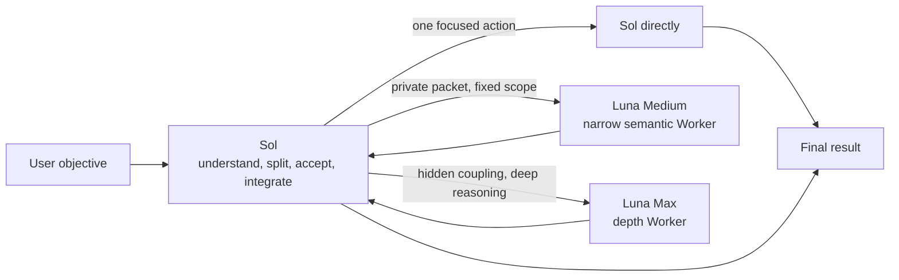

<div align="center">
  <h1>Sol Worker Routing for Codex</h1>
  <p><strong>Send the right task to the right Worker.</strong></p>
  <p>Converge from first principles, route by the actual bottleneck, and keep only the process and evidence needed for a decision.</p>
  <p>
    <a href="README.md">简体中文</a> ·
    <strong>English</strong> ·
    <a href="CHANGELOG.md">Changelog</a>
  </p>
  <p>
    <a href="https://github.com/liuyejinghong/sol-worker-routing-codex/tags"></a>
    <a href="https://github.com/liuyejinghong/sol-worker-routing-codex/stargazers"></a>
  </p>
</div>

## What it solves

`Sol Worker Routing` is more than adding subagents to Codex. It combines four ideas:

- **First principles**: establish the objective, invariant facts, minimum acceptance, and authorization boundary before adding abstractions or process.
- **Route by the actual bottleneck**: the coordinator role (called Sol below) keeps the objective and final judgment; Luna Medium handles narrow work with fixed scope and acceptance; Luna Max handles hidden coupling, difficult diagnosis, and depth-first reasoning.
- **HERO Anti-OverDefense**: governs Sol and every Worker to reject checks with no consumer, defenses for unreachable cases, review loops with no live uncertainty, and wrappers or guards with no direct requirement.
- **Less process, more useful evidence**: fixed gates, review rounds, and extra tools are not goals. The default is one focused contract check and one necessary real-path result.

“Sol” names the coordinator role; it does not require selecting `gpt-5.6-sol`. When the current main Agent is `gpt-5.6-terra`, it has the same duties and may route eligible packets through the two Luna lanes.

Sol stays in the main thread and owns objective understanding, decomposition, evidence quality, acceptance, authorization, and delivery. One-step work stays with Sol. Luna Medium receives only narrow packets with fixed boundaries; if it finds hidden coupling or an unresolved root cause, it returns a blocker and Sol decides whether to issue a Luna Max packet.

| Executor | Best fit | Examples |
|---|---|---|
| **Sol (coordinator role)** | Tiny work, ambiguity, architecture, authorization, and final decisions | Decide whether to change, integrate results, finish a one-step edit |
| **Luna Medium** | Narrow semantic work with fixed scope, paths, ownership, and acceptance | Specified diff review, target-test diagnosis, constrained implementation |
| **Luna Max** | Hidden coupling, subtle semantics, and long-horizon reasoning | Difficult review, complex diagnosis, critical implementation, cross-module judgment |

## Changes in this release

- **Added**: an existing checkout can run `bash scripts/update.sh` to update from the current branch's configured upstream and reinstall the workflow.
- **Protected**: it accepts only a branch with no tracked edits that can fast-forward; local-only commits or divergence stop rather than being merged or discarded.

See [`CHANGELOG.md`](CHANGELOG.md) for release details. The full contracts live in [`personalization.md`](personalization.md), [`AGENTS.md`](AGENTS.md), and [`skills/sol-worker-routing/SKILL.md`](skills/sol-worker-routing/SKILL.md).

## How routing works



Luna Medium and Luna Max are peer Workers, not automatic stages. Medium returns a blocker when it discovers hidden coupling; it cannot widen scope or upgrade itself. Sol retains task selection, packet design, write ownership, acceptance, authorization, and final judgment.

Use a routine parent reasoning level for normal routing and integration. Raise it only for ambiguous architecture, conflicting evidence, high-stakes decisions, or complex synthesis. Main-thread and handoff cost should not exceed the task itself.

## Routing governance and lane switches

Explicit task constraints apply first, then persistent profile state and real route qualification, and only then task fit. “Sol only” or “no subagents” blocks new delegation for the current task without editing files or stopping already-running Workers.

Persistent state affects new tasks: `<profile>.toml` is enabled and `<profile>.toml.disabled` is disabled. `all` means Luna Medium and Luna Max, never Sol. Start a new Codex task after installation or a state change so Agent discovery reloads. A profile on disk is not proof of a working route.

Once dispatched, a Worker keeps its execution lease through silence, long reasoning, absence of writes, or a single wait timeout. Interrupt only for user cancellation, obsolescence, observed scope or authorization violation, repeated concrete errors, or resource deadlock.

Parallel work starts with one Worker and expands only for independent scopes with disjoint ownership, up to four concurrent Workers in one stage at depth one. Write-bearing work still prefers a single Worker.

## Installation

The simplest method is to give Codex this prompt:

```text
Install https://github.com/liuyejinghong/sol-worker-routing-codex for my Codex user configuration.
Read and follow AGENTS.md completely, preserve existing Codex settings, and do not overwrite unknown content, dual states, or symbolic links.
After installation, verify both Luna profiles, `sol-worker-routing`, and the global `github-review-handoff` Skill. Do not modify Providers, credentials, or model catalogs, and do not probe retired routes.
```

Or install from a terminal:

```bash
git clone https://github.com/liuyejinghong/sol-worker-routing-codex.git
cd sol-worker-routing-codex
bash scripts/install.sh
```

For an existing clone, update the source and reinstall with one command:

```bash
bash scripts/update.sh
```

It fetches the current branch's configured upstream, accepts only a checkout with no tracked edits that can fast-forward, and then reuses the installer while preserving both Luna lane states. Tracked edits, local-only commits, or divergence stop the update rather than being merged or discarded; unrelated untracked files do not block it by themselves. It does not modify Providers, credentials, or model catalogs.

Exact lane operations:

```bash
bash scripts/install.sh --lane-status
bash scripts/install.sh --disable-lane luna_medium_worker
bash scripts/install.sh --enable-lane luna_worker
bash scripts/install.sh --disable-lane all
```

A fresh install enables both Luna lanes. A recognized upgrade preserves each state. Unknown lane names fail rather than fuzzy-match.

The installer stages and backs up before replacement, and rolls back normal failures or `INT` / `TERM` / `HUP`. Final artifacts span three directory trees, so it does not claim cross-directory atomicity under power loss or `SIGKILL`; a rerun verifies and converges complete state.

Windows requires Git Bash/MSYS Bash or WSL Bash; this is not a native PowerShell script. Until a real Windows installation path is accepted, this is a compatibility path rather than a full platform-support claim.

Account-wide Personalization is the only manual step: copy one complete language block from [`personalization.md`](personalization.md) into Codex App Settings → Personalization → Custom Instructions. Installed files do not activate account-wide instructions.

## Usage examples

Normally, describe the objective without selecting a Worker. Sol decides whether delegation adds value.

Keep one-step work with Sol:

```text
Confirm this setting's current default and tell me whether it needs to change.
```

Use Luna Medium when scope and acceptance are fixed:

```text
Review only this specified diff against its behavior contract. Return at most three locatable risks, do not expand to other modules, and verify each with existing tests or read-only evidence.
```

Use Luna Max for hidden coupling or long-horizon reasoning:

```text
Diagnose this intermittent concurrency leak across scheduling, cancellation, and resource release. Explain the hidden coupling, implement the minimum fix, and prove re-entry semantics remain intact.
```

Keep objective and architecture decisions with Sol:

```text
Decide whether this requirement justifies changing the current architecture and give me the final approach.
```

## Use 5.6 Pro for an independent GitHub review

`github-review-handoff` routes review to an independent 5.6 Pro reviewer. Its review does not consume Codex quota and does not reuse Codex's current judgment of the project, so it can re-examine the repository, PR diff, call chain, and verification evidence from a third-party perspective.

The execution rule lives in [`SKILL.md`](skills/github-review-handoff/SKILL.md): after the user requests an independent review, Codex uses its in-app Browser to open or continue the GPT-5.6 Pro conversation, send the review packet, and continue the dialogue. The user never has to relay messages. If the browser cannot sign in or select GPT-5.6 Pro, the Skill reports the true blocker rather than passing off the current Codex as an independent reviewer.

The handoff is direct: `Issue / PR + exact review head` → `independent 5.6 Pro review` → `GitHub findings and verdict` → `developer response or fix` → `review of the new head`. The Issue keeps the problem, root cause, and acceptance criteria; the PR keeps the exact SHA, findings, replies, and final source verdict. Only a verdict written back to GitHub and tied to the full commit SHA — `APPROVE_SOURCE`, `REQUEST_CHANGES`, or `NEEDS_MORE_EVIDENCE` — is a durable result.

| Repository type | How 5.6 Pro accesses it | Submitting the GitHub review result |
|---|---|---|
| Public | Read and review the repository, Issue, or PR link directly; no connector is needed | Submit under the existing GitHub write authorization |
| Private | Manually connect the GitHub connector and authorize the repository first; it will not read private source before that | Both reading and submitting depend on that manual connection and repository permission |

### Native GitHub email notification

No webhook or email service is normally required. Installing the workflow installs the Skill only; it does not change a user's GitHub notification settings, create a connector, or start a review. The recipient enables Email for participating conversations once in GitHub Notifications and selects a verified notification address. For each handoff, provide the repository URL and the GitHub `@handle` roles: who receives a new finding, and who receives an initial or re-review request. An actual review still needs the Issue/PR link and exact head SHA.

An independent 5.6 Pro judgment does not create an independent GitHub writer identity. If it writes an Issue through your GitHub connector, the Issue author is still your account; a visible self-`@mention` is not acceptance evidence for an incoming review email. When automation using the same account must reliably wake that account, the Skill provides an optional native GitHub Actions relay: only a newly opened Issue that places the invisible marker `<!-- github-review-handoff: native-email-relay -->` below its first-line user-provided `@mention` receives one matching `@mention` comment from the GitHub Actions identity. It uses no third-party email service, webhook, label, or repository variable; it requires only a one-time workflow commit. See [`github-actions-notifier.md`](skills/github-review-handoff/references/github-actions-notifier.md) for the complete setup and test.

A GitHub username is an account identifier used for an `@mention`, not a credential. Do not provide an email address, PAT, webhook URL, or connector secret, and the Skill does not persist the handle. For a private repository, 5.6 Pro still needs the manually connected GitHub connector and the corresponding repository permission to read or write.

Use it for a GitHub handoff that needs independent review, not for an ordinary local code review. The connector is never created automatically, and it does not replace the separate authorization required for push, commenting, merge, Issue closure, release, or deployment.

## Installation boundary and repository files

The installer manages only these seven final files:

```text
${CODEX_HOME:-$HOME/.codex}/agents/luna-medium-worker.toml[.disabled]
${CODEX_HOME:-$HOME/.codex}/agents/luna-worker.toml[.disabled]
$HOME/.agents/skills/sol-worker-routing/SKILL.md
${CODEX_HOME:-$HOME/.codex}/skills/github-review-handoff/SKILL.md
${CODEX_HOME:-$HOME/.codex}/skills/github-review-handoff/references/github-templates.md
${CODEX_HOME:-$HOME/.codex}/skills/github-review-handoff/references/github-actions-notifier.md
${CODEX_HOME:-$HOME/.codex}/skills/github-review-handoff/agents/openai.yaml
```

During upgrade it removes an old Spark or DeepSeek profile only when its content exactly matches a registered historical version. Unknown content, dual states, symlinks, and non-regular files stop before writes. The DeepSeek Provider, credentials, model catalog, and unrelated Codex settings are outside retirement scope.

| File | Purpose |
|---|---|
| [`personalization.md`](personalization.md) | Account-wide behavior and routing preferences copied manually |
| [`skills/sol-worker-routing/SKILL.md`](skills/sol-worker-routing/SKILL.md) | Sol routing, packet, lease, and acceptance rules |
| [`skills/github-review-handoff/`](skills/github-review-handoff/) | Global GitHub developer and independent-reviewer handoff, templates, and exact-head verdicts |
| [`agents/`](agents/) | Luna Medium and Luna Max Worker profiles |
| [`scripts/install.sh`](scripts/install.sh) | Conflict detection, state preservation, installation, and old-profile migration |
| [`scripts/update.sh`](scripts/update.sh) | Fast-forward source from the current Git upstream, then run the installer |
| [`benchmarks/`](benchmarks/) | Historical route experiments and raw evidence, not current lanes |

Installation, implementation, and verification do not authorize commit, push, merge, tag, release, or deployment. This is a community workflow, not an official OpenAI preset. Profile files and Worker self-reports do not prove a real route.

## References

- [Codex subagents and custom Agents](https://developers.openai.com/codex/agent-configuration/subagents)
- [Codex Skills](https://developers.openai.com/codex/skills)
- [Codex instruction discovery](https://developers.openai.com/codex/guides/agents-md)
- [HERO Anti-OverDefense](https://github.com/wanshuiyin/HERO-Anti-OverDefense)
- [Codex rust-v0.149.0](https://github.com/openai/codex/releases/tag/rust-v0.149.0)
- [Agent-role Provider inheritance change #39299](https://github.com/openai/codex/pull/39299)
- [Cross-provider child reproduction #17598](https://github.com/openai/codex/issues/17598#issuecomment-5376031711)
