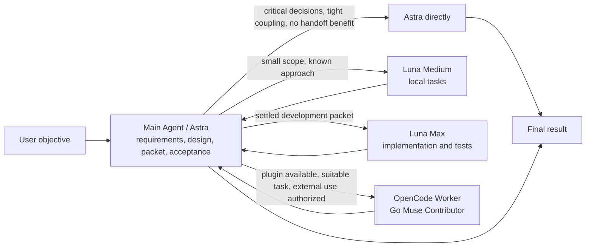

<div align="center">
  <h1>Sol Worker Routing for Codex</h1>
  <p><strong>Send the right task to the right Worker.</strong></p>
  <p>Converge from first principles, route by the actual bottleneck, and keep only the process and evidence needed for a decision.</p>
  <p>
    <a href="README.md">简体中文</a> ·
    <strong>English</strong> ·
    <a href="CHANGELOG.md">Changelog</a>
  </p>
  <p>
    <a href="https://github.com/liuyejinghong/sol-worker-routing-codex/tags"></a>
    <a href="https://github.com/liuyejinghong/sol-worker-routing-codex/stargazers"></a>
  </p>
</div>

## What it solves

`Sol Worker Routing` is more than adding subagents to Codex. It combines four ideas:

- **First principles**: establish the objective, invariant facts, minimum acceptance, and authorization boundary before adding abstractions or process.
- **Route by the actual bottleneck**: the main Agent owns requirements, root cause, architecture, and final judgment; Luna Medium handles small, well-defined tasks; Luna Max programs a feature or module from a settled development packet.
- **HERO Anti-OverDefense**: governs the main Agent and every Worker to reject checks with no consumer, defenses for unreachable cases, review loops with no live uncertainty, and wrappers or guards with no direct requirement.
- **Less process, more useful evidence**: select sufficient verification for the actual change and risk, not a fixed check count. Complete required checks, then expand only for new changes, failures, or concrete concerns.

Astra (`gpt-6-astra`) is the current primary main Agent; other supported parents can perform the same role. “Sol” in the project name is the historical coordinator name, not a requirement to select `gpt-5.6-sol`. Preserve the user's selected model and reasoning effort.

Astra settles the problem and design before deciding whether implementation is worth delegating. Luna Max takes implementation work; Astra keeps unresolved critical decisions. Difficulty alone is not a reason to delegate. If acceptance requires Astra to reread the entire context or repeat the central reasoning, Astra does the work directly.

| Executor | Best fit | Examples |
|---|---|---|
| **Main Agent (primarily Astra)** | Requirements, root cause, architecture, tightly coupled work, integration, and acceptance | Settle state ownership and business ambiguity, prepare development packets, finish work that does not benefit from handoff |
| **Luna Medium** | Small tasks with a known approach and independent acceptance | Local edits, source lookups, targeted test investigation |
| **Luna Max** | Implement an independently testable feature or module from a settled development packet | Code and necessary tests under agreed interfaces and behavior; bounded supplementary review |

## Optional OpenCode Worker plugin

The separately installed `opencode-worker` plugin adds a bounded external execution channel through local OpenCode + OMO and the user's Go Muse Spark Contributor subscription. The plugin owns execution and result collection; the main Agent keeps judgment and acceptance.

Use the channel only when its tools are callable in the current task and external execution is authorized. Without the plugin, the existing workflow continues. Luna lane states remain independent. This repository's installer does not install the plugin or alter Provider configuration. There is no web management page.

The plugin is currently a separate local project and is not distributed by this repository. With it installed, a task can begin with:

```text
Use the sol-worker-routing workflow for this request. Within the existing
external-execution authorization, delegate suitable independent work to
OpenCode Worker using Muse Contributor, then inspect and accept the result.
```

Once the Skill is loaded, the main Agent selects an executor based on task fit, callable plugin tools and existing authorization. There is no need to open the OpenCode CLI manually. You can also explicitly request the plugin or disable delegation for the task. The tools are `status`, `start`, `wait`, `followup` and `cancel`; `completed` means execution ended, while the main Agent still owns acceptance.

Contributor pricing permits Meta to train on submitted inputs and outputs. The plugin has one active task slot. Confirm cancellation has stopped execution before handing its files to another executor. Load updated Skill instructions in a new task; do not append another Personalization block.

The installer still manages only `~/.agents/skills/sol-worker-routing`. If an existing copy lives under `~/.codex/skills`, explicitly retain or migrate it rather than installing duplicate instructions. This local maintenance retained the existing `.codex/skills` location at the user's request.

See the [implementation plan](docs/2026-09-07-opencode-worker-plugin-plan.md), [local integration probes](docs/2026-09-07-opencode-worker-plugin-probe.md), and [development acceptance](docs/2026-09-07-opencode-worker-plugin-development-acceptance.md). The workflow source version is 0.14.0; the independent plugin has its own installation and validation.

## Changes in v0.14.0

- Add an optional OpenCode Worker execution channel while keeping judgment and acceptance with the main Agent.
- Define tool discovery, same-session corrections, failure recovery and file ownership; Luna lane state remains independent.
- Update recognition of the previous Skill contents and include integration and development acceptance records.

## Changes in v0.13.0

- Astra leads design and Luna Max works as a programmer; Medium blockers return to the main Agent for judgment.
- Development packets settle behavior, design, and acceptance while preserving implementation discretion. Count preparation, waiting, verification, and rework when deciding whether delegation pays off.

See [`CHANGELOG.md`](CHANGELOG.md) for release details. The full contracts live in [`personalization.md`](personalization.md), [`AGENTS.md`](AGENTS.md), and [`skills/sol-worker-routing/SKILL.md`](skills/sol-worker-routing/SKILL.md).

## How routing works



Luna Medium and Luna Max are peer Workers. Medium returns questions it cannot resolve within scope to the main Agent. Only after the critical decisions are settled does the main Agent decide whether Max should implement. There is no fixed `Medium → Max → Astra rescue` chain.

## Development packets for Luna Max

A packet can reference an existing spec or be a concise task message. Completeness means decisions affecting correctness are settled, not that every function is prescribed.

| Content | What must be settled |
|---|---|
| Goal and behavior | Which inputs or actions should produce which results |
| Design | Responsible module, state owner, interfaces, and invariants |
| Scope and constraints | Readable sources, exclusive write scope, behavior to preserve, and non-goals |
| Acceptance | Expected results, relevant failure cases, existing caller or test evidence |
| Decision boundary | Local implementation discretion and decisions to return to the main Agent |

Luna Max chooses local function structure, names, existing utilities, and necessary tests. It investigates facts within the assigned read scope. When the spec conflicts with code, business or interface meaning must change, ownership must move, or work exceeds scope, it pauses the dependent implementation and returns the specific conflict, evidence, and options while continuing unaffected work. The main Agent resolves questions under existing authority instead of automatically forwarding Worker blockers to the user.

Delivery includes code, actual verification, checks not run, spec deviations, and unresolved items. Astra checks business semantics, integration, and important failure paths against the packet and existing callers, rather than relying only on Worker-authored tests. Small omissions can go back for correction; wrong root-cause, business, or interface assumptions return to Astra for judgment. Preserve useful work and avoid repeated speculative rewrites. Repeated substantial rework on the same task type is a reason to stop delegating that work.

## Routing governance and lane switches

Explicit task constraints apply first, then persistent profile state and real route qualification, and only then task fit. “Sol only” or “no subagents” blocks new delegation for the current task without editing files or stopping already-running Workers.

Persistent state affects new tasks: `<profile>.toml` is enabled and `<profile>.toml.disabled` is disabled. `all` means Luna Medium and Luna Max, never Sol. Start a new Codex task after installation or a state change so Agent discovery reloads. A profile on disk is not proof of a working route.

Once dispatched, a Worker keeps its execution lease through silence, long reasoning, absence of writes, or a single wait timeout. Interrupt only for user cancellation, obsolescence, observed scope or authorization violation, repeated concrete errors, or resource deadlock.

Parallel work starts with one Worker and expands only for independent scopes with disjoint ownership, up to four concurrent Workers in one stage at depth one. Write-bearing work still prefers a single Worker.

## Installation

The simplest method is to give Codex this prompt:

```text
Install https://github.com/liuyejinghong/sol-worker-routing-codex for my Codex user configuration.
Read and follow AGENTS.md completely, preserve existing Codex settings, and do not overwrite unknown content, dual states, or symbolic links.
After installation, verify both Luna profiles and `sol-worker-routing`. Do not modify Providers, credentials, or model catalogs, and do not probe retired routes.
```

Or install from a terminal:

```bash
git clone https://github.com/liuyejinghong/sol-worker-routing-codex.git
cd sol-worker-routing-codex
bash scripts/install.sh
```

For an existing clone, update the source and reinstall with one command:

```bash
bash scripts/update.sh
```

It fetches the current branch's configured upstream, accepts only a checkout with no tracked edits that can fast-forward, and then reuses the installer while preserving both Luna lane states. Tracked edits, local-only commits, or divergence stop the update rather than being merged or discarded; unrelated untracked files do not block it by themselves. It does not modify Providers, credentials, or model catalogs.

Exact lane operations:

```bash
bash scripts/install.sh --lane-status
bash scripts/install.sh --disable-lane luna_medium_worker
bash scripts/install.sh --enable-lane luna_worker
bash scripts/install.sh --disable-lane all
```

A fresh install enables both Luna lanes. A recognized upgrade preserves each state. Unknown lane names fail rather than fuzzy-match.

The installer stages and backs up before replacement, and rolls back normal failures or `INT` / `TERM` / `HUP`. Final artifacts span two directory trees, so it does not claim cross-directory atomicity under power loss or `SIGKILL`; a rerun verifies and converges complete state.

Windows requires Git Bash/MSYS Bash or WSL Bash; this is not a native PowerShell script. Until a real Windows installation path is accepted, this is a compatibility path rather than a full platform-support claim.

Update account-wide Personalization manually: copy one complete language block from [`personalization.md`](personalization.md) and replace the previous workflow text in Codex App Settings → Personalization → Custom Instructions. Keep unrelated preferences and do not append duplicate versions. Editing the file does not update the App setting.

Personalization holds general collaboration and writing preferences; global AGENTS.md holds coding agreements; project AGENTS.md holds repository rules; the routing Skill owns Worker roles and development packets. Do not paste AGENTS.md or the whole Skill into Personalization. The installer does not manage global AGENTS.md; any old routing details there require separate cleanup.

## Usage examples

Normally, describe the objective without selecting a Worker. The main Agent decides whether delegation adds value.

Keep one-step work with the main Agent:

```text
Confirm this setting's current default and tell me whether it needs to change.
```

Use Luna Medium when scope and acceptance are fixed:

```text
Review only this specified diff against its behavior contract. Return at most three locatable risks, do not expand to other modules, and verify each with existing tests or read-only evidence.
```

Use Luna Max to implement a feature with a settled development packet:

```text
Implement Astra's agreed export packet: reuse the existing query service and permission checks, preserve the specified columns and order, and output only the header for empty results.
Read the export module and its existing callers; modify only the export module and tests named in the packet, without changing the public query interface.
Verify populated results, empty results, denied access, and fields containing commas. Choose local function structure yourself; return evidence and options if the spec conflicts with existing interfaces.
```

Keep root cause, architecture, and critical business decisions with the main Agent:

```text
Decide whether this requirement justifies changing the current architecture and give me the final approach.
```

## Installation boundary and repository files

The installer manages only these three final files:

```text
${CODEX_HOME:-$HOME/.codex}/agents/luna-medium-worker.toml[.disabled]
${CODEX_HOME:-$HOME/.codex}/agents/luna-worker.toml[.disabled]
$HOME/.agents/skills/sol-worker-routing/SKILL.md
```

During upgrade it removes an old Spark or DeepSeek profile only when its content exactly matches a registered historical version. Unknown content, dual states, symlinks, and non-regular files stop before writes. The DeepSeek Provider, credentials, model catalog, and unrelated Codex settings are outside retirement scope.

| File | Purpose |
|---|---|
| [`personalization.md`](personalization.md) | Concise collaboration and writing preferences to replace manually |
| [`skills/sol-worker-routing/SKILL.md`](skills/sol-worker-routing/SKILL.md) | Main Agent routing, development packets, Worker leases, and acceptance rules |
| [`agents/`](agents/) | Luna Medium and Luna Max Worker profiles |
| [`scripts/install.sh`](scripts/install.sh) | Conflict detection, state preservation, installation, and old-profile migration |
| [`scripts/update.sh`](scripts/update.sh) | Fast-forward source from the current Git upstream, then run the installer |
| [`benchmarks/`](benchmarks/) | Historical route experiments and raw evidence, not current lanes |

Installation, implementation, and verification do not authorize commit, push, merge, tag, release, or deployment. This is a community workflow, not an official OpenAI preset. Profile files and Worker self-reports do not prove a real route.

## References

- [Codex subagents and custom Agents](https://developers.openai.com/codex/agent-configuration/subagents)
- [Codex Skills](https://developers.openai.com/codex/skills)
- [Codex instruction discovery](https://developers.openai.com/codex/guides/agents-md)
- [HERO Anti-OverDefense](https://github.com/wanshuiyin/HERO-Anti-OverDefense)
- [Codex rust-v0.149.0](https://github.com/openai/codex/releases/tag/rust-v0.149.0)
- [Agent-role Provider inheritance change #39299](https://github.com/openai/codex/pull/39299)
- [Cross-provider child reproduction #17598](https://github.com/openai/codex/issues/17598#issuecomment-5376031711)
