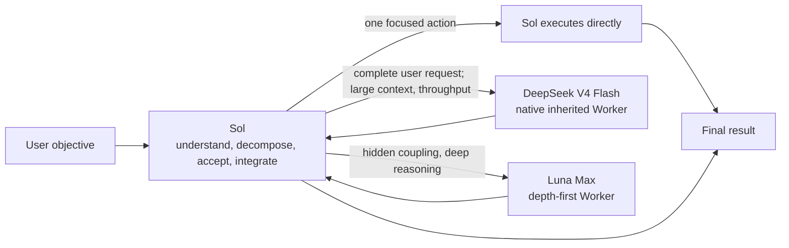

<div align="center">
  <h1>Sol Worker Routing for Codex</h1>
  <p><strong>Send each task to the Worker that fits it.</strong></p>
  <p>Reduce the problem from first principles, route by work shape, and keep only the process and evidence needed to decide.</p>
  <p>
    <a href="README.md">简体中文</a> ·
    <strong>English</strong> ·
    <a href="CHANGELOG.md">Changelog</a>
  </p>
  <p>
    <a href="https://github.com/liuyejinghong/sol-worker-routing-codex/tags"></a>
    <a href="https://github.com/liuyejinghong/sol-worker-routing-codex/stargazers"></a>
  </p>
</div>

## What problem does it solve?

`Sol Worker Routing` does more than add two subagents to Codex. It combines three ideas in one working method:

- **First principles**: establish the final objective, invariant facts, minimum acceptance, and authorization boundary first. When patches, abstractions, or unrelated process accumulate, return to the root cause and simplify.
- **Route by the actual bottleneck**: Sol keeps the objective and final judgment; DeepSeek V4 Flash uses its speed, low cost, and 1M context for large-input and throughput-sensitive bounded work; Luna Max gets the time needed for depth-first reasoning. Simple work stops consuming excess tokens, while deep work is not killed merely because it stays silent for a while.
- **Less process, more useful evidence**: TDD, spec-first work, fixed review rounds, and extra tooling are never goals by themselves. The default is one focused contract check plus one real-path result check. Add validation only when it protects a concrete risk and failure would change a decision.

Sol stays in the lead to understand the goal, decide whether a handoff fits, inspect evidence, and deliver the result. Luna receives independent packets composed by Sol. DeepSeek currently receives the complete user request through native turn inheritance, a temporary boundary explained below.

| Executor | Best fit | Typical examples |
|---|---|---|
| **Sol** | Tiny tasks, ambiguity, architecture, and final decisions | Decide whether to change something, integrate results, make a one-step edit |
| **DeepSeek V4 Flash** | Large context and bounded work where speed or throughput matters | Repository-wide analysis, long documents, bulk diagnosis, medium-complexity implementation, structured data |
| **Luna Max** | Hidden coupling, subtle semantics, and long-horizon deep reasoning | Difficult code review, complex diagnosis, critical implementation, cross-module semantic judgment |

## What does the same work cost?

We gave DeepSeek and Luna Max the same two evidence/mechanical tasks. Objectives, scope, acceptance commands, and stop conditions were identical. Both Workers passed **2/2** tasks.

[](benchmarks/report-2026-08-09.md)

| Worker | Tasks passed | Total time | Generated tokens |
|---|---:|---:|---:|
| **DeepSeek** | 2 / 2 | **88 seconds** | **5,081** |
| Luna Max | 2 / 2 | 235 seconds | 16,708 |

For the same accepted results, DeepSeek used **147 fewer seconds** and **11,627 fewer generated tokens** - a **62.6%** reduction in time and a **69.6%** reduction in generated tokens. This shows that DeepSeek should not be treated as a cheap search utility: with a clear contract, it can finish real code work faster. It does not prove that both models are interchangeable on every long-horizon task, so routing still follows context, throughput, and reasoning depth.

> This is a measured result from two paired tasks, not a general model ranking. Generated tokens are `output tokens + reasoning tokens`, a workload comparison within the same client rather than a dollar bill or total-token count. See the [full report](benchmarks/report-2026-08-09.md) for methods, task-level results, and limitations, or inspect the raw [CSV](benchmarks/pilot-2026-08-09.csv). [`render_readme_chart.py`](benchmarks/render_readme_chart.py) generates the chart directly from that CSV.

## How routing works



DeepSeek and Luna Max are peer leaf Workers, not stages in a hierarchy. Sol owns task recognition, material discovery, decomposition, dispatch, acceptance, and the final conclusion. For everyday use, we recommend `gpt-5.6-sol` at **medium** effort: it is enough for most routing and integration without erasing the savings in the lead thread. Move to high only for ambiguous architecture, conflicting evidence, high-stakes decisions, or complex synthesis. The Skill describes this policy but cannot change the model or effort selected for the current task.

The workflow also follows one deliberately simple rule: if Sol can finish the task in one focused action, it does not delegate merely to use a subagent. Handoffs cost time and tokens too.

## Where DeepSeek's 1M context pays off

DeepSeek V4 Flash is a fast, low-cost general Worker rather than an evidence-only extractor. Its 1M context can keep a large repository, long document set, or batch of records coherent instead of fragmenting the material early to fit a smaller window.

The official DeepSeek model catalog declares a **1,048,576-token** context window for V4 Flash. The direct official route has passed real text, built-in Codex tool, and native web-search calls. That proves the current route needs no local protocol bridge; it does not claim that one task has saturated the full 1M window. The [official-route acceptance record](benchmarks/official-deepseek-acceptance-2026-08-10.md) also preserves the failed third-party MCP and subagent-handoff boundaries. The historical 260K bridge probe remains in the [long-context acceptance record](benchmarks/long-context-acceptance-2026-08-10.md), but it no longer represents the active installation path.

| Input or task | What DeepSeek can return to Sol |
|---|---|
| Fixed webpages, papers, or long documents | Evidence table with source, date, core fact, support, and limitations |
| Large repositories or diffs | Architecture relationships, call sites, configuration references, repeated patterns, and review candidates |
| CI output, runtime logs, or incident records | Error classes, frequency, and timeline |
| Issues, pull requests, or release records | Deduplicated items, module groups, and status lists |
| CSV, JSON, or API snapshots | Reconciliation results, missing records, and anomaly candidates |
| Localization and dependency data | Missing keys, placeholder differences, version matches, and affected-file candidates |
| Clearly bounded multi-file work | Semantic analysis, implementation changes, and named acceptance results |

Web research can go directly through DeepSeek's native `web_search` when **the current user turn already contains the complete question, date range, source requirements, and deliverable**. DeepSeek inherits that turn, performs bounded discovery, reads many pages, and returns exact URLs, facts, and evidence limits; Sol rechecks decisive primary sources, resolves conflicts, and writes the conclusion. If Sol must first discover sources, narrow the scope, or add a private packet, Sol keeps the work or uses Luna rather than pretending those new instructions reached DeepSeek.

Concurrency is not a permanent fixed number, but the current client cannot secretly split one user request into four DeepSeek packets because cross-provider dynamic payloads are still lost. A normal user turn therefore uses at most one inherited DeepSeek Worker. Luna may run in parallel when packets and write ownership are genuinely independent; any shared write surface stays sequential. Hidden DeepSeek sharding can return after Codex repairs dynamic handoff.

## Let deep reasoning finish

A completed wait poll means only that no final result arrived during that polling window. It does not mean the Worker failed. Sol must not interrupt Luna because it is silent, slower than expected, has not written files yet, or because the packet looks larger after dispatch. When progress matters, Sol asks for a non-terminating checkpoint and keeps waiting.

Interruption is reserved for user cancellation, obsolete work, observed scope or authorization violations, repeated concrete execution errors, or resource deadlock that blocks the parent task. Packet sizing happens before dispatch; a deep Worker must not spend reasoning tokens only to be killed and repackaged as a cost-control reaction.

## Install

The easiest path is to give this prompt directly to Codex:

```text
Install https://github.com/liuyejinghong/sol-worker-routing-codex for my Codex user profile.
Read and follow the repository AGENTS.md first. Preserve my existing Codex configuration
and do not overwrite conflicts. Have the installer inspect the existing DeepSeek provider
and run a real route first. Preserve it when it works; only repair a proven failure
with a mechanism supported by the current Codex client and host. Do not send me away to discover the schema.
```

Or install from a terminal:

```bash
git clone https://github.com/liuyejinghong/sol-worker-routing-codex.git
cd sol-worker-routing-codex
bash scripts/install.sh
```

### Direct official DeepSeek route

The DeepSeek Worker uses only the **official DeepSeek V4 Flash API**. Codex sends requests directly to the DeepSeek Responses API, with native built-in tools and web search. No LiteLLM process, OpenCode Go proxy, or other resident bridge is required.

Run the installer directly. The explicit option remains only for compatibility with existing installation commands:

```bash
bash scripts/install.sh --deepseek-provider deepseek-api
```

The installation Agent checks the existing official provider and credential, installs the official model catalog, then verifies one real tool result and one native web-search result. A working configuration is preserved instead of being rebuilt because the installer cannot see one particular credential backend. OpenCode Go is intentionally unsupported until it exposes the Codex Responses and tool contract directly; the project no longer maintains a Chat Completions conversion layer.

### Current native-subagent boundary

DeepSeek remains a **native Codex subagent**, not an API runner, a `codex exec` process, or a separate first-class task. Codex currently has public cross-provider handoff bugs: a child can start while the encrypted dynamic task payload from an OpenAI parent is lost in a non-OpenAI child (see [#36586](https://github.com/openai/codex/issues/36586), [#36376](https://github.com/openai/codex/issues/36376), and [#35932](https://github.com/openai/codex/issues/35932)).

This project uses a tested conditional workaround. Sol creates `deepseek_worker` with `fork_turns="1"` only when **the current user request is already the complete DeepSeek assignment**. The child inherits the current turn and context and retains a real Codex subagent lifecycle, the official DeepSeek model, native tools, and native web search. It cannot yet reliably receive a narrower private packet in `spawn_agent.message`, nor can the workflow depend on later `send_message` or `followup_task` calls. Work that needs decomposition, a changed objective, restricted write ownership, or later instructions stays with Sol or goes to Luna.

This does not claim to repair the upstream bug. It preserves native-subagent semantics within a clearly conditional route. See the [official-route acceptance record](benchmarks/official-deepseek-acceptance-2026-08-10.md).

The installation flow handles all of the following:

1. Install `deepseek_worker`, `luna_worker`, and the `sol-worker-routing` Skill.
2. Inspect the official DeepSeek upstream, model catalog, and credential, then verify them with an obvious bounded task.
3. Preserve a working setup instead of reinstalling it because one environment variable or credential backend is not visible.
4. Only after a real invocation fails, repair the provider and authentication using mechanisms supported by the current Codex client and operating system.

Users do not need to learn the provider schema or edit TOML. If a service credential is truly missing, the installation Agent guides the secure input supported by the current environment instead of prescribing Keychain, an environment variable, or another platform-specific backend. If the current task cannot see a newly installed Worker, the Agent asks only for a new task; the Skill then runs the route probe automatically.

Account-level personalization is the one step the repository cannot perform: paste one complete language block from [`personalization.md`](personalization.md) into Codex App **Settings → Personalization → Custom Instructions**.

## What using it looks like

You do not need to select a Worker manually. Describe the objective normally and Sol first decides whether a handoff is worthwhile:

```text
At this pinned commit, find the setting's default and every call site. Cite a line for each claim.
```

This user request itself contains the source boundary and acceptance, so DeepSeek can inherit it natively.

```text
Have DeepSeek search for the small set of webpages that actually matters, prefer primary sources,
and return exact URLs, claims, figures, dates, and evidence limitations;
then verify the decisive original sources and give me the conclusion.
```

This request is already a complete research contract. DeepSeek can inherit, search, read, and reduce it natively; Sol then verifies and synthesizes.

```text
Read the full service directory and migration note, find every legacy configuration call site,
complete the migration inside the assigned files, and run the target tests.
```

This fits native DeepSeek inheritance when the user request itself makes scope, write ownership, and acceptance explicit.

```text
Diagnose this intermittent concurrency leak across scheduling, cancellation, and cleanup.
Explain the hidden coupling, make the smallest fix, and prove re-entry semantics remain intact.
```

This fits Luna Max because depth and subtle semantics matter more than latency. Once dispatched, it should be allowed to finish instead of being interrupted for a quiet period.

```text
Decide whether this requirement justifies changing the architecture, then recommend the final approach.
```

This stays with Sol because a Worker must not redefine the parent objective or own the final decision.

<details>
<summary>See the task contract Sol gives a Worker</summary>

```text
Worker and mode:
Objective:
Scope and owned paths:
Relevant facts / source pins:
Non-goals:
Acceptance criteria:
Verification:
State-based stop condition:
Return format:
```

This is not another user-facing process. It is the minimum packet for Luna and for DeepSeek after dynamic handoff is repaired. Current DeepSeek cannot reliably receive this private packet and inherits only the current user request; Sol fills gaps or selects Luna instead of letting a Worker widen scope.

</details>

## Installation boundaries and project files

The repository installer writes only two Agent profiles and one Skill. It can safely upgrade the known previous Skill release; any other different content stops the install before it is overwritten:

```text
~/.codex/agents/deepseek-worker.toml
~/.codex/agents/luna-worker.toml
~/.agents/skills/sol-worker-routing/SKILL.md
```

| File | Purpose |
|---|---|
| [`personalization.md`](personalization.md) | Global routing preference that you paste manually |
| [`skills/sol-worker-routing/SKILL.md`](skills/sol-worker-routing/SKILL.md) | Sol's routing, acceptance, and integration rules |
| [`agents/`](agents/) | Official DeepSeek API and Luna Max Worker profiles |
| [`scripts/install.sh`](scripts/install.sh) | Conflict checks, minimal install, and old-name migration |
| [`benchmarks/`](benchmarks/) | Benchmark cases, raw data, and the full report |

The provider is not a fixed repository-installer output. The installation Agent judges the existing setup by a real route first and only repairs a confirmed failure using mechanisms supported by the current client and host. Credentials are never written to the repository, chat, or `config.toml`. A known `sol-luna-workflow` installation is also migrated only when its content matches a prior release and the path is not a symbolic link. Unknown content is never overwritten or removed.

If a development-branch foreground DeepSeek runner was installed previously, the installer removes it only when it exactly matches that known pre-release file. Modified content or a symbolic link stops the installation before any write.

This is a community workflow, not an OpenAI preset. A profile file or Worker self-report is not route proof by itself; use client-exposed subagent information and the accepted task result.

## References

- [Codex subagents and custom agents](https://developers.openai.com/codex/agent-configuration/subagents)
- [Codex Skills and discovery paths](https://developers.openai.com/codex/skills)
- [Codex instruction discovery](https://developers.openai.com/codex/guides/agents-md)
- [Official DeepSeek Codex integration](https://api-docs.deepseek.com/quick_start/agent_integrations/codex/)
- [Codex cross-provider subagent task loss #36586](https://github.com/openai/codex/issues/36586)
- [Oh My OpenAgent orchestration reference](https://github.com/code-yeongyu/oh-my-openagent)
