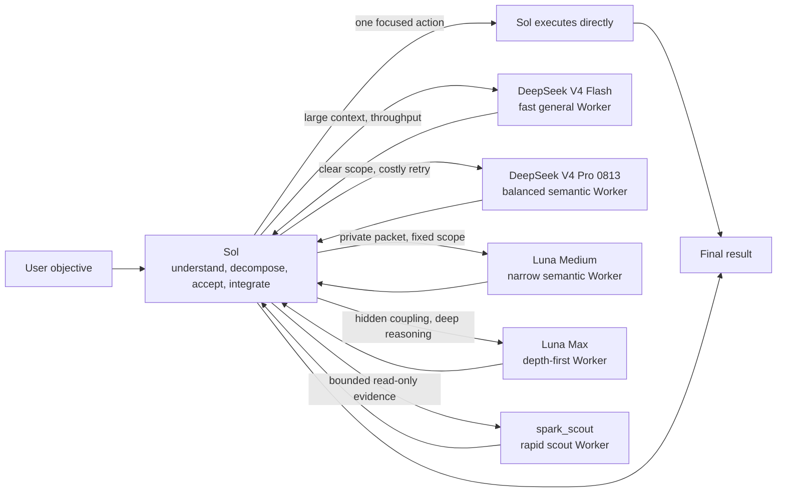

<div align="center">
  <h1>Sol Worker Routing for Codex</h1>
  <p><strong>Send each task to the Worker that fits it.</strong></p>
  <p>Reduce the problem from first principles, route by work shape, and keep only the process and evidence needed to decide.</p>
  <p>
    <a href="README.md">简体中文</a> ·
    <strong>English</strong> ·
    <a href="CHANGELOG.md">Changelog</a>
  </p>
  <p>
    <a href="https://github.com/liuyejinghong/sol-worker-routing-codex/tags"></a>
    <a href="https://github.com/liuyejinghong/sol-worker-routing-codex/stargazers"></a>
  </p>
</div>

## What problem does it solve?

`Sol Worker Routing` does more than add five subagents to Codex. It combines four ideas in one working method:

- **First principles**: establish the final objective, invariant facts, minimum acceptance, and authorization boundary first. When patches, abstractions, or unrelated process accumulate, return to the root cause and simplify.
- **Scope economy (HERO distilled)**: use `H` (hashing without a consumer), `E` (defense for unreachable inputs), `R` (review loops without a live uncertainty), and `O` (defensive scaffolding without a direct requirement) as diagnostic labels. They bound proposals without suppressing real reachable defects; every new check must name the concrete failure and the next decision it would change. [Source and case catalogue](https://github.com/wanshuiyin/HERO-Anti-OverDefense)
- **Route by the actual bottleneck**: Sol keeps the objective and final judgment; DeepSeek V4 Flash uses its speed, low cost, and 1M context for large-input and throughput-sensitive bounded work; DeepSeek V4 Pro 0813 handles bounded medium-high semantic work where a wrong first pass is more expensive; Luna Medium handles narrow work that needs a private Sol packet but already has fixed scope and acceptance; Luna Max gets the time needed for hidden coupling and depth-first reasoning; the new `spark_scout` performs only bounded, read-only evidence reconnaissance with `gpt-5.3-codex-spark` at `xhigh`. Simple work stops consuming excess tokens, while deep work is not killed merely because it stays silent for a while.
- **Less process, more useful evidence**: TDD, spec-first work, fixed review rounds, and extra tooling are never goals by themselves. The default is one focused contract check plus one real-path result check. Add validation only when it protects a concrete risk and failure would change a decision.

### How HERO is integrated

HERO is not a sixth Worker or a new standing gate. It is first an always-on behavior contract for the main Agent, then carried directly in compact form by every Worker profile; it does not depend on delegation occurring or on a child inheriting the parent context. Discovery may be broad enough to find real problems, while proposed work must stay proportionate. A reachable defect is not dismissed because it sounds rare, and a merely constructible case does not automatically grow into defensive machinery.

| Surface | Role |
|---|---|
| `personalization.md` | Becomes the account-wide main-Agent contract after manual paste, retaining the full diagnostics, negative shapes, and four key counterexamples |
| `AGENTS.md` | Directly constrains the main Agent with a medium calibration block whether or not it delegates |
| Five Agent profiles | Give every Worker the compact HERO contract without relying on context inheritance or Skill activation |
| `sol-worker-routing` Skill | Defines the full H/E/R/O diagnostics and requires Sol to constrain its own work before routing |

The core applies across code, documentation, research, data work, and agent orchestration. Threat models, irreversible risks, and required security, migration, data-integrity, release, authorization, and verification controls are not universal; the user and project contract define them. This is a natural-language operating constraint, not an enforced security boundary. The always-on contract carries only a bounded set of positive and negative calibration examples; HERO's full case catalogue is neither installed nor loaded into every task and remains an external reference for diagnosing a concrete pattern.

Sol stays in the lead to understand the goal, decide whether a handoff fits, inspect evidence, and deliver the result. Luna Medium and Luna Max both receive independent packets composed by Sol; Medium accepts only a narrow packet with fixed paths, non-goals, and acceptance, and returns a blocker if hidden coupling calls for a Max decision. DeepSeek currently receives only the complete user request as its sole native initial task: use `fork_turns="1"` when the client supports it, otherwise only copy the current request verbatim. This temporary boundary is explained below.

| Executor | Best fit | Typical examples |
|---|---|---|
| **Sol** | Tiny tasks, ambiguity, architecture, and final decisions | Decide whether to change something, integrate results, make a one-step edit |
| **DeepSeek V4 Flash** | Large context and bounded work where speed or throughput matters | Repository-wide analysis, long documents, bulk diagnosis, medium-complexity implementation, structured data |
| **DeepSeek V4 Pro 0813 (local full-request route verified)** | Bounded work with clear scope but higher semantic density or rework cost | Multi-file behavior changes, isolated complex diagnosis, deep PR review, conflicting-evidence synthesis |
| **Luna Medium (local native route verified)** | Narrow semantic work that needs a private packet but has fixed paths, scope, and acceptance | Specified-diff review, target-test diagnosis in a known module, constrained implementation |
| **Luna Max** | Hidden coupling, subtle semantics, and long-horizon deep reasoning | Difficult code review, complex diagnosis, critical implementation, cross-module semantic judgment |
| **`spark_scout`** | Bounded, read-only, independently verifiable evidence reconnaissance | Locate entry points, call chains, configuration differences, and log/test classifications with exact evidence |

This workspace passed a native `luna_medium_worker` route probe in a fresh Codex task: the client created the named child and it returned `MEDIUM_ROUTE_PROBE=PASS; 7*8=56`. That proves the named route and return path only for this client and profile; every new installation or material client change still needs its own probe. The repository includes the `spark_scout` profile; it returns only a conclusion, exact evidence, uncertainty, a blocker, and narrowly scoped next checks, and it does not write files or own architecture, release, risk-control, or final-verdict decisions. A profile or a successful installation never replaces Spark's separate real route probe.

## What does the same work cost?

We gave DeepSeek and Luna Max the same two evidence/mechanical tasks. Objectives, scope, acceptance commands, and stop conditions were identical. Both Workers passed **2/2** tasks.

[](benchmarks/report-2026-08-09.md)

| Worker | Tasks passed | Total time | Generated tokens |
|---|---:|---:|---:|
| **DeepSeek** | 2 / 2 | **88 seconds** | **5,081** |
| Luna Max | 2 / 2 | 235 seconds | 16,708 |

For the same accepted results, DeepSeek used **147 fewer seconds** and **11,627 fewer generated tokens** - a **62.6%** reduction in time and a **69.6%** reduction in generated tokens. This shows that DeepSeek should not be treated as a cheap search utility: with a clear contract, it can finish real code work faster. It does not prove that both models are interchangeable on every long-horizon task, so routing still follows context, throughput, and reasoning depth.

> This is a measured result from two paired tasks, not a general model ranking. Generated tokens are `output tokens + reasoning tokens`, a workload comparison within the same client rather than a dollar bill or total-token count. See the [full report](benchmarks/report-2026-08-09.md) for methods, task-level results, and limitations, or inspect the raw [CSV](benchmarks/pilot-2026-08-09.csv). [`render_readme_chart.py`](benchmarks/render_readme_chart.py) generates the chart directly from that CSV.

## Why not send everything to the cheapest model?

[](benchmarks/agent-routing-evaluation-2026-08-13.md)

We fully recomputed the public TraceLab v0.0.1 dataset: across **357,161** real engineering-agent steps, **95.746%** of input tokens were accumulated context prefix rather than fresh input. Engineering cost is therefore often driven by repeated context reconstruction, unbounded tool echoes, handoffs, and failed retries—not by a few extra final-answer tokens.

The workflow routes by the cost of an accepted completion: Flash handles clear, mechanically verifiable high-throughput work; Pro is used only when a stronger first semantic pass can prevent a retry; Luna Medium is limited to clear private packets, Luna Max handles hidden coupling and deep semantics; Sol retains goals, authorization, and final judgment. The [balanced routing evaluation](benchmarks/agent-routing-evaluation-2026-08-13.md) contains the source-checked recomputation, pricing formula, vendor capability evidence, community caveats, and Pro acceptance gate. This workspace has passed a native Pro probe for one complete, self-contained task; it does not prove that private dynamic task packets or follow-ups work. See the [probe record](benchmarks/deepseek-pro-route-probe-2026-08-13.md).

## How routing works



Spark, Flash, Pro, Luna Medium, and Luna Max are peer leaf Workers, not stages in a hierarchy. Sol owns task recognition, material discovery, decomposition, dispatch, acceptance, and the final conclusion. Medium is not an automatic downgrade from Max: use it only when a private packet's scope, ownership, and acceptance are fixed; it returns a blocker when hidden coupling appears, and Sol explicitly selects any later Max packet. For everyday use, we recommend `gpt-5.6-sol` at **medium** effort: it is enough for most routing and integration without erasing the savings in the lead thread. Move to high only for ambiguous architecture, conflicting evidence, high-stakes decisions, or complex synthesis. The Skill describes this policy but cannot change the model or effort selected for the current task.

The workflow follows five simple rules: do not add a handoff when Sol can finish in one focused action; use Flash's 1M context for large repositories, long documents, batch data, and high-volume web research; use Pro for clear-scope semantic work where a retry would cost more; use Luna Medium only for a clear private packet; use `spark_scout` only for read-only evidence and blockers, never implementation, architecture, release, risk control, or final judgment; give Luna Max the time required for deep reasoning.

## Routing governance and Worker switches

Routing first honors explicit limits in the current task, then checks persistent profile state and real route qualification, and only then chooses a Worker by the task bottleneck. A user may say “do not use DeepSeek this time,” “do not use Spark,” “Sol only,” or “use no subagents”; each soft disable blocks new delegation for this task without changing files or automatically stopping a Worker that is already running.

Persistent hard disable changes Agent discovery for new tasks. Enabled state is `<profile>.toml`; disabled state is `<profile>.toml.disabled`, with the profile content retained for reversible recovery. Disabling DeepSeek renames only the two DeepSeek profiles and does not change the Provider, model catalog, or credentials. `all` means all five Workers and excludes Sol; `deepseek` is the group alias for the Flash and Pro lanes. After enabling, disabling, or upgrading, a new task must reload the Agent registry. An old task is not proof of hot reload, and a profile file is not proof that a real route works.

An upgrade must preserve each lane's existing enabled/disabled state. A lane introduced by the upgrade, such as Spark, defaults to disabled and must not become discoverable merely because the user upgraded. Missing files, dual states, unknown content, symbolic links, and non-regular files must stop before writes; the installer must not guess or repair them automatically. Disabling DeepSeek must not modify its Provider or credentials.

Spark returns `CONCLUSION`, `EVIDENCE` (an exact file, symbol, command output, or URL), `UNCERTAINTY`, `BLOCKER`, and `NEXT CHECKS`. It uses `gpt-5.3-codex-spark / xhigh / 128K / read-only`, does not write files or change workspace or external state, and returns a blocker when the request involves writes, context overflow, hidden coupling, architecture, release, risk control, or a final verdict. Sol decides what happens next. DeepSeek retains the current full-request restriction: prefer `fork_turns="1"`; otherwise reproduce the complete current user request verbatim, without a private Sol packet or a dependency on reliable follow-ups. Luna Medium retains the private-packet boundary: paths or sources, ownership, non-goals, and acceptance must be fixed; hidden coupling, an unresolved root cause, or long-horizon reasoning returns a blocker for Sol to decide whether to issue a Luna Max packet.

## Install

The easiest path is to give this prompt directly to Codex:

```text
Install https://github.com/liuyejinghong/sol-worker-routing-codex for my Codex user profile.
Read and follow the repository AGENTS.md first. Preserve my existing Codex configuration
and do not overwrite conflicts. Have the installer inspect the existing DeepSeek provider
and run a real route first. Preserve it when it works; only repair a proven failure
with a mechanism supported by the current Codex client and host. Do not send me away to discover the schema.
```

Or install from a terminal:

```bash
git clone https://github.com/liuyejinghong/sol-worker-routing-codex.git
cd sol-worker-routing-codex
bash scripts/install.sh
```

This terminal command only installs and migrates five profile-state files and one Skill. It does not configure or validate the provider, credential, model catalog, or a real route; use the Codex prompt above for the complete installation contract.

The installer provides these exact lane-management commands:

```bash
bash scripts/install.sh --lane-status
bash scripts/install.sh --disable-lane deepseek
bash scripts/install.sh --disable-lane spark_scout
bash scripts/install.sh --enable-lane deepseek_worker
```

The exact lane names are `spark_scout`, `deepseek_worker`, `deepseek_pro_worker`, `luna_medium_worker`, and `luna_worker`; unknown names fail rather than fuzzy-match. `deepseek` changes Flash and Pro together; `all` changes all five Workers and excludes Sol. A fresh install enables every lane. An upgrade preserves each known state and adds a newly introduced lane disabled. Start a new Codex task after a switch or upgrade; the installer does not claim hot reload of an old task.

The installer stages and backs up files in their target directories before replacement, then rolls back ordinary command failures and `INT`/`TERM`/`HUP`. The six final artifacts live in two directory trees, so it does not claim a cross-directory transaction after power loss or `SIGKILL`; final targets may be complete old/new files and hidden recovery files may remain, while a rerun revalidates and converges the final state.

On Windows, run it in Git Bash/MSYS Bash or WSL Bash; it is not a native PowerShell script. Use Git Bash POSIX paths such as `/c/Users/...` (a `C:/...` value inherited into `HOME` or `CODEX_HOME` is converted only in an MSYS environment); use WSL's own POSIX paths such as `/mnt/c/...`. Until a real Windows installation path is exercised, this is a compatibility path rather than a verified platform-support claim.

### Direct official DeepSeek route

The DeepSeek Workers use the **official DeepSeek V4 Flash** and separate **DeepSeek V4 Pro 0813** API profiles. Codex sends requests directly to the DeepSeek Responses API, with native built-in tools and web search. No LiteLLM process, OpenCode Go proxy, or other resident bridge is required. Pro never replaces Flash and becomes routable only after its independent route probe passes. The workspace probe passed a complete task, a read-only tool, and native web search; every new installation or material client change still needs its own probe, and it does not validate private dynamic handoff.

The terminal installer only handles file installation. The explicit option remains only for compatibility with existing installation commands:

```bash
bash scripts/install.sh --deepseek-provider deepseek-api
```

The installation Agent checks the existing official provider and credential, installs the official model catalog, then verifies one real tool result and one native web-search result. A working configuration is preserved instead of being rebuilt because the installer cannot see one particular credential backend. OpenCode Go is intentionally unsupported until it exposes the Codex Responses and tool contract directly; the project no longer maintains a Chat Completions conversion layer.

> Codex still has a cross-provider handoff limitation, so DeepSeek is used only when the user request is already complete. It remains a native subagent; this project does not use an API runner or resident bridge. See the [installation acceptance record](benchmarks/official-deepseek-acceptance-2026-08-10.md) and [Pro route probe](benchmarks/deepseek-pro-route-probe-2026-08-13.md) for the exact boundary.

When Codex runs the installation Agent, the installation flow handles all of the following:

1. The current implementation installs `spark_scout` (read-only evidence), `deepseek_worker` (Flash), `deepseek_pro_worker` (Pro), `luna_medium_worker` (Medium), `luna_worker` (Max), and the `sol-worker-routing` Skill, with enabled/disabled state managed by profile suffix.
2. Inspect the official DeepSeek upstream, model catalog, and credential, then verify each newly claimed route with an obvious bounded task.
3. Preserve a working setup instead of reinstalling it because one environment variable or credential backend is not visible.
4. Only after a real invocation fails, repair the provider and authentication using mechanisms supported by the current Codex client and operating system.

Users do not need to learn the provider schema or edit TOML. If a service credential is truly missing, the installation Agent guides the secure input supported by the current environment instead of prescribing Keychain, an environment variable, or another platform-specific backend. If the current task cannot see a newly installed Worker, the Agent asks only for a new task; the Skill then runs the route probe automatically.

Account-level personalization is the one step the repository cannot perform: manually paste one complete language block from [`personalization.md`](personalization.md) into Codex App **Settings → Personalization → Custom Instructions**. This is the required activation step for HERO to constrain the whole main Agent rather than only this repository and the installed Workers. App Personalization does not update itself; do not claim account-wide HERO activation until this step is completed and confirmed.

## What using it looks like

You do not need to select a Worker manually. Describe the objective normally and Sol first decides whether a handoff is worthwhile:

```text
At this pinned commit, find the setting's default and every call site. Cite a line for each claim.
```

With fixed sources and acceptance, this fits DeepSeek.

```text
Have DeepSeek search for the small set of webpages that actually matters, prefer primary sources,
and return exact URLs, claims, figures, dates, and evidence limitations;
then verify the decisive original sources and give me the conclusion.
```

This is the standard split for context-heavy web work: DeepSeek searches, reads, and reduces; Sol verifies and synthesizes.

```text
Read the full service directory and migration note, find every legacy configuration call site,
complete the migration inside the assigned files, and run the target tests.
```

This fits DeepSeek when the material is large but scope, write ownership, and acceptance are explicit.

```text
This PR changes only three modules. Check the cross-file behavioral impact against the stated contract and return at most three located risks. Do not refactor or recommend an architecture change. Every finding must be verifiable with existing tests or read-only evidence.
```

When scope is fixed but first-pass semantic quality can avoid an entire retry, this fits route-probed DeepSeek V4 Pro 0813.

```text
Review only this specified diff against the stated behavioral contract and return at most three located risks. Do not expand to unspecified modules. Every finding must be verifiable with existing tests or read-only evidence.
```

When Sol needs a private packet but the paths, ownership, and acceptance are already fixed, this fits Luna Medium. If it encounters hidden coupling or a broader root-cause question, it must stop and return a blocker to Sol rather than expanding itself.

```text
Diagnose this intermittent concurrency leak across scheduling, cancellation, and cleanup.
Explain the hidden coupling, make the smallest fix, and prove re-entry semantics remain intact.
```

This fits Luna Max because depth and subtle semantics matter more than latency. Once dispatched, it should be allowed to finish instead of being interrupted for a quiet period.

```text
Decide whether this requirement justifies changing the architecture, then recommend the final approach.
```

This stays with Sol because a Worker must not redefine the parent objective or own the final decision.

## Installation boundaries and project files

The repository installer writes one enabled or disabled state file for each of five Agent profiles plus one Skill. Each profile accepts only its own known previous-release content; other content, dual states, symbolic links, or non-regular files stop the install before it is overwritten:

```text
~/.codex/agents/spark-scout.toml[.disabled]
~/.codex/agents/deepseek-worker.toml[.disabled]
~/.codex/agents/deepseek-pro-worker.toml[.disabled]
~/.codex/agents/luna-medium-worker.toml[.disabled]
~/.codex/agents/luna-worker.toml[.disabled]
~/.agents/skills/sol-worker-routing/SKILL.md
```

| File | Purpose |
|---|---|
| [`personalization.md`](personalization.md) | Global main-Agent behavior contract and routing preference that you paste manually |
| [`skills/sol-worker-routing/SKILL.md`](skills/sol-worker-routing/SKILL.md) | Sol's routing, acceptance, and integration rules |
| [`agents/`](agents/) | Spark Scout, DeepSeek Flash, DeepSeek Pro 0813, Luna Medium, and Luna Max Worker profiles |
| [`scripts/install.sh`](scripts/install.sh) | Conflict checks, minimal install, and old-name migration |
| [`benchmarks/`](benchmarks/) | Benchmark cases, raw data, and the full report |

The provider is not a fixed repository-installer output. The installation Agent judges the existing setup by a real route first and only repairs a confirmed failure using mechanisms supported by the current client and host. Credentials are never written to the repository, chat, or `config.toml`. A known `sol-luna-workflow` installation is also migrated only when its content matches a prior release and the path is not a symbolic link. Unknown content is never overwritten or removed.

If a development-branch foreground DeepSeek runner was installed previously, the installer removes it only when it exactly matches that known pre-release file. Modified content or a symbolic link stops the installation before any write.

This is a community workflow, not an OpenAI preset. A profile file or Worker self-report is not route proof by itself; use client-exposed subagent information and the accepted task result.

## References

- [Codex subagents and custom agents](https://developers.openai.com/codex/agent-configuration/subagents)
- [Codex Skills and discovery paths](https://developers.openai.com/codex/skills)
- [Codex instruction discovery](https://developers.openai.com/codex/guides/agents-md)
- [Official DeepSeek Codex integration](https://api-docs.deepseek.com/quick_start/agent_integrations/codex/)
- [Codex cross-provider subagent task loss #36586](https://github.com/openai/codex/issues/36586)
- [Oh My OpenAgent orchestration reference](https://github.com/code-yeongyu/oh-my-openagent)
