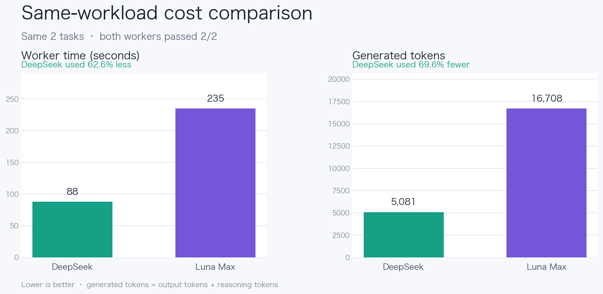
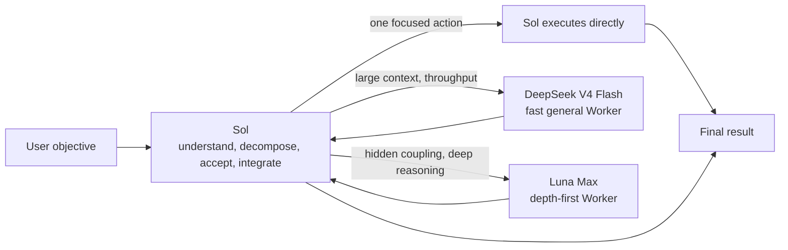

<div align="center">
  <h1>Sol Worker Routing for Codex</h1>
  <p><strong>Send each task to the Worker that fits it.</strong></p>
  <p>Reduce the problem from first principles, route by work shape, and keep only the process and evidence needed to decide.</p>
  <p>
    <a href="README.md">简体中文</a> ·
    <strong>English</strong> ·
    <a href="CHANGELOG.md">Changelog</a>
  </p>
  <p>
    <a href="https://github.com/liuyejinghong/sol-worker-routing-codex/tags"></a>
    <a href="https://github.com/liuyejinghong/sol-worker-routing-codex/stargazers"></a>
  </p>
</div>

## What problem does it solve?

`Sol Worker Routing` does more than add two subagents to Codex. It combines three ideas in one working method:

- **First principles**: establish the final objective, invariant facts, minimum acceptance, and authorization boundary first. When patches, abstractions, or unrelated process accumulate, return to the root cause and simplify.
- **Route by the actual bottleneck**: Sol keeps the objective and final judgment; DeepSeek V4 Flash uses its speed, low cost, and 1M context for large-input and throughput-sensitive bounded work; Luna Max gets the time needed for depth-first reasoning. Simple work stops consuming excess tokens, while deep work is not killed merely because it stays silent for a while.
- **Less process, more useful evidence**: TDD, spec-first work, fixed review rounds, and extra tooling are never goals by themselves. The default is one focused contract check plus one real-path result check. Add validation only when it protects a concrete risk and failure would change a decision.

Sol stays in the lead to understand the goal, decompose the work, inspect evidence, and deliver the result. Both Workers receive only bounded tasks they can complete and verify independently.

| Executor | Best fit | Typical examples |
|---|---|---|
| **Sol** | Tiny tasks, ambiguity, architecture, and final decisions | Decide whether to change something, integrate results, make a one-step edit |
| **DeepSeek V4 Flash** | Large context and bounded work where speed or throughput matters | Repository-wide analysis, long documents, bulk diagnosis, medium-complexity implementation, structured data |
| **Luna Max** | Hidden coupling, subtle semantics, and long-horizon deep reasoning | Difficult code review, complex diagnosis, critical implementation, cross-module semantic judgment |

## What does the same work cost?

We gave DeepSeek and Luna Max the same two evidence/mechanical tasks. Objectives, scope, acceptance commands, and stop conditions were identical. Both Workers passed **2/2** tasks.

[](benchmarks/report-2026-08-09.md)

| Worker | Tasks passed | Total time | Generated tokens |
|---|---:|---:|---:|
| **DeepSeek** | 2 / 2 | **88 seconds** | **5,081** |
| Luna Max | 2 / 2 | 235 seconds | 16,708 |

For the same accepted results, DeepSeek used **147 fewer seconds** and **11,627 fewer generated tokens** - a **62.6%** reduction in time and a **69.6%** reduction in generated tokens. This shows that DeepSeek should not be treated as a cheap search utility: with a clear contract, it can finish real code work faster. It does not prove that both models are interchangeable on every long-horizon task, so routing still follows context, throughput, and reasoning depth.

> This is a measured result from two paired tasks, not a general model ranking. Generated tokens are `output tokens + reasoning tokens`, a workload comparison within the same client rather than a dollar bill or total-token count. See the [full report](benchmarks/report-2026-08-09.md) for methods, task-level results, and limitations, or inspect the raw [CSV](benchmarks/pilot-2026-08-09.csv). [`render_readme_chart.py`](benchmarks/render_readme_chart.py) generates the chart directly from that CSV.

## How routing works



DeepSeek and Luna Max are peer leaf Workers, not stages in a hierarchy. Sol owns task recognition, material discovery, decomposition, dispatch, acceptance, and the final conclusion. For everyday use, we recommend `gpt-5.6-sol` at **medium** effort: it is enough for most routing and integration without erasing the savings in the lead thread. Move to high only for ambiguous architecture, conflicting evidence, high-stakes decisions, or complex synthesis. The Skill describes this policy but cannot change the model or effort selected for the current task.

The workflow also follows one deliberately simple rule: if Sol can finish the task in one focused action, it does not delegate merely to use a subagent. Handoffs cost time and tokens too.

## Where DeepSeek's 1M context pays off

DeepSeek V4 Flash is a fast, low-cost general Worker rather than an evidence-only extractor. Its 1M context can keep a large repository, long document set, or batch of records coherent instead of fragmenting the material early to fit a smaller window.

The OpenCode Go route has passed a real request beyond 256K: the direct bridge reported **260,093 input tokens**, and the same input returned both boundary markers through Codex end to end. This proves that the current route crosses 256K, not that the full 1M limit has been saturated. See the [long-context acceptance record](benchmarks/long-context-acceptance-2026-08-10.md) for the method and limitation.

| Input or task | What DeepSeek can return to Sol |
|---|---|
| Fixed webpages, papers, or long documents | Evidence table with source, date, core fact, support, and limitations |
| Large repositories or diffs | Architecture relationships, call sites, configuration references, repeated patterns, and review candidates |
| CI output, runtime logs, or incident records | Error classes, frequency, and timeline |
| Issues, pull requests, or release records | Deduplicated items, module groups, and status lists |
| CSV, JSON, or API snapshots | Reconciliation results, missing records, and anomaly candidates |
| Localization and dependency data | Missing keys, placeholder differences, version matches, and affected-file candidates |
| Clearly bounded multi-file work | Semantic analysis, implementation changes, and named acceptance results |

Web research uses one clear handoff: **Sol performs the minimum useful search and source judgment, fixes the URLs, and saves the relevant page text or excerpts as local artifacts; DeepSeek reads only those materialized sources and compresses the evidence; Sol checks the primary sources, resolves conflicts, and writes the conclusion.** A URL alone is not a complete handoff because the OpenCode Go Worker may have neither built-in web tools nor outbound network access. This keeps large webpage contexts out of repeated premium-model passes without outsourcing open-ended discovery or source credibility.

Concurrency is adaptive rather than permanently capped at two. Sol starts with two Workers to validate the packet contract. If the first results pass and the remaining material is genuinely independent and read-only, Sol may expand DeepSeek to **four active Workers**. Write-bearing DeepSeek and Luna work stays at two or fewer with fully disjoint ownership; work touching the same write surface remains sequential.

## Let deep reasoning finish

A completed wait poll means only that no final result arrived during that polling window. It does not mean the Worker failed. Sol must not interrupt Luna because it is silent, slower than expected, has not written files yet, or because the packet looks larger after dispatch. When progress matters, Sol asks for a non-terminating checkpoint and keeps waiting.

Interruption is reserved for user cancellation, obsolete work, observed scope or authorization violations, repeated concrete execution errors, or resource deadlock that blocks the parent task. Packet sizing happens before dispatch; a deep Worker must not spend reasoning tokens only to be killed and repackaged as a cost-control reaction.

## Install

The easiest path is to give this prompt directly to Codex:

```text
Install https://github.com/liuyejinghong/sol-worker-routing-codex for my Codex user profile.
Read and follow the repository AGENTS.md first. Preserve my existing Codex configuration
and do not overwrite conflicts. Have the installer inspect the existing DeepSeek provider
and run a real route first. Preserve it when it works; only repair a proven failure
with a mechanism supported by the current Codex client and host. Do not send me away to discover the schema.
```

Or install from a terminal:

```bash
git clone https://github.com/liuyejinghong/sol-worker-routing-codex.git
cd sol-worker-routing-codex
bash scripts/install.sh
```

### Choose a DeepSeek upstream

DeepSeek Worker supports two configurations. Both use the same `deepseek_worker` name, **1M model context**, and routing rules, and both currently expose only **DeepSeek V4 Flash**. The difference is where usage is billed and whether a local protocol bridge is required.

| Configuration | Best for | Request path | Runtime requirement |
|---|---|---|---|
| **Official DeepSeek API (default)** | Users with official DeepSeek API credentials who want a direct connection | Codex → DeepSeek API | No local bridge |
| **OpenCode Go** | OpenCode Go subscribers who want to use the subscription's V4 Flash allowance | Codex → local LiteLLM → OpenCode Go | The bridge must stay running while in use |

When handing installation to Codex, append either “use the official DeepSeek API” or “use OpenCode Go” to the installation prompt above. The official API is selected when no preference is stated.

Use the official DeepSeek API when you do not have a reason to choose Go. The explicit command below is equivalent to running `bash scripts/install.sh` without an option:

```bash
bash scripts/install.sh --deepseek-provider deepseek-api
```

The installation Agent checks the existing official provider and credentials, then verifies the route with an obvious read-only task. A working configuration is preserved instead of being rebuilt because the installer cannot see one particular credential backend.

For OpenCode Go, select the Go Worker and then start the local bridge:

```bash
bash scripts/install.sh --deepseek-provider opencode-go
bash scripts/run-opencode-go-bridge.sh
```

This uses the API included with the OpenCode Go subscription and does not install or configure the OpenCode application. Go exposes V4 Flash through `chat/completions`, while the Codex provider uses the Responses API. Local LiteLLM translates the protocol and normalizes tool history into the adjacent `tool_calls → tool results` order Go accepts. Supply the API key through the hidden startup prompt or `OPENCODE_API_KEY`; it is not written to the repository or Codex TOML. Restart the bridge after its process stops or the computer reboots.

For either configuration, the installation Agent owns the matching provider setup and one real Worker verification. A profile file, health check, or successful text request does not replace acceptance of a tool-using task.

The installation flow handles all of the following:

1. Install `deepseek_worker`, `luna_worker`, and the `sol-worker-routing` Skill.
2. Inspect the selected DeepSeek upstream and verify it with an obvious bounded task.
3. Preserve a working setup instead of reinstalling it because one environment variable or credential backend is not visible.
4. Only after a real invocation fails, repair the provider and authentication using mechanisms supported by the current Codex client and operating system.

Users do not need to learn the provider schema or edit TOML. If a service credential is truly missing, the installation Agent guides the secure input supported by the current environment instead of prescribing Keychain, an environment variable, or another platform-specific backend. If the current task cannot see a newly installed Worker, the Agent asks only for a new task; the Skill then runs the route probe automatically.

Account-level personalization is the one step the repository cannot perform: paste one complete language block from [`personalization.md`](personalization.md) into Codex App **Settings → Personalization → Custom Instructions**.

## What using it looks like

You do not need to select a Worker manually. Describe the objective normally and Sol first decides whether a handoff is worthwhile:

```text
At this pinned commit, find the setting's default and every call site. Cite a line for each claim.
```

With fixed sources and acceptance, this fits DeepSeek.

```text
Find and fix the relevant URL set first, then save the page text or relevant excerpts.
Have DeepSeek extract claims, figures, dates, and evidence limitations from those local materials;
then verify the primary sources and give me the conclusion.
```

That is the standard split for context-heavy web work: Sol searches and selects, DeepSeek reads and reduces, and Sol verifies and synthesizes.

```text
Read the full service directory and migration note, find every legacy configuration call site,
complete the migration inside the assigned files, and run the target tests.
```

This fits DeepSeek when the material is large but scope, write ownership, and acceptance are explicit.

```text
Diagnose this intermittent concurrency leak across scheduling, cancellation, and cleanup.
Explain the hidden coupling, make the smallest fix, and prove re-entry semantics remain intact.
```

This fits Luna Max because depth and subtle semantics matter more than latency. Once dispatched, it should be allowed to finish instead of being interrupted for a quiet period.

```text
Decide whether this requirement justifies changing the architecture, then recommend the final approach.
```

This stays with Sol because a Worker must not redefine the parent objective or own the final decision.

<details>
<summary>See the task contract Sol gives a Worker</summary>

```text
Worker and mode:
Objective:
Scope and owned paths:
Relevant facts / source pins:
Non-goals:
Acceptance criteria:
Verification:
State-based stop condition:
Return format:
```

This is not another user-facing process. It is the minimum context Sol provides behind the scenes. When the packet is insufficient, a Worker returns an exact blocker instead of widening its own scope.

</details>

## Installation boundaries and project files

The repository installer writes only two Agent profiles and one Skill. It can safely upgrade the known previous Skill release; any other different content stops the install before it is overwritten:

```text
~/.codex/agents/deepseek-worker.toml
~/.codex/agents/luna-worker.toml
~/.agents/skills/sol-worker-routing/SKILL.md
```

| File | Purpose |
|---|---|
| [`personalization.md`](personalization.md) | Global routing preference that you paste manually |
| [`skills/sol-worker-routing/SKILL.md`](skills/sol-worker-routing/SKILL.md) | Sol's routing, acceptance, and integration rules |
| [`agents/`](agents/) | DeepSeek API, OpenCode Go, and Luna Max Worker profiles |
| [`providers/`](providers/) | Single-model OpenCode Go bridge and Codex provider template |
| [`scripts/install.sh`](scripts/install.sh) | Conflict checks, minimal install, and old-name migration |
| [`benchmarks/`](benchmarks/) | Benchmark cases, raw data, and the full report |

The provider is not a fixed repository-installer output. The installation Agent judges the existing setup by a real route first and only repairs a confirmed failure using mechanisms supported by the current client and host. OpenCode Go mode adds only a local Responses bridge and its provider; it does not modify the OpenCode application or write the key to the repository, chat, or `config.toml`. A known `sol-luna-workflow` installation is also migrated only when its content matches a prior release and the path is not a symbolic link. Unknown content is never overwritten or removed.

This is a community workflow, not an OpenAI preset. A profile file or Worker self-report is not route proof by itself; use client-exposed subagent information and the accepted task result.

## References

- [Codex subagents and custom agents](https://developers.openai.com/codex/agent-configuration/subagents)
- [Codex Skills and discovery paths](https://developers.openai.com/codex/skills)
- [Codex instruction discovery](https://developers.openai.com/codex/guides/agents-md)
- [OpenCode Go models and API endpoints](https://opencode.ai/docs/zh-cn/go/)
- [LiteLLM Responses API bridge](https://docs.litellm.ai/docs/response_api)
- [Oh My OpenAgent orchestration reference](https://github.com/code-yeongyu/oh-my-openagent)
