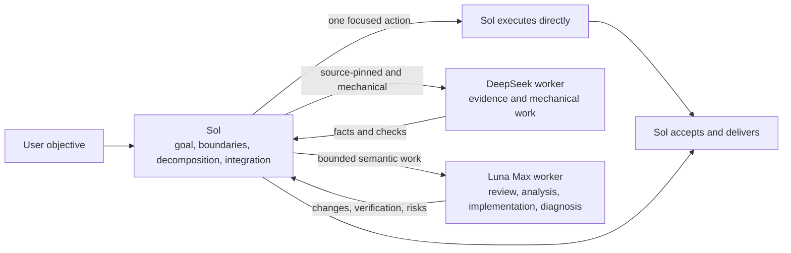

<div align="center">
  <h1>Sol + DeepSeek + Luna Codex Workflow</h1>
  <p><strong>Sol owns goals and judgment. DeepSeek handles mechanically checkable evidence. Luna Max handles bounded semantic execution.</strong></p>
  <p>An agent-deployable dual-worker workflow for Codex, with first-principles limits on over-programming, over-testing, and performative parallelism.</p>
  <p>
    <a href="README.md">简体中文</a> ·
    <strong>English</strong> ·
    <a href="CHANGELOG.md">Changelog</a>
  </p>
  <p>
    <a href="https://github.com/liuyejinghong/sol-luna-codex-workflow/tags"></a>
    <a href="https://github.com/liuyejinghong/sol-luna-codex-workflow/stargazers"></a>
  </p>
</div>

## Install in three steps

This repository is written for both people and agents. Its [`AGENTS.md`](AGENTS.md) grants an installer permission to write only two custom-agent files and one Skill; the installer checks every destination first and stops before overwriting different content.

```text
Install https://github.com/liuyejinghong/sol-luna-codex-workflow for my Codex user profile.
Read and follow the repository AGENTS.md first. Preserve my existing Codex configuration
and do not overwrite conflicts. Verify deepseek_worker, luna_worker, and the
sol-luna-workflow Skill after installation, then tell me which manual steps remain.
```

Or install it locally:

```bash
git clone https://github.com/liuyejinghong/sol-luna-codex-workflow.git
cd sol-luna-codex-workflow
bash scripts/install.sh
```

The installer writes only:

```text
~/.codex/agents/deepseek-worker.toml
~/.codex/agents/luna-worker.toml
~/.agents/skills/sol-luna-workflow/SKILL.md
```

Then paste one complete language block from [`personalization.md`](personalization.md) into Codex App **Settings → Personalization → Custom Instructions**. Repository files and `AGENTS.md` cannot replace account-level personalization. A restart is normally unnecessary; start a new task to verify routing.

The DeepSeek lane also requires an existing Codex provider named `deepseek` and usable credentials. The installer never edits `config.toml`, imports credentials, or enables a provider. If the provider is unavailable, Sol must not claim that DeepSeek ran.

## One lead, three execution paths

The task card is not a Codex UI feature. It is the compact execution contract that Sol gives a Worker after reducing ambiguity to an observable outcome.



| Work shape | Route | Reason |
|---|---|---|
| Tiny task that finishes in one focused action | Sol directly | Handoff costs more tokens and waiting than execution |
| Source-pinned, read-heavy, mechanically verifiable evidence | `deepseek_worker` | A compact evidence chain and fixed command can decide acceptance |
| Code review, module analysis, isolated implementation, focused diagnosis | `luna_worker` | The bounded result still needs non-trivial code understanding |
| Ambiguity, coupling, shared state, architecture, final decision | Sol | A Worker must not make the parent judgment |

DeepSeek and Luna are peer leaf workers, not a hierarchy. Only an evidence-then-implementation flow is ordered as `DeepSeek → Sol → Luna`. Shared state, ordered dependencies, or overlapping writes are sequential. The default is at most two workers at depth one, and workers never delegate again.

## What a Worker receives

Sol owns decomposition; a Worker does not discover its own scope. Each packet includes only the facts needed to complete one outcome:

```text
Worker and mode:
Objective:
Scope and owned paths:
Relevant facts / source pins:
Non-goals:
Acceptance criteria:
Verification:
Stop condition:
Return format:
```

DeepSeek is read-only by default. It may make a minimal patch only when writable paths, mechanical acceptance, and approval are explicit. Luna may implement or diagnose an isolated change, but it cannot alter the parent objective, architecture, priorities, or authorization boundary. An insufficient packet must return an exact blocker rather than widen the investigation.

A complete DeepSeek packet can look like this:

```text
Worker and mode: deepseek_worker | read-only evidence
Objective: Explain a setting's default and call site at the named commit.
Scope and owned paths: README.md, src/options.ts; no writes.
Relevant facts / source pins: repository@<immutable-sha>.
Non-goals: No architecture advice, dependency install, or other branches.
Acceptance criteria: file:line for every claim; run the named read-only command.
Verification: git status --short and the supplied assertion command.
Stop condition: Return a blocker if the commit or fact is absent locally.
Return format: Facts; command result; files changed; risks.
```

## Why not send every task to the cheaper model?

The [DeepSeek update from July 31, 2026](https://api-docs.deepseek.com/updates/) states that `deepseek-v4-flash` supports the Responses API and is adapted for Codex. That supports an evidence lane only after Sol has reduced the task to fixed sources and mechanical acceptance; it does not make an ambiguous request safe to delegate.

The [DeepSWE v1.1 cost leaderboard](https://deepswe.datacurve.ai/) page updated August 7, 2026 reports `deepseek-v4-flash[max]` at 53%±4% and $0.10/task, versus `gpt-5.6-luna[max]` at 67%±4% and $0.61/task. The first is about 83.6% cheaper in that benchmark; the second has a higher success rate on its long-horizon engineering tasks. This is not a universal winner/loser claim. It is the reason to separate mechanical evidence from semantic execution.

[](https://deepswe.datacurve.ai/)

The image is a historical snapshot; use the linked live page for current figures and update date.

The topology does not require a worker for every task. Tiny tasks remain with Sol, so model-price savings do not create more handoff cost. Bounded work that needs semantic judgment remains with Luna Max, so a low-cost route does not create avoidable rework from an incomplete task.

## Reproducible pilot benchmark

The repository includes four common open-source task shapes: source fact finding, failure diagnosis, narrow mechanical patching, and bounded code review. Each uses a fixed GitHub commit, PR, or discussion and runs only in a disposable public worktree. The case catalog, commands, raw aggregate data, chart, and limitations are in [`benchmarks/README.md`](benchmarks/README.md) and [`benchmarks/report-2026-08-09.md`](benchmarks/report-2026-08-09.md).

[](benchmarks/report-2026-08-09.md)

In the two paired acceptance tests, both workers passed. Routing source-pinned evidence and mechanical patching to DeepSeek reduced Worker wall time from 235 to 88 seconds and generated tokens from 16,708 to 5,081. This is two single-run pairs, not a billing estimate or general quality ranking; it validates only the intended lane boundary.

## Constrain the working method, not the development process

TDD, spec-first work, and fixed review rounds can be useful, but they should not become the model's objective. As model capability rises, a heavy process can lead the agent to create more abstractions, tests, reviewers, and tools until effort no longer serves the original problem.

This repository does not prescribe a development process. It requires a final objective, invariant facts, minimum acceptance criteria, and authorization boundary before choosing the shortest direct path that can be verified. Before adding any test, gate, dry run, review, or tool, the agent must answer what irreversible risk it protects, what decision changes on failure, and why cheaper existing evidence is insufficient.

The default is one focused contract check plus one real-path result check. Do not repeat validation when the candidate and facts have not changed. If verification costs more than implementation, or two consecutive steps repair only the validation layer without adding facts about the original objective, stop expanding the toolchain and return to the root problem.

## No always-on cost probe

A Skill cannot reliably intercept every invocation. Instrumenting each task would add context, I/O, and privacy surface, and could make measurement itself into a process burden. This repository therefore does not count tokens or estimate dollars during normal delegation.

Use an optional diagnostic only when the user explicitly asks for cost analysis or a benchmark rerun. Sol can record the worker, model/effort, start/end time, terminal status, and acceptance result; it records usage only when the client exposes native data and marks it unknown otherwise. It never stores full conversations, source code, secrets, or a fabricated bill.

## Configuration and safety boundaries

| File | Responsibility |
|---|---|
| [`personalization.md`](personalization.md) | App-level routing preference; manually pasted |
| [`skills/sol-luna-workflow/SKILL.md`](skills/sol-luna-workflow/SKILL.md) | Sol's direct gate, routing, packet, verification, and integration rules |
| [`agents/deepseek-worker.toml`](agents/deepseek-worker.toml) | DeepSeek evidence/mechanical worker profile and boundary |
| [`agents/luna-worker.toml`](agents/luna-worker.toml) | Luna Max semantic-execution worker profile and boundary |
| [`scripts/install.sh`](scripts/install.sh) | Conflict-first, minimal installation and legacy Skill migration |
| [`AGENTS.md`](AGENTS.md) | Authorization contract for an Agent installing this repository |
| [`benchmarks/`](benchmarks/) | Reproducible cases, data, and pilot report |

The installer does not edit `config.toml`, other agents, other Skills, global or project `AGENTS.md`, or Codex App settings. It migrates the old `~/.codex/skills/sol-luna-workflow/SKILL.md` only when content is identical and neither it nor its directory is a symbolic link. Agents use `${CODEX_HOME:-~/.codex}`; the Skill uses the official user path `~/.agents/skills`.

This is a community workflow, not an OpenAI preset. After installation, delegate one obvious read-only task and inspect client-exposed subagent metadata. A Worker saying its model name in text is not evidence of effective routing.

The author environment used `codex-cli 0.147.0-alpha.6.5` for a DeepSeek read-only and minimal-patch smoke test and parsed both TOML files. This client may still show metadata-fallback or model-list warnings for the custom DeepSeek model. That does not imply every task fails, but a call or routing error makes the DeepSeek lane unavailable; do not silently attribute another route to it.

## Usage observation

The embed below is the author's aggregate Codex usage. It can show the overall Sol, Luna, and DeepSeek distribution, but it does not prove that every token was caused by this repository and does not replace task-level acceptance.

[](https://tokens.ci/u/liuyejinghong)

## References

| Topic | Source |
|---|---|
| Codex subagents and custom agents | [OpenAI Developers](https://developers.openai.com/codex/agent-configuration/subagents) |
| Codex Skills and discovery paths | [OpenAI Developers](https://developers.openai.com/codex/skills) |
| Codex instruction discovery | [OpenAI Developers](https://developers.openai.com/codex/guides/agents-md) |
| DeepSeek V4-Flash update | [DeepSeek API Docs](https://api-docs.deepseek.com/updates/) |
| DeepSWE v1.1 leaderboard | [DataCurve](https://deepswe.datacurve.ai/) |
| Orchestration reference | [code-yeongyu/oh-my-openagent](https://github.com/code-yeongyu/oh-my-openagent) |
