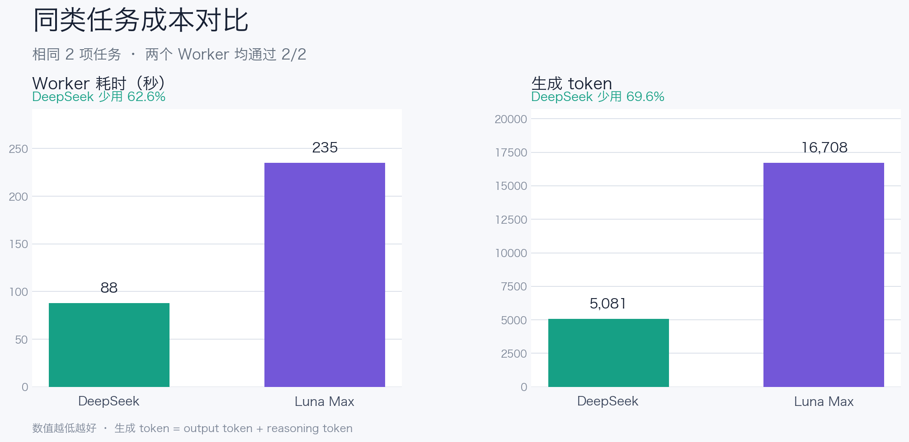
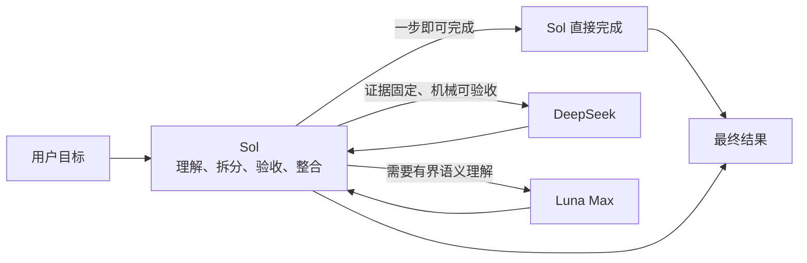

<div align="center">
  <h1>Sol Worker Routing for Codex</h1>
  <p><strong>把合适的任务，交给合适的 Worker。</strong></p>
  <p>先从第一性原理收敛问题，再按任务分流，只保留足够完成判断的流程与证据。</p>
  <p>
    <strong>简体中文</strong> ·
    <a href="README.en.md">English</a> ·
    <a href="CHANGELOG.md">更新日志</a>
  </p>
  <p>
    <a href="https://github.com/liuyejinghong/sol-worker-routing-codex/tags"></a>
    <a href="https://github.com/liuyejinghong/sol-worker-routing-codex/stargazers"></a>
  </p>
</div>

## 它解决什么问题

`Sol Worker Routing` 不只是给 Codex 增加两个子代理。它把三件事放进同一套工作方式里：

- **第一性原理**：先明确最终目标、不可变事实、最小验收标准和授权边界，出现重复补丁、额外抽象或无关流程时，回到根因重新简化。
- **按任务分流**：Sol 保留目标和最终判断；DeepSeek 处理来源固定、可机械验收的工作；Luna Max 处理需要语义理解的有界任务。简单任务不再消耗过多时间和 token，模糊问题也不会被过早分散给多个子代理。
- **少一些流程，多一些有效证据**：不把 TDD、spec-first、固定审查轮次或更多工具当成目标。默认只做一次聚焦合同检查和一次真实链路结果核对；新增验证之前，先确认它保护了什么具体风险，以及失败是否真的会改变决策。

Sol 始终留在主线程，负责理解目标、拆分任务、检查证据和交付结果。两个 Worker 只接收边界明确、能够独立完成并验收的任务。

| 执行者 | 最适合的工作 | 典型例子 |
|---|---|---|
| **Sol** | 极小任务、模糊问题、架构与最终决策 | 判断是否该改、整合多个结果、直接完成一步修改 |
| **DeepSeek** | 来源固定、偏阅读、可机械验收 | 查找代码事实、整理证据、完成单文件机械补丁 |
| **Luna Max** | 有明确边界、但需要语义理解 | 代码审查、模块分析、独立实现、聚焦排障 |

## 同类任务，成本差多少

我们把相同的两项证据/机械任务分别交给 DeepSeek 和 Luna Max。任务目标、范围、验收命令和停止条件完全一致，两个 Worker 都通过了 **2/2** 项验收。

[](benchmarks/report-2026-08-09.md)

| Worker | 通过任务 | 总耗时 | 生成 token |
|---|---:|---:|---:|
| **DeepSeek** | 2 / 2 | **88 秒** | **5,081** |
| Luna Max | 2 / 2 | 235 秒 | 16,708 |

在相同验收结果下，DeepSeek 少用了 **147 秒**和 **11,627 个生成 token**，对应耗时减少 **62.6%**、生成 token 减少 **69.6%**。这说明把来源固定、可机械验收的工作从 Luna Max 分流出去，能够显著降低这一类任务的 Worker 成本。

> 这是两项配对任务的实测结果，不是通用模型排名。生成 token 为 `output token + reasoning token`，用于比较同一客户端内的工作量，不等同于美元账单或总 token。复现方法、逐项结果和样本限制见[完整报告](benchmarks/report-2026-08-09.md)，原始数据见 [CSV](benchmarks/pilot-2026-08-09.csv)。图表由 [`render_readme_chart.py`](benchmarks/render_readme_chart.py) 直接从 CSV 生成。

## 路由是怎样工作的



DeepSeek 与 Luna Max 是并列的叶子 Worker，不是前后级关系。Sol 只在任务可以独立完成、范围不重叠时才并行；存在共享状态、顺序依赖或同一写入面时，任务会按顺序执行。

这个分工还有一个简单但重要的原则：如果 Sol 一步就能完成，就不为“使用子代理”而交接。交接本身也会消耗时间和 token。

## 安装

最简单的方式，是把下面这段话直接交给 Codex：

```text
请为我的 Codex 用户配置安装 https://github.com/liuyejinghong/sol-worker-routing-codex 。
先读取并遵守仓库里的 AGENTS.md，保留现有 Codex 配置，遇到冲突不要覆盖。
由安装流程检查并配置 DeepSeek provider，通过安全提示录入缺失的凭据，
不要让我自己编辑 config.toml。安装后验证两个 Worker、Skill 和一次真实的只读路由。
```

也可以在终端安装：

```bash
git clone https://github.com/liuyejinghong/sol-worker-routing-codex.git
cd sol-worker-routing-codex
bash scripts/install.sh
```

安装流程会自动完成这些工作：

1. 安装 `deepseek_worker`、`luna_worker` 和 `sol-worker-routing` Skill。
2. 检查 `deepseek` provider；缺失时只添加预期的配置段。
3. 检查 DeepSeek 凭据；缺失时打开隐藏输入，并把密钥保存到 macOS Keychain。
4. 用一个答案明确的只读任务验证真实路由，而不是只检查配置文件。

使用者不需要研究 provider 格式或手动修改 TOML，只需在安全提示出现时输入自己的 DeepSeek API key。安装 Agent 如果在当前任务中还看不到新 Worker，只会请你新建一个任务，随后由 Skill 自动完成路由探针。

唯一无法由仓库自动完成的是账号级个性化：从 [`personalization.md`](personalization.md) 复制一个完整语言块，粘贴到 Codex App 的“设置 → 个性化 → 自定义指令”。

## 实际使用方式

安装后不需要手动指定每个 Worker。正常描述目标即可，Sol 会先判断是否值得交接：

```text
查清这个固定提交里配置项的默认值和调用位置，每条结论给出行号。
```

来源和验收都固定时，适合交给 DeepSeek。

```text
审查这个模块的取消与资源清理路径，只报告能够定位和复现的问题。
```

需要跨文件语义理解，但范围清楚时，适合交给 Luna Max。

```text
判断这次需求是否值得改变现有架构，并给出最终方案。
```

这类问题保留给 Sol，因为 Worker 不应替主线程改变目标或做最终决策。

<details>
<summary>查看 Sol 交给 Worker 的任务合同</summary>

```text
Worker and mode:
Objective:
Scope and owned paths:
Relevant facts / source pins:
Non-goals:
Acceptance criteria:
Verification:
Stop condition:
Return format:
```

这不是额外的用户流程，而是 Sol 在后台给 Worker 的最小上下文。任务信息不足时，Worker 应返回明确的 blocker，而不是自行扩大范围。

</details>

## 安装边界与项目文件

安装器写入两个 Agent 配置、一个 Skill、预期的 DeepSeek provider 配置段和一项 macOS Keychain 凭据；已知上一版 Skill 可以安全升级，遇到其他不同内容会在覆盖前停止：

```text
~/.codex/agents/deepseek-worker.toml
~/.codex/agents/luna-worker.toml
~/.agents/skills/sol-worker-routing/SKILL.md
~/.agents/skills/sol-worker-routing/scripts/configure_deepseek_provider.py
[model_providers.deepseek] in ~/.codex/config.toml
com.openai.codex.deepseek-api-key in macOS Keychain
```

| 文件 | 用途 |
|---|---|
| [`personalization.md`](personalization.md) | 需要手动粘贴的全局路由偏好 |
| [`skills/sol-worker-routing/SKILL.md`](skills/sol-worker-routing/SKILL.md) | Sol 的分流、验收和整合规则 |
| [`agents/`](agents/) | DeepSeek 与 Luna Max 的 Worker 配置 |
| [`scripts/install.sh`](scripts/install.sh) | 冲突检测、最小安装、provider 配置和旧名称迁移 |
| [`skills/sol-worker-routing/scripts/configure_deepseek_provider.py`](skills/sol-worker-routing/scripts/configure_deepseek_provider.py) | 随 Skill 安装的 provider 与 Keychain 配置脚本 |
| [`benchmarks/`](benchmarks/) | 基准案例、原始数据与完整报告 |

provider 脚本只会在配置缺失时添加已知段落；不同的现有 `[model_providers.deepseek]` 会被视为冲突。密钥不会写入仓库、聊天记录或 `config.toml`。已知旧版 `sol-luna-workflow` 也只会在内容与历史版本一致、且路径不是符号链接时迁移；未知内容不会被覆盖或删除。

这是社区工作流，不是 OpenAI 官方预设。配置文件和 Worker 自述不能单独证明路由成功，应以客户端实际返回的子代理信息和任务验收结果为准。

## 参考资料

- [Codex 子代理和自定义 Agent](https://developers.openai.com/codex/agent-configuration/subagents)
- [Codex Skills 与发现路径](https://developers.openai.com/codex/skills)
- [Codex 指令发现顺序](https://developers.openai.com/codex/guides/agents-md)
- [Oh My OpenAgent 编排参考](https://github.com/code-yeongyu/oh-my-openagent)
