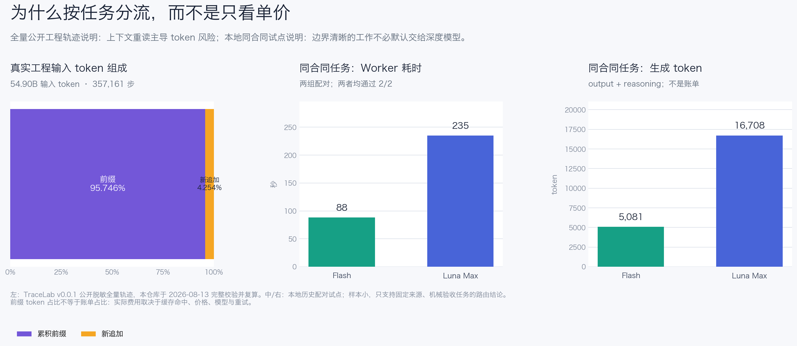
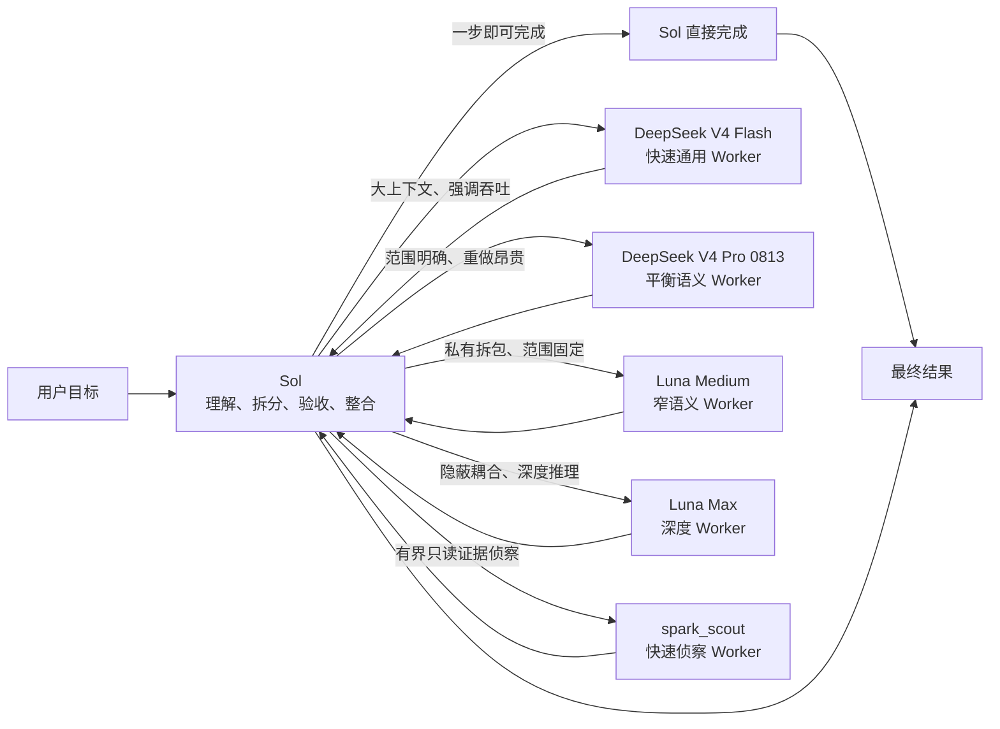

<div align="center">
  <h1>Sol Worker Routing for Codex</h1>
  <p><strong>把合适的任务，交给合适的 Worker。</strong></p>
  <p>先从第一性原理收敛问题，再按任务分流，只保留足够完成判断的流程与证据。</p>
  <p>
    <strong>简体中文</strong> ·
    <a href="README.en.md">English</a> ·
    <a href="CHANGELOG.md">更新日志</a>
  </p>
  <p>
    <a href="https://github.com/liuyejinghong/sol-worker-routing-codex/tags"></a>
    <a href="https://github.com/liuyejinghong/sol-worker-routing-codex/stargazers"></a>
  </p>
</div>

## 它解决什么问题

`Sol Worker Routing` 不只是给 Codex 增加五个子代理。它把四件事放进同一套工作方式里：

- **第一性原理**：先明确最终目标、不可变事实、最小验收标准和授权边界，出现重复补丁、额外抽象或无关流程时，回到根因重新简化。
- **范围经济（HERO 提炼）**：把 `H`（无消费者的哈希/指纹）、`E`（不可达输入的防御）、`R`（没有活的不确定性的审查循环）和 `O`（没有直接需求的防御性脚手架）当作诊断标签。它约束提议怎么做，不压掉真实可达的问题；新增检查必须说明具体失败和会改变的下一步。[来源与案例](https://github.com/wanshuiyin/HERO-Anti-OverDefense)
- **按真正瓶颈分流**：Sol 保留目标和最终判断；DeepSeek V4 Flash 用速度、低成本和 1M 上下文处理大输入与强调吞吐的有界工作；DeepSeek V4 Pro 0813 处理范围已收敛、但一次错判返工更贵的中高语义任务；Luna Medium 处理需要 Sol 私有拆包、但范围和验收已固定的窄任务；Luna Max 用更长时间完成隐蔽耦合与深度推理；新增的 `spark_scout` 只做 `gpt-5.3-codex-spark`、`xhigh`、只读的有界证据侦察。简单任务不再消耗过多时间和 token，深度任务也不会因为暂时沉默而被提前终止。
- **少一些流程，多一些有效证据**：不把 TDD、spec-first、固定审查轮次或更多工具当成目标。默认只做一次聚焦合同检查和一次真实链路结果核对；新增验证之前，先确认它保护了什么具体风险，以及失败是否真的会改变决策。

### HERO 是如何融入的

HERO 在这里不是第六个 Worker，也不是新的固定 gate。它首先是主 Agent 始终生效的行为合同，然后由每个 Worker profile 直接携带同一份精简规则；它不依赖是否发生路由，也不依赖子代理能否继承主上下文。查找问题可以充分，提出修法必须收敛；真实可达的问题不能因为看起来罕见而被压掉，纯理论可构造的问题也不能自动长成防御工程。

| 入口 | 作用 |
|---|---|
| `personalization.md` | 用户手动复制后，成为主 Agent 的账号级常驻合同；保留完整诊断、负面形状和四个关键反例 |
| `AGENTS.md` | 以中等长度校准版直接约束本仓库里的主 Agent，不论任务是否委派 |
| 五个 Agent profile | 让每个 Worker 直接携带精简 HERO，不依赖上下文继承或 Skill 触发 |
| `sol-worker-routing` Skill | 定义完整 H/E/R/O 诊断，并要求 Sol 在路由前先约束自己的工作 |

这套核心判断对代码、文档、研究、数据处理和 Agent 编排都通用；具体威胁模型、不可逆风险以及必要的安全、迁移、数据完整性、发布、授权和校验要求不通用，必须以用户和项目合同为准。它是自然语言工作约束，不是强制执行的安全边界。常驻合同只带有限的正反案例用于校准；HERO 的完整案例库不会被安装或塞进每次上下文，只在需要辨别具体模式时作为外部参考。

Sol 始终留在主线程，负责理解目标、判断是否适合交接、检查证据和交付结果。Luna Medium 与 Luna Max 都能接收 Sol 拆出的独立任务包；Medium 只接收路径、非目标和验收已固定的窄包，发现隐蔽耦合时必须交回 Sol 决定是否升级到 Max。DeepSeek 当前只接收完整的用户请求作为唯一原生初始任务：客户端支持时用 `fork_turns="1"` 继承，否则只能逐字复制当前请求，下面会说明这项临时边界。

| 执行者 | 最适合的工作 | 典型例子 |
|---|---|---|
| **Sol** | 极小任务、模糊问题、架构与最终决策 | 判断是否该改、整合多个结果、直接完成一步修改 |
| **DeepSeek V4 Flash** | 大量上下文、强调速度和吞吐的有界工作 | 全库分析、长文档、批量排障、中等复杂实现、结构化数据 |
| **DeepSeek V4 Pro 0813（本机 full-request 已验证）** | 范围明确、但语义判断密度或重做成本更高的有界工作 | 多文件行为变更、复杂但隔离的诊断、PR 深审、冲突证据综合 |
| **Luna Medium（本机 native route 已验证）** | 需要私有任务包、但范围、路径和验收已固定的窄语义工作 | 指定 diff 审查、已知模块的目标测试排障、受限实现 |
| **Luna Max** | 隐蔽耦合、微妙语义和长程深度推理 | 困难代码审查、复杂排障、关键实现、跨模块语义判断 |
| **`spark_scout`** | 有界、只读、可独立验收的证据侦察 | 定位入口、调用链、配置差异、日志/测试归类，并返回精确证据 |

本工作区已在一个新 Codex 任务中通过 `luna_medium_worker` 的原生 route probe：客户端按该名称创建子代理，并回传 `MEDIUM_ROUTE_PROBE=PASS; 7*8=56`。这只证明当前客户端与该 profile 的命名路由和结果回传可用；每次新安装或重大客户端变更仍须重新 probe。仓库已收录 `spark_scout` profile；它只返回结论、精确证据、不确定性、`blocker` 和窄后续检查，不写文件，也不做架构、发布、风控或最终 verdict。profile 与安装成功都不能替代 Spark 的独立真实 route probe。

## 同类任务，成本差多少

我们把相同的两项证据/机械任务分别交给 DeepSeek 和 Luna Max。任务目标、范围、验收命令和停止条件完全一致，两个 Worker 都通过了 **2/2** 项验收。

[](benchmarks/report-2026-08-09.md)

| Worker | 通过任务 | 总耗时 | 生成 token |
|---|---:|---:|---:|
| **DeepSeek** | 2 / 2 | **88 秒** | **5,081** |
| Luna Max | 2 / 2 | 235 秒 | 16,708 |

在相同验收结果下，DeepSeek 少用了 **147 秒**和 **11,627 个生成 token**，对应耗时减少 **62.6%**、生成 token 减少 **69.6%**。这组结果证明 DeepSeek 不应只被当作廉价搜索器；当合同清楚时，它可以更快完成真实代码工作。它没有证明两个模型在所有长程任务上等价，因此路由仍按上下文、吞吐和推理深度决定。

> 这是两项配对任务的实测结果，不是通用模型排名。生成 token 为 `output token + reasoning token`，用于比较同一客户端内的工作量，不等同于美元账单或总 token。复现方法、逐项结果和样本限制见[完整报告](benchmarks/report-2026-08-09.md)，原始数据见 [CSV](benchmarks/pilot-2026-08-09.csv)。图表由 [`render_readme_chart.py`](benchmarks/render_readme_chart.py) 直接从 CSV 生成。

## 为什么不是“谁便宜就全交给谁”

[](benchmarks/agent-routing-evaluation-2026-08-13.md)

我们验证了公开 TraceLab v0.0.1 的 **357,161** 个真实工程 Agent 步骤：总输入的 **95.746%** 是已有上下文前缀，而不是新追加内容。实际工程成本的主要风险往往是重复建立上下文、无界工具回显、交接与失败重做，而不是最终回答多几百个 token。

因此，项目按“通过验收的一次完成成本”而非单价分流：Flash 负责边界清晰、可机械验证的高吞吐工作；Pro 仅在更高的首次判断质量能避免一次重做时介入；Luna Medium 仅处理私有拆包但合同已清楚的工作，Luna Max 留给隐藏耦合与深度语义；Sol 保留目标、授权和最终判断。完整的公开数据复算、价格公式、厂商能力证据、社区限制与 Pro 验收门槛见[平衡型路由评估](benchmarks/agent-routing-evaluation-2026-08-13.md)。本工作区已通过一条完整、自包含任务的 Pro 原生 route probe；其只证明该受限 lane，不证明私有动态任务包或后续追问可用，见[测试记录](benchmarks/deepseek-pro-route-probe-2026-08-13.md)。

## 路由是怎样工作的



Spark、Flash、Pro、Luna Medium 与 Luna Max 是并列的叶子 Worker，不是前后级关系。Sol 负责全部任务识别、材料发现、拆分、分发、验收和最终结论。Medium 不是 Max 的自动降级：只有私有任务包的范围、所有权和验收都已固定时才可选择；发现隐蔽耦合就返回 blocker，由 Sol 明确选择后续 Max 包。日常推荐使用 `gpt-5.6-sol` 的 **medium**：它足以完成大多数路由与整合，又不会让主线程成本吞掉分流节省；只有架构模糊、证据冲突、高风险决策或复杂整合时再切到 high。Skill 只能规定这套策略，不能替使用者改变当前任务选择的模型档位。

这个分工还有五个简单原则：Sol 一步能完成的任务不做多余交接；Flash 用 1M 上下文承接大型代码库、长文档、批量数据和高网页吞吐；Pro 用于范围明确但一次重做昂贵的语义工作；需要私有拆包但合同清楚时才用 Luna Medium；`spark_scout` 只侦察证据并返回 blocker，不拥有实现、架构、发布、风控或最终判断；Luna Max 则获得完成深度推理所需的时间。

## 路由治理与 Worker 开关

路由先服从当前任务的明确限制，再检查持久 profile 状态、真实 route qualification，最后才按任务瓶颈选择 Worker。用户可以在本次任务中声明“本次不用 DeepSeek”“不要 Spark”“只用 Sol”或“不要任何子代理”；这类软禁用只阻止本次任务后续的新委派，不修改文件，也不自动中止已经运行的 Worker。

持久硬禁用只影响新任务的 Agent 发现状态。启用状态是 `<profile>.toml`，禁用状态是 `<profile>.toml.disabled`；profile 内容保留且可逆恢复。DeepSeek 的停用只改两个 profile 的后缀，不修改 Provider、模型目录或 credentials。`all` 只代表五个 Worker，不包含 Sol；`deepseek` 是 DeepSeek Flash 与 Pro 两条 lane 的组别别名。启用、停用或升级后，需要在新任务中重新加载 Agent；不能声称旧任务已经热更新，也不能用 profile 文件存在证明真实 route 可用。

升级必须逐 lane 保留既有 enabled/disabled 状态。升级中新引入的 lane（例如 Spark）默认写成 disabled，不能因升级自动启用。缺失、双状态、未知内容、符号链接和非普通文件都必须在写入前停止，不能自动修复或猜测用户意图。Provider 和 credentials 不因停用 DeepSeek 而改变。

Spark 的返回格式应包含 `CONCLUSION`、`EVIDENCE`（精确文件、符号、命令输出或 URL）、`UNCERTAINTY`、`BLOCKER` 和 `NEXT CHECKS`。它使用 `gpt-5.3-codex-spark / xhigh / 128K / read-only`，不写文件、不改变工作区或外部状态；遇到写入、上下文溢出、隐藏耦合、架构、发布、风控或最终 verdict 需求时返回 blocker，由 Sol 决定后续路线。DeepSeek 仍维持当前 full-request 限制：优先 `fork_turns="1"`，否则只能逐字复制完整当前用户请求，不能接收 Sol 私有窄包或依赖可靠 follow-up。Luna Medium 仍只接收路径或来源、所有权、非目标和验收都已固定的私有 packet；发现隐蔽耦合、未定根因或长程推理时返回 blocker，由 Sol 决定是否另发 Luna Max packet。

## 安装

最简单的方式，是把下面这段话直接交给 Codex：

```text
请为我的 Codex 用户配置安装 https://github.com/liuyejinghong/sol-worker-routing-codex 。
先读取并遵守仓库里的 AGENTS.md，保留现有 Codex 配置，遇到冲突不要覆盖。
由安装流程检查现有 DeepSeek provider，并先执行一次真实路由。
能用就完整保留；真实调用失败时再按当前 Codex 和系统支持的方式修复，不要让我自己研究配置格式。
```

也可以在终端安装：

```bash
git clone https://github.com/liuyejinghong/sol-worker-routing-codex.git
cd sol-worker-routing-codex
bash scripts/install.sh
```

这条终端命令只安装和迁移五个 profile 状态文件与一个 Skill；它不会配置或验证 provider、凭据、模型目录或真实路由。需要完整安装时，请使用上方交给 Codex 的提示词。

安装器已提供精确的 lane 管理接口：

```bash
bash scripts/install.sh --lane-status
bash scripts/install.sh --disable-lane deepseek
bash scripts/install.sh --disable-lane spark_scout
bash scripts/install.sh --enable-lane deepseek_worker
```

精确 lane 名为 `spark_scout`、`deepseek_worker`、`deepseek_pro_worker`、`luna_medium_worker`、`luna_worker`；未知名称会失败，不能模糊匹配。`deepseek` 同时操作 Flash 与 Pro，`all` 操作五个 Worker 而不包含 Sol。新装时全部 lane 启用；从已识别的旧版本升级时保留原状态，而新引入的 lane 默认 disabled。开关或升级后需要新建 Codex 任务；安装器不声称旧任务会热更新。

安装器会先在目标目录暂存并备份，再替换文件；普通命令失败或 `INT`/`TERM`/`HUP` 会回滚。六个最终 artifact 位于两棵目录树，因此断电或 `SIGKILL` 后不声称跨目录全局原子；最终目标可能保留完整的新旧文件，隐藏的恢复文件也可能残留，重新运行会重新核验并收敛最终状态。

Windows 请在 Git Bash/MSYS Bash 或 WSL 的 Bash 中运行；它不是原生 PowerShell 脚本。Git Bash 请使用 `/c/Users/...` 这类 POSIX 路径（从 Windows 继承到 `HOME` 或 `CODEX_HOME` 的 `C:/...` 会在 MSYS 环境中转换）；WSL 请使用其自身的 POSIX 路径，例如 `/mnt/c/...`。在真实 Windows 安装链路跑通前，这只是兼容路径，不是已验收的平台支持声明。

### DeepSeek 官方直连

DeepSeek Worker 使用 **DeepSeek V4 Flash** 和独立 **DeepSeek V4 Pro 0813** 官方 API profile。请求从 Codex 直接进入 DeepSeek Responses API，原生支持 Codex 内置工具和网页搜索，不需要 LiteLLM、OpenCode Go proxy 或其他常驻桥接进程。Pro 不会替换 Flash，只有独立 route probe 通过后才进入可路由 lane。本工作区的最小 probe 已通过完整任务、只读工具与原生搜索；每次新安装或重大客户端变更仍须重新 probe，且私有动态交接不能据此视为通过。

终端安装器只负责文件安装；保留的显式参数只用于兼容已有安装命令：

```bash
bash scripts/install.sh --deepseek-provider deepseek-api
```

安装 Agent 会检查现有官方 provider 和凭据，安装官方模型目录，再分别核对一个真实工具结果和一次原生网页搜索。已经可用的配置会被保留，不会因为安装流程无法看到某个特定凭据后端而重建。OpenCode Go 暂不接入；等它直接支持 Codex Responses 与工具合同后再重新评估，而不是继续维护 Chat Completions 转换层。

> 当前 Codex 的跨 provider 交接仍有限制，因此 DeepSeek 只在用户请求本身已经完整时启用；它仍是原生子代理，不使用 API runner 或常驻桥接。详细验收边界见[安装记录](benchmarks/official-deepseek-acceptance-2026-08-10.md)和[Pro route probe](benchmarks/deepseek-pro-route-probe-2026-08-13.md)。

交给 Codex 安装 Agent 时，安装流程会自动完成这些工作：

1. 当前实现安装 `spark_scout`（只读证据）、`deepseek_worker`（Flash）、`deepseek_pro_worker`（Pro）、`luna_medium_worker`（Medium）、`luna_worker`（Max）和 `sol-worker-routing` Skill，并以 profile 后缀管理 enabled/disabled 状态。
2. 检查官方 DeepSeek 上游、模型目录和凭据，并用一个答案明确的有界任务验证每个新声明的真实路由。
3. 路由可用时完整保留现有配置，不因为某个环境变量或凭据后端不可见而重装。
4. 只有真实调用失败时，才根据当前 Codex 客户端与操作系统支持的方式修复 provider 和认证。

使用者不需要研究 provider 格式或手动修改 TOML。确实缺少服务凭据时，安装 Agent 只负责引导当前环境支持的安全输入方式，不会预设 Keychain、环境变量或其他平台专属方案。安装 Agent 如果在当前任务中还看不到新 Worker，只会请你新建一个任务，随后由 Skill 自动完成路由探针。

唯一无法由仓库自动完成的是账号级个性化：从 [`personalization.md`](personalization.md) 复制一个完整语言块，手动粘贴到 Codex App 的“设置 → 个性化 → 自定义指令”。这是让 HERO 约束整个主 Agent、而不只约束当前仓库和已安装 Worker 的必要激活步骤。App Personalization 不会自行更新；在完成并确认这一步前，不得声称账号级 HERO 已生效。

## 实际使用方式

安装后不需要手动指定每个 Worker。正常描述目标即可，Sol 会先判断是否值得交接：

```text
查清这个固定提交里配置项的默认值和调用位置，每条结论给出行号。
```

来源和验收都固定时，适合交给 DeepSeek。

```text
让 DeepSeek 搜索这次研究真正相关的一组网页，优先一手来源，返回精确 URL、观点、数据、日期和证据限制；最后复核决定性来源并给我结论。
```

这是高上下文联网任务的标准分工：DeepSeek 搜索、阅读与压缩，Sol 复核与综合。

```text
读取整个服务目录和迁移说明，找出所有旧配置调用点，在指定文件内完成迁移，并运行目标测试。
```

材料很多，但范围、写入所有权和验收明确时，适合交给 DeepSeek V4 Flash。

```text
这个 PR 只改了三个模块。请按指定行为合同检查跨文件影响，给出最多三项可定位风险；不要重构，也不要改变架构建议。每项必须能用现有测试或只读证据验证。
```

范围已经固定，但第一次语义判断的质量会避免整轮返工时，适合交给已通过 route probe 的 DeepSeek V4 Pro 0813。

```text
只检查指定 diff 的行为合同，最多返回三项可定位风险；不要扩展到未指定模块。每项必须能用现有测试或只读证据验证。
```

当 Sol 需要私有拆包、但路径、所有权和验收已经固定时，适合 Luna Medium。它一旦发现隐藏耦合或需要更广的根因判断，必须停止并把 blocker 交回 Sol，而不是自行升级范围。

```text
排查这个偶发并发泄漏。它跨越调度、取消和资源释放路径，需要解释隐藏耦合，完成最小修复并证明不会破坏重入语义。
```

这类深度和隐蔽语义比速度更重要的任务适合 Luna Max。派发后应让它完成，不能因为一段时间没有状态回报而中断。

```text
判断这次需求是否值得改变现有架构，并给出最终方案。
```

这类问题保留给 Sol，因为 Worker 不应替主线程改变目标或做最终决策。

## 安装边界与项目文件

仓库安装器为五个 Agent profile 各写入一个 enabled 或 disabled 状态文件，并写入一个 Skill；每个 profile 只接受自己的已知旧版本内容，遇到其他不同内容、双状态、符号链接或非普通文件会在覆盖前停止：

```text
~/.codex/agents/spark-scout.toml[.disabled]
~/.codex/agents/deepseek-worker.toml[.disabled]
~/.codex/agents/deepseek-pro-worker.toml[.disabled]
~/.codex/agents/luna-medium-worker.toml[.disabled]
~/.codex/agents/luna-worker.toml[.disabled]
~/.agents/skills/sol-worker-routing/SKILL.md
```

| 文件 | 用途 |
|---|---|
| [`personalization.md`](personalization.md) | 需要手动粘贴的全局主 Agent 行为合同与路由偏好 |
| [`skills/sol-worker-routing/SKILL.md`](skills/sol-worker-routing/SKILL.md) | Sol 的分流、验收和整合规则 |
| [`agents/`](agents/) | Spark Scout、DeepSeek Flash、DeepSeek Pro 0813、Luna Medium 与 Luna Max 的 Worker 配置 |
| [`scripts/install.sh`](scripts/install.sh) | 冲突检测、最小安装和旧名称迁移 |
| [`benchmarks/`](benchmarks/) | 基准案例、原始数据与完整报告 |

Provider 不属于仓库安装器的固定写入物。安装 Agent 先以真实路由判断现有配置是否有效；只有确认失败后，才按当前客户端和系统支持的方式处理。凭据不得写入仓库、聊天记录或 `config.toml`。已知旧版 `sol-luna-workflow` 也只会在内容与历史版本一致、且路径不是符号链接时迁移；未知内容不会被覆盖或删除。

如果本机曾安装过开发分支中的前台 DeepSeek runner，安装器只会在文件与该已知预发布版本完全一致时移除它；任何自行修改或符号链接都会在写入前停止，不会盲删。

这是社区工作流，不是 OpenAI 官方预设。配置文件和 Worker 自述不能单独证明路由成功，应以客户端实际返回的子代理信息和任务验收结果为准。

## 参考资料

- [Codex 子代理和自定义 Agent](https://developers.openai.com/codex/agent-configuration/subagents)
- [Codex Skills 与发现路径](https://developers.openai.com/codex/skills)
- [Codex 指令发现顺序](https://developers.openai.com/codex/guides/agents-md)
- [DeepSeek 官方 Codex 集成](https://api-docs.deepseek.com/quick_start/agent_integrations/codex/)
- [Codex 跨 provider 子代理任务丢失 #36586](https://github.com/openai/codex/issues/36586)
- [Oh My OpenAgent 编排参考](https://github.com/code-yeongyu/oh-my-openagent)
