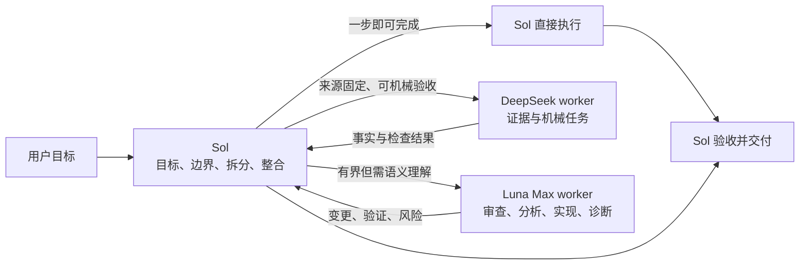

<div align="center">
  <h1>Sol Worker Routing for Codex</h1>
  <p><strong>Sol 保留目标与判断；DeepSeek 处理可机械验收的证据；Luna Max 完成有界的语义执行。</strong></p>
  <p>可直接交给 Codex 安装的双 Worker 工作流，用第一性原理限制过度编程、过度测试与无意义并行。</p>
  <p>
    <strong>简体中文</strong> ·
    <a href="README.en.md">English</a> ·
    <a href="CHANGELOG.md">更新日志</a>
  </p>
  <p>
    <a href="https://github.com/liuyejinghong/sol-worker-routing-codex/tags"></a>
    <a href="https://github.com/liuyejinghong/sol-worker-routing-codex/stargazers"></a>
  </p>
</div>

## 交给 Codex 的三步安装

这个仓库既供人阅读，也可以直接交给 Agent 部署。仓库内的 [`AGENTS.md`](AGENTS.md) 把写入权限限制为两个 Agent 配置和一个 Skill；安装器先检测冲突，任何目标存在不同内容都会在写入前停止。

```text
请为我的 Codex 用户配置安装 https://github.com/liuyejinghong/sol-worker-routing-codex 。
先读取并遵守仓库里的 AGENTS.md，保留现有 Codex 配置，遇到冲突不要覆盖。
安装后验证 deepseek_worker、luna_worker 和 sol-worker-routing Skill，
并说明我还需要完成的人工步骤。
```

也可以在本地执行：

```bash
git clone https://github.com/liuyejinghong/sol-worker-routing-codex.git
cd sol-worker-routing-codex
bash scripts/install.sh
```

安装器只会写入以下文件：

```text
~/.codex/agents/deepseek-worker.toml
~/.codex/agents/luna-worker.toml
~/.agents/skills/sol-worker-routing/SKILL.md
```

接着在 Codex App 的“设置 → 个性化 → 自定义指令”中，从 [`personalization.md`](personalization.md) 复制一个完整语言块。GitHub 文件和 `AGENTS.md` 不能代替账号级个性化设置；通常无需重启，建议新建一个任务验证路由。

DeepSeek lane 还需要你已经在 Codex 中配置名为 `deepseek` 的 provider 与凭据。安装器不会写入 `config.toml`、导入密钥或替你开通服务；provider 不可用时，Sol 不应假装 DeepSeek 已运行。

## 一个主线程，三条执行路径

这个 Skill 的任务卡不是 Codex UI 功能，而是 Sol 写给 Worker 的最小执行合同。Sol 先把模糊性收敛为一个可验收结果，再决定是否需要交接。



| 任务性质 | 路由 | 原因 |
|---|---|---|
| 极小、一步即可完成 | Sol 直接完成 | 子代理交接会增加 token 和等待 |
| 固定来源、偏阅读、可机械验证 | `deepseek_worker` | 证据链短，验收可由命令或固定事实决定 |
| 代码审查、模块分析、独立实现、聚焦排障 | `luna_worker` | 需要跨文件理解或局部语义判断 |
| 模糊、耦合、共享状态、架构、最终决策 | Sol | 不能把整体判断外包给 Worker |

DeepSeek 与 Luna 是同一层级的叶子 Worker，不是前后级。只有“先查证据、再做实现”时才按 `DeepSeek → Sol → Luna` 顺序衔接；同一状态、同一写入面或存在顺序依赖时不并行。默认最多两个 Worker、深度一层，Worker 不再委派。

## Worker 收到什么

Sol 负责拆分，Worker 不负责发现自己的范围。每个包只带必要事实，并固定为：

```text
Worker and mode:
Objective:
Scope and owned paths:
Relevant facts / source pins:
Non-goals:
Acceptance criteria:
Verification:
Stop condition:
Return format:
```

DeepSeek 默认只读；只有明确列出可写路径、机械验收和授权时才允许做最小补丁。Luna 可以处理独立实现与诊断，但同样不能改变父目标、架构、优先级或授权边界。包不足时，正确结果是返回精确 blocker，而不是自行扩大调查范围。

一个适合 DeepSeek 的完整包可以是：

```text
Worker and mode: deepseek_worker | read-only evidence
Objective: 说明指定提交中某个开关的默认值和实际调用点。
Scope and owned paths: README.md, src/options.ts；不写文件。
Relevant facts / source pins: repository@<immutable-sha>。
Non-goals: 不提出架构建议，不安装依赖，不搜索其他分支。
Acceptance criteria: 每条结论附 file:line；运行指定只读命令。
Verification: git status --short 与给定断言命令。
Stop condition: 目标提交或事实不在本地时返回 blocker。
Return format: Facts; command result; files changed; risks.
```

## 按工作形态分流

这个工作流不按“哪个模型更便宜”或“哪个模型更强”做固定分配。只有当来源、范围和验收都已固定时，才把证据或机械任务交给 DeepSeek；需要跨文件语义理解的有界执行交给 Luna；任何模糊、耦合、共享状态或最终判断都留在 Sol。

因此，极小任务也不必为了使用 Worker 而交接。路由是否合适由任务合同决定，而不是一次模型比较、个人账户用量或外部价格榜。

## 基准与成本边界

[`benchmarks/`](benchmarks/) 保存独立的案例目录、重跑协议、原始 [CSV](benchmarks/pilot-2026-08-09.csv) 和[基准报告](benchmarks/report-2026-08-09.md)。这些材料用于复核一项具体路由假设；README 不复述其中某次执行的结果，也不把它们当作性能或价格承诺。

| 记录项 | 口径 | 不代表 |
|---|---|---|
| 验收结果 | 固定任务合同是否通过 | 通用质量排名 |
| Worker 墙钟 | 发出任务包到终态的时间 | 整个项目的端到端耗时 |
| 生成 token | 客户端原生提供时的 `output_tokens + reasoning_tokens` | 输入或总 token，也不是美元账单 |

正常委派不常驻统计 token 或估算价格。只有用户明确要求成本评估或重跑基准时，Sol 才记录 worker、模型与推理强度、开始与结束时间、终态和验收；原生 usage 缺失时标为未知，不从自述推断账单，也不保存完整对话、源码或密钥。

## 不规定流程，只约束工作方式

TDD、spec-first 和固定审查轮次可以有用，但它们不应成为模型工作的目标。能力增强后，重流程可能驱动模型继续生成抽象、测试、审查器和工具，直到工作量脱离原始问题。

这里不强制某个开发流程。它要求先明确最终目标、不可变事实、最小验收标准和授权边界，再选最短、最直接、可验证的路径。每增加一个测试、gate、dry-run、审查或工具，都必须能回答：它保护什么具体且不可逆的风险；失败会改变什么决策；为什么现有更便宜的证据不足。

默认验证是“一次聚焦合同检查 + 一次真实链路结果核对”。候选和事实未变化时不重复验证；如果验证比实现更贵，或连续两步只是在修复验证层而没有增加原始目标的事实，就停止扩张工具链并回到根问题。

## 配置与安全边界

| 文件 | 职责 |
|---|---|
| [`personalization.md`](personalization.md) | App 级路由偏好，需人工粘贴 |
| [`skills/sol-worker-routing/SKILL.md`](skills/sol-worker-routing/SKILL.md) | Sol 的直接门槛、分流、任务包、验收与整合 |
| [`agents/deepseek-worker.toml`](agents/deepseek-worker.toml) | DeepSeek 证据/机械 Worker 的模型与边界 |
| [`agents/luna-worker.toml`](agents/luna-worker.toml) | Luna Max 语义执行 Worker 的模型与边界 |
| [`scripts/install.sh`](scripts/install.sh) | 冲突前置、最小写入、旧 Skill 路径迁移 |
| [`AGENTS.md`](AGENTS.md) | Agent 部署本仓库时的授权合同 |
| [`benchmarks/`](benchmarks/) | 可复现案例、数据和首轮报告 |

安装器不会编辑 `config.toml`、其他 Agent、其他 Skill、全局或项目 `AGENTS.md`、以及 Codex App 设置。它只会把内容可验证为已知旧版本、且没有符号链接的 `sol-luna-workflow` 从 `~/.agents/skills/` 或旧的 `~/.codex/skills/` 迁移到 `~/.agents/skills/sol-worker-routing/`；任何未知旧内容都会停止，不会覆盖或删除。Agent 使用 `${CODEX_HOME:-~/.codex}`，Skill 使用官方用户路径 `~/.agents/skills`。

这是社区工作流，不是 OpenAI 官方预设。安装后先委派一个答案明确、只读的小任务，并根据客户端实际返回的子代理信息和验收结果判断路由是否可用。配置文件或 Worker 的文字自述都不能证明有效路由；provider 或调用异常时，应将对应 lane 视为不可用。

## 参考资料

| 主题 | 来源 |
|---|---|
| Codex 子代理和自定义 Agent | [OpenAI Developers](https://developers.openai.com/codex/agent-configuration/subagents) |
| Codex Skills 与发现路径 | [OpenAI Developers](https://developers.openai.com/codex/skills) |
| Codex 指令发现顺序 | [OpenAI Developers](https://developers.openai.com/codex/guides/agents-md) |
| Oh My OpenAgent 编排参考 | [code-yeongyu/oh-my-openagent](https://github.com/code-yeongyu/oh-my-openagent) |
