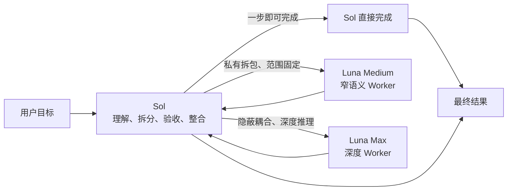

<div align="center">
  <h1>Sol Worker Routing for Codex</h1>
  <p><strong>把合适的任务，交给合适的 Worker。</strong></p>
  <p>先从第一性原理收敛问题，再按任务分流，只保留足够完成判断的流程与证据。</p>
  <p>
    <strong>简体中文</strong> ·
    <a href="README.en.md">English</a> ·
    <a href="CHANGELOG.md">更新日志</a>
  </p>
  <p>
    <a href="https://github.com/liuyejinghong/sol-worker-routing-codex/tags"></a>
    <a href="https://github.com/liuyejinghong/sol-worker-routing-codex/stargazers"></a>
  </p>
</div>

## 它解决什么问题

`Sol Worker Routing` 不只是给 Codex 增加子代理。它把四件事放进同一套工作方式里：

- **第一性原理**：先明确最终目标、不可变事实、最小验收标准和授权边界，出现重复补丁、额外抽象或无关流程时，回到根因重新简化。
- **按真正瓶颈分流**：主控协调角色（下文称 Sol）保留目标和最终判断；Luna Medium 处理范围、路径和验收已经固定的窄任务；Luna Max 处理隐蔽耦合、复杂排障和长程深度推理。
- **HERO Anti-OverDefense**：约束主 Agent 和每个 Worker，避免无消费者的校验、不可达场景的防御、没有活不确定性的审查循环，以及没有直接需求的包装层和守卫。
- **少一些流程，多一些有效证据**：不把固定 gate、审查轮次或更多工具当成目标。默认只做一次聚焦合同检查和一次必要的真实链路核对。

“Sol”是主控协调角色名，而不是必须选用 `gpt-5.6-sol`。当前主 Agent 为 `gpt-5.6-terra` 时，也承担同一职责，并可按相同规则把合格任务包派给两条 Luna lane。

Sol 始终留在主线程，负责理解目标、判断是否值得交接、拆分任务、检查证据并交付最终结果。任务一步即可完成时由 Sol 直接处理。Luna Medium 只接收边界已经固定的窄任务包；发现隐蔽耦合或根因未定时返回 blocker，由 Sol 决定是否另发 Luna Max。

| 执行者 | 最适合的工作 | 典型例子 |
|---|---|---|
| **Sol（主控协调角色）** | 极小任务、模糊问题、架构、授权与最终决策 | 判断是否该改、整合结果、直接完成一步修改 |
| **Luna Medium** | 范围、路径、所有权和验收已固定的窄语义工作 | 指定 diff 审查、目标测试排障、受限实现 |
| **Luna Max** | 隐蔽耦合、微妙语义和长程深度推理 | 困难代码审查、复杂排障、关键实现、跨模块判断 |

## 本版更新

- **新增**：已有 checkout 可直接运行 `bash scripts/update.sh`，从当前分支的已配置上游更新源码后重新安装工作流。
- **保护**：仅接受没有已跟踪修改且可 fast-forward 的分支；本地领先提交或分叉会停止，不会自动合并或丢弃。

详细版本记录见 [`CHANGELOG.md`](CHANGELOG.md)。完整行为合同分别位于 [`personalization.md`](personalization.md)、[`AGENTS.md`](AGENTS.md) 和 [`skills/sol-worker-routing/SKILL.md`](skills/sol-worker-routing/SKILL.md)。

## 路由是怎样工作的



Luna Medium 与 Luna Max 是并列 Worker，不是自动前后级。Medium 遇到隐藏耦合时只返回 blocker，不能自行扩大范围或升级到 Max。Sol 保留全部任务识别、任务包、写入所有权、验收、授权和最终结论。

日常可使用主 Agent 的常规推理档位完成路由与整合；只有架构模糊、证据冲突、高风险决策或复杂综合时才提高推理强度。不要让主线程和交接成本超过任务本身。

## 路由治理与 Worker 开关

路由先服从当前任务的明确限制，再检查持久 profile 状态和真实 route qualification，最后才按任务瓶颈选择 Worker。“只用 Sol”或“不要任何子代理”等任务级限制只阻止本次任务后续的新委派，不修改文件，也不自动停止已经运行的 Worker。

持久状态只影响新任务：`<profile>.toml` 表示 enabled，`<profile>.toml.disabled` 表示 disabled。`all` 只代表 Luna Medium 与 Luna Max，不包含 Sol。启用、停用或升级后，需要新建 Codex 任务重新加载 Agent；profile 文件存在不等于真实路由已经通过。

Worker 获得执行租约后，不会因为暂时沉默、耗时较长、尚未写入文件或一次等待结束而被中断。只有用户取消、任务失效、已观察到范围或授权越界、重复真实错误或资源死锁时才允许终止。

并行默认从一个 Worker 开始；只有任务相互独立且所有权互斥时，才扩展到同一阶段最多四个 Worker，且只允许一层深度。涉及写入的任务仍优先使用单 Worker。

## 安装

最简单的方式，是把下面这段话直接交给 Codex：

```text
请为我的 Codex 用户配置安装 https://github.com/liuyejinghong/sol-worker-routing-codex 。
先完整读取并遵守仓库里的 AGENTS.md，保留现有 Codex 配置，遇到未知内容、双状态或符号链接时不要覆盖。
安装完成后核对两条 Luna profile、`sol-worker-routing` 与全局 `github-review-handoff` Skill；不要修改 Provider、凭据或 model catalog，也不要执行已退役路由的探针。
```

也可以在终端安装：

```bash
git clone https://github.com/liuyejinghong/sol-worker-routing-codex.git
cd sol-worker-routing-codex
bash scripts/install.sh
```

已经 clone 本仓库时，可用一条命令更新源码并重新安装：

```bash
bash scripts/update.sh
```

它从当前分支已配置的上游拉取，并且只接受没有已跟踪修改、可 fast-forward 的 checkout，然后复用安装器保留两条 Luna lane 的状态。已跟踪修改、本地领先提交或分叉会停止更新，不会自动合并或丢弃；无关未跟踪文件不会单独阻塞。它同样不修改 Provider、凭据或 model catalog。

安装器提供精确的 lane 管理接口：

```bash
bash scripts/install.sh --lane-status
bash scripts/install.sh --disable-lane luna_medium_worker
bash scripts/install.sh --enable-lane luna_worker
bash scripts/install.sh --disable-lane all
```

新安装默认启用两条 Luna lane；从已识别版本升级时分别保留其 enabled/disabled 状态。未知 lane 名称会失败，不做模糊匹配。

安装器先暂存并备份，再替换文件；普通失败或 `INT` / `TERM` / `HUP` 会回滚。最终文件分布在三棵目录树，因此不宣称断电或 `SIGKILL` 下的跨目录原子性；重新运行会核验并收敛到完整状态。

Windows 需要 Git Bash/MSYS Bash 或 WSL Bash；这不是原生 PowerShell 脚本。在真实 Windows 安装链路完成验收前，这只是兼容路径，不是完整平台支持声明。

唯一不能由仓库自动完成的是账号级个性化：从 [`personalization.md`](personalization.md) 复制一个完整语言块，手动粘贴到 Codex App 的“设置 → 个性化 → 自定义指令”。文件安装成功不等于账号级规则已经激活。

## 实际使用方式

安装后通常不需要手动指定 Worker，直接描述目标即可。Sol 会先判断任务是否值得交接。

一步即可完成的任务留给 Sol：

```text
确认这个配置项当前的默认值，并告诉我是否需要修改。
```

范围和验收已经固定时，可使用 Luna Medium：

```text
只检查这个指定 diff 的行为合同，最多返回三项可定位风险；不要扩展到其他模块，每项都用现有测试或只读证据验证。
```

存在隐蔽耦合或需要长程推理时，适合 Luna Max：

```text
排查这个偶发并发泄漏。它跨越调度、取消和资源释放路径，需要解释隐藏耦合，完成最小修复并证明不会破坏重入语义。
```

目标、架构或最终授权仍由 Sol 决定：

```text
判断这次需求是否值得改变现有架构，并给出最终方案。
```

## 用 5.6 Pro 做独立 GitHub 复审

`github-review-handoff` 把审阅交给独立的 5.6 Pro 审阅端：这部分审阅不消耗 Codex 额度，也不复用当前 Codex 对项目的判断，因此可以从独立第三方视角重新检查仓库、PR diff、调用链和验证证据。

一次交接的链路很直接：`Issue / PR + 精确 review head` → `5.6 Pro 独立审阅` → `GitHub finding 与 verdict` → `开发者回复或修复` → `针对新 head 复审`。Issue 保留问题、根因和验收条件；PR 保留精确 SHA、审阅 finding、回复和最终源码结论。只有写回 GitHub、并绑定完整 commit SHA 的 `APPROVE_SOURCE`、`REQUEST_CHANGES` 或 `NEEDS_MORE_EVIDENCE` 才是可追溯结论。

| 仓库类型 | 5.6 Pro 如何访问 | GitHub 上提交审阅结果 |
|---|---|---|
| 公开仓库 | 直接读取仓库、Issue 或 PR 链接并审查，无需连接器 | 按已有 GitHub 写入授权提交 |
| 私有仓库 | 先手动连接 GitHub 连接器并授权对应仓库；未连接时不会读取私有源码 | 读取和提交都依赖这条手动连接及仓库权限 |

### GitHub 原生邮件提醒

通常不需要 Webhook 或邮件服务。安装工作流只安装 Skill，不会替用户修改 GitHub 账号设置、创建连接器或启动审阅。收件人一次性在 GitHub Notifications 的“参与的会话”中开启 Email，并选择已验证的通知地址；随后每次交接只需提供仓库 URL 和 GitHub `@handle` 的角色：新 finding 通知谁、初审/复审通知谁。实际审阅时还必须给出 Issue/PR 链接和精确 head SHA。

独立的 5.6 Pro 判断不等于独立的 GitHub 发件身份：如果它通过你的 GitHub connector 写 Issue，Issue 作者仍是你的账号。此时可见的自我 `@mention` 不能作为“收到外部审阅邮件”的验收。需要由同一账号的自动化可靠唤醒时，Skill 提供可选的 GitHub Actions 中继：只有新建 Issue 在首行用户提供的 `@mention` 下方加入不可见标记 `<!-- github-review-handoff: native-email-relay -->` 时，GitHub Actions 才用自己的身份写一条相同的 `@mention` 评论。它不使用第三方邮件服务、Webhook、标签或仓库变量；只需一次性提交工作流文件。完整配置和测试步骤见 [`github-actions-notifier.md`](skills/github-review-handoff/references/github-actions-notifier.md)。

GitHub 用户名是用于 `@mention` 的账号标识，不是凭据；无需提供邮箱、PAT、Webhook URL 或连接器密钥，也不会被 Skill 持久化。私有仓库的 5.6 Pro 读取和写回仍需手动连接 GitHub connector 并具备对应权限。

它适合需要独立复核的 GitHub 交接，不是普通本地代码审查。连接器不会自动创建，也不替代 push、评论、合并、关闭 Issue、发布或部署所需的单独授权。

## 安装边界与项目文件

安装器只管理以下七个最终文件：

```text
${CODEX_HOME:-$HOME/.codex}/agents/luna-medium-worker.toml[.disabled]
${CODEX_HOME:-$HOME/.codex}/agents/luna-worker.toml[.disabled]
$HOME/.agents/skills/sol-worker-routing/SKILL.md
${CODEX_HOME:-$HOME/.codex}/skills/github-review-handoff/SKILL.md
${CODEX_HOME:-$HOME/.codex}/skills/github-review-handoff/references/github-templates.md
${CODEX_HOME:-$HOME/.codex}/skills/github-review-handoff/references/github-actions-notifier.md
${CODEX_HOME:-$HOME/.codex}/skills/github-review-handoff/agents/openai.yaml
```

升级时，安装器仅在内容与已登记历史版本完全一致时移除旧 Spark/DeepSeek profile。未知内容、双状态、符号链接和非普通文件会在任何写入前停止。DeepSeek Provider、凭据、model catalog 及其他 Codex 配置均不属于退役清理范围。

| 文件 | 用途 |
|---|---|
| [`personalization.md`](personalization.md) | 需要手动粘贴的账号级行为与路由偏好 |
| [`skills/sol-worker-routing/SKILL.md`](skills/sol-worker-routing/SKILL.md) | Sol 的分流、任务包、租约和验收规则 |
| [`skills/github-review-handoff/`](skills/github-review-handoff/) | 全局 GitHub 开发者与独立审阅者交接、模板与精确 head 结论 |
| [`agents/`](agents/) | Luna Medium 与 Luna Max Worker 配置 |
| [`scripts/install.sh`](scripts/install.sh) | 冲突检测、状态保留、安装与旧 profile 迁移 |
| [`scripts/update.sh`](scripts/update.sh) | 从当前 Git 上游 fast-forward 更新源码，再调用安装器 |
| [`benchmarks/`](benchmarks/) | 历史路由实验和原始证据，不代表当前可用 lane |

安装、实现和验证不自动授权 commit、push、merge、tag、release 或部署。这是社区工作流，不是 OpenAI 官方预设；配置文件和 Worker 自述不能单独证明真实路由成功。

## 参考资料

- [Codex 子代理和自定义 Agent](https://developers.openai.com/codex/agent-configuration/subagents)
- [Codex Skills 与发现路径](https://developers.openai.com/codex/skills)
- [Codex 指令发现顺序](https://developers.openai.com/codex/guides/agents-md)
- [HERO Anti-OverDefense](https://github.com/wanshuiyin/HERO-Anti-OverDefense)
- [Codex rust-v0.149.0](https://github.com/openai/codex/releases/tag/rust-v0.149.0)
- [Agent role Provider 继承变更 #39299](https://github.com/openai/codex/pull/39299)
- [跨 Provider 子代理复现 #17598](https://github.com/openai/codex/issues/17598#issuecomment-5376031711)
