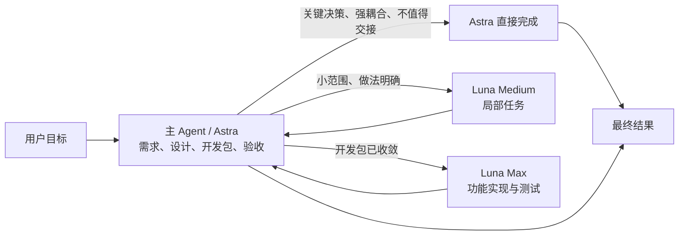

<div align="center">
  <h1>Sol Worker Routing for Codex</h1>
  <p><strong>把合适的任务，交给合适的 Worker。</strong></p>
  <p>先从第一性原理收敛问题，再按任务分流，只保留足够完成判断的流程与证据。</p>
  <p>
    <strong>简体中文</strong> ·
    <a href="README.en.md">English</a> ·
    <a href="CHANGELOG.md">更新日志</a>
  </p>
  <p>
    <a href="https://github.com/liuyejinghong/sol-worker-routing-codex/tags"></a>
    <a href="https://github.com/liuyejinghong/sol-worker-routing-codex/stargazers"></a>
  </p>
</div>

## 它解决什么问题

`Sol Worker Routing` 不只是给 Codex 增加子代理。它把四件事放进同一套工作方式里：

- **第一性原理**：先明确最终目标、不可变事实、最小验收标准和授权边界，出现重复补丁、额外抽象或无关流程时，回到根因重新简化。
- **按真正瓶颈分流**：主 Agent 保留需求、根因、架构与最终判断；Luna Medium 完成小范围明确任务；Luna Max 作为程序员，根据已收敛的开发包完成一个功能或模块。
- **HERO Anti-OverDefense**：约束主 Agent 和每个 Worker，避免无消费者的校验、不可达场景的防御、没有活不确定性的审查循环，以及没有直接需求的包装层和守卫。
- **少一些流程，多一些有效证据**：按实际改动和风险选择足够的验证，不要求固定检查次数。明确要求的检查完成后，只有新改动、失败或具体疑点才扩大验证。

当前主要使用 Astra（`gpt-6-astra`）作为主 Agent，其他受支持的父模型也可承担同一职责。项目名中的“Sol”保留为协调角色的历史名称，不要求选择 `gpt-5.6-sol`；模型与推理档位沿用用户设置。

Astra 负责把问题和方案确定下来，再判断实现是否值得交接。Luna Max 承接实现工作量，Astra 保留尚未解决的关键决策。任务复杂本身不构成委派理由；如果验收需要 Astra 重读全部上下文、重做主要推理，就由 Astra 直接完成。

| 执行者 | 最适合的工作 | 典型例子 |
|---|---|---|
| **主 Agent（当前主要使用 Astra）** | 需求、根因、架构、强耦合工作、整合与验收 | 确定状态归属、解决业务歧义、编写开发包、直接完成不值得交接的工作 |
| **Luna Medium** | 小范围、做法明确、可独立验收的任务 | 局部修改、来源查找、目标测试排障 |
| **Luna Max** | 按已收敛开发包实现可独立验收的功能或模块 | 在约定接口和行为下完成代码与必要测试；有界补充审查 |

## v0.13.0 更新

- 明确 Astra 主控与 Luna Max 程序员分工，Medium 的 blocker 先交回主 Agent 判断。
- 开发包确定行为、设计与验收，保留局部实现自主权；按准备、等待、验收和返工的总成本判断委派是否值得。

详细版本记录见 [`CHANGELOG.md`](CHANGELOG.md)。完整行为合同分别位于 [`personalization.md`](personalization.md)、[`AGENTS.md`](AGENTS.md) 和 [`skills/sol-worker-routing/SKILL.md`](skills/sol-worker-routing/SKILL.md)。

## 路由是怎样工作的



Luna Medium 与 Luna Max 是并列 Worker。Medium 遇到无法在范围内解决的问题时，交回主 Agent；主 Agent 解决关键决策后，才决定是否需要 Max 实现。不存在固定的 `Medium → Max → Astra 兜底` 链条。

## 给 Luna Max 的开发包

开发包可以引用已有 spec，也可以是一段明确的任务说明。完整是指影响正确性的决定已经做完，不是提前规定每个函数怎么写。

| 内容 | 需要确定什么 |
|---|---|
| 目标与行为 | 什么输入或操作应产生什么结果 |
| 已确定的设计 | 负责模块、状态归属、接口及不变量 |
| 范围与约束 | 可读取材料、独占写入范围、必须保持的行为与非目标 |
| 验收 | 预期结果、相关失败场景、现有调用方或测试依据 |
| 决策边界 | 可自主选择的实现细节，以及需要交回主 Agent 的决定 |

Luna Max 自主选择局部函数组织、命名、现有工具和必要测试。范围内可查清的事实继续调查；spec 与代码冲突、业务或接口含义需要改变、状态归属需要调整或超出范围时，暂停依赖该决定的实现，返回具体冲突、证据和可选方案，继续不受影响的工作。主 Agent 在已有授权内解决问题，不把 Worker 的 blocker 自动转交给用户。

交付包含代码、实际验证结果、未运行的检查、spec 偏离和未解决问题。Astra 依据开发包及现有调用方检查业务语义、集成和关键失败路径，不单凭 Worker 自写测试接受实现。小遗漏可以交回修正；根因、业务或接口理解错误由 Astra 接管判断，保留可用成果，不反复指导猜测式重写。同类任务反复产生大幅返工时，应收回这类委派。

## 路由治理与 Worker 开关

路由先服从当前任务的明确限制，再检查持久 profile 状态和真实 route qualification，最后才按任务瓶颈选择 Worker。“只用 Sol”或“不要任何子代理”等任务级限制只阻止本次任务后续的新委派，不修改文件，也不自动停止已经运行的 Worker。

持久状态只影响新任务：`<profile>.toml` 表示 enabled，`<profile>.toml.disabled` 表示 disabled。`all` 只代表 Luna Medium 与 Luna Max，不包含 Sol。启用、停用或升级后，需要新建 Codex 任务重新加载 Agent；profile 文件存在不等于真实路由已经通过。

Worker 获得执行租约后，不会因为暂时沉默、耗时较长、尚未写入文件或一次等待结束而被中断。只有用户取消、任务失效、已观察到范围或授权越界、重复真实错误或资源死锁时才允许终止。

并行默认从一个 Worker 开始；只有任务相互独立且所有权互斥时，才扩展到同一阶段最多四个 Worker，且只允许一层深度。涉及写入的任务仍优先使用单 Worker。

## 安装

最简单的方式，是把下面这段话直接交给 Codex：

```text
请为我的 Codex 用户配置安装 https://github.com/liuyejinghong/sol-worker-routing-codex 。
先完整读取并遵守仓库里的 AGENTS.md，保留现有 Codex 配置，遇到未知内容、双状态或符号链接时不要覆盖。
安装完成后核对两条 Luna profile 与 `sol-worker-routing`；不要修改 Provider、凭据或 model catalog，也不要执行已退役路由的探针。
```

也可以在终端安装：

```bash
git clone https://github.com/liuyejinghong/sol-worker-routing-codex.git
cd sol-worker-routing-codex
bash scripts/install.sh
```

已经 clone 本仓库时，可用一条命令更新源码并重新安装：

```bash
bash scripts/update.sh
```

它从当前分支已配置的上游拉取，并且只接受没有已跟踪修改、可 fast-forward 的 checkout，然后复用安装器保留两条 Luna lane 的状态。已跟踪修改、本地领先提交或分叉会停止更新，不会自动合并或丢弃；无关未跟踪文件不会单独阻塞。它同样不修改 Provider、凭据或 model catalog。

安装器提供精确的 lane 管理接口：

```bash
bash scripts/install.sh --lane-status
bash scripts/install.sh --disable-lane luna_medium_worker
bash scripts/install.sh --enable-lane luna_worker
bash scripts/install.sh --disable-lane all
```

新安装默认启用两条 Luna lane；从已识别版本升级时分别保留其 enabled/disabled 状态。未知 lane 名称会失败，不做模糊匹配。

安装器先暂存并备份，再替换文件；普通失败或 `INT` / `TERM` / `HUP` 会回滚。最终文件分布在两棵目录树，因此不宣称断电或 `SIGKILL` 下的跨目录原子性；重新运行会核验并收敛到完整状态。

Windows 需要 Git Bash/MSYS Bash 或 WSL Bash；这不是原生 PowerShell 脚本。在真实 Windows 安装链路完成验收前，这只是兼容路径，不是完整平台支持声明。

账号级个性化需要手动更新：从 [`personalization.md`](personalization.md) 复制一个完整语言块，在 Codex App 的“设置 → 个性化 → 自定义指令”中替换旧的工作流文本，保留其他个人偏好，不要追加重复版本。修改文件不会更新 App 设置。

个性化只保留通用协作和表达偏好；全局 AGENTS.md 保留编码约定；项目 AGENTS.md 保留仓库规则；Worker 分工与开发包由路由 Skill 维护。不要把 AGENTS.md 或整份 Skill 再粘贴到个性化中。安装器不管理全局 AGENTS.md；其中若有旧路由细节，需要单独清理。

## 实际使用方式

安装后通常不需要手动指定 Worker，直接描述目标即可。主 Agent 会先判断任务是否值得交接。

一步即可完成的任务留给主 Agent：

```text
确认这个配置项当前的默认值，并告诉我是否需要修改。
```

范围和验收已经固定时，可使用 Luna Medium：

```text
只检查这个指定 diff 的行为合同，最多返回三项可定位风险；不要扩展到其他模块，每项都用现有测试或只读证据验证。
```

已有明确开发包、需要完成一个功能时，适合 Luna Max：

```text
按 Astra 已确认的导出开发包实现：复用现有查询服务与权限检查，固定输出列及顺序，空结果只输出表头。
读取范围为导出模块及其现有调用方；只修改开发包指定的导出模块和对应测试，不调整公共查询接口。
验证有数据、空结果、无权限和字段含逗号的行为。局部函数组织自行选择；spec 与现有接口冲突时，返回证据和可选方案。
```

根因、架构和关键业务决定仍由主 Agent 负责：

```text
判断这次需求是否值得改变现有架构，并给出最终方案。
```

## 安装边界与项目文件

安装器只管理以下三个最终文件：

```text
${CODEX_HOME:-$HOME/.codex}/agents/luna-medium-worker.toml[.disabled]
${CODEX_HOME:-$HOME/.codex}/agents/luna-worker.toml[.disabled]
$HOME/.agents/skills/sol-worker-routing/SKILL.md
```

升级时，安装器仅在内容与已登记历史版本完全一致时移除旧 Spark/DeepSeek profile。未知内容、双状态、符号链接和非普通文件会在任何写入前停止。DeepSeek Provider、凭据、model catalog 及其他 Codex 配置均不属于退役清理范围。

| 文件 | 用途 |
|---|---|
| [`personalization.md`](personalization.md) | 需要手动替换的精简协作与表达偏好 |
| [`skills/sol-worker-routing/SKILL.md`](skills/sol-worker-routing/SKILL.md) | 主 Agent 的分流、开发包、Worker 租约和验收规则 |
| [`agents/`](agents/) | Luna Medium 与 Luna Max Worker 配置 |
| [`scripts/install.sh`](scripts/install.sh) | 冲突检测、状态保留、安装与旧 profile 迁移 |
| [`scripts/update.sh`](scripts/update.sh) | 从当前 Git 上游 fast-forward 更新源码，再调用安装器 |
| [`benchmarks/`](benchmarks/) | 历史路由实验和原始证据，不代表当前可用 lane |

安装、实现和验证不自动授权 commit、push、merge、tag、release 或部署。这是社区工作流，不是 OpenAI 官方预设；配置文件和 Worker 自述不能单独证明真实路由成功。

## 参考资料

- [Codex 子代理和自定义 Agent](https://developers.openai.com/codex/agent-configuration/subagents)
- [Codex Skills 与发现路径](https://developers.openai.com/codex/skills)
- [Codex 指令发现顺序](https://developers.openai.com/codex/guides/agents-md)
- [HERO Anti-OverDefense](https://github.com/wanshuiyin/HERO-Anti-OverDefense)
- [Codex rust-v0.149.0](https://github.com/openai/codex/releases/tag/rust-v0.149.0)
- [Agent role Provider 继承变更 #39299](https://github.com/openai/codex/pull/39299)
- [跨 Provider 子代理复现 #17598](https://github.com/openai/codex/issues/17598#issuecomment-5376031711)
