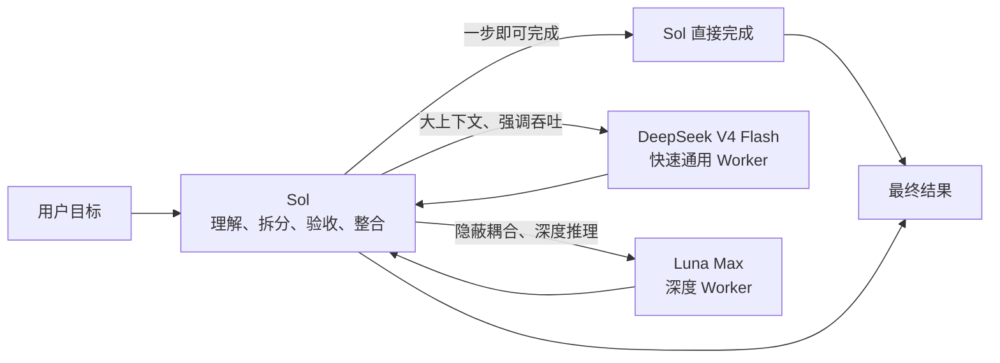

<div align="center">
  <h1>Sol Worker Routing for Codex</h1>
  <p><strong>把合适的任务，交给合适的 Worker。</strong></p>
  <p>先从第一性原理收敛问题，再按任务分流，只保留足够完成判断的流程与证据。</p>
  <p>
    <strong>简体中文</strong> ·
    <a href="README.en.md">English</a> ·
    <a href="CHANGELOG.md">更新日志</a>
  </p>
  <p>
    <a href="https://github.com/liuyejinghong/sol-worker-routing-codex/tags"></a>
    <a href="https://github.com/liuyejinghong/sol-worker-routing-codex/stargazers"></a>
  </p>
</div>

## 它解决什么问题

`Sol Worker Routing` 不只是给 Codex 增加两个子代理。它把三件事放进同一套工作方式里：

- **第一性原理**：先明确最终目标、不可变事实、最小验收标准和授权边界，出现重复补丁、额外抽象或无关流程时，回到根因重新简化。
- **按真正瓶颈分流**：Sol 保留目标和最终判断；DeepSeek V4 Flash 用速度、低成本和 1M 上下文处理大输入与强调吞吐的有界工作；Luna Max 用更长时间完成需要深度推理的任务。简单任务不再消耗过多时间和 token，深度任务也不会因为暂时沉默而被提前终止。
- **少一些流程，多一些有效证据**：不把 TDD、spec-first、固定审查轮次或更多工具当成目标。默认只做一次聚焦合同检查和一次真实链路结果核对；新增验证之前，先确认它保护了什么具体风险，以及失败是否真的会改变决策。

Sol 始终留在主线程，负责理解目标、拆分任务、检查证据和交付结果。两个 Worker 只接收边界明确、能够独立完成并验收的任务。

| 执行者 | 最适合的工作 | 典型例子 |
|---|---|---|
| **Sol** | 极小任务、模糊问题、架构与最终决策 | 判断是否该改、整合多个结果、直接完成一步修改 |
| **DeepSeek V4 Flash** | 大量上下文、强调速度和吞吐的有界工作 | 全库分析、长文档、批量排障、中等复杂实现、结构化数据 |
| **Luna Max** | 隐蔽耦合、微妙语义和长程深度推理 | 困难代码审查、复杂排障、关键实现、跨模块语义判断 |

## 同类任务，成本差多少

我们把相同的两项证据/机械任务分别交给 DeepSeek 和 Luna Max。任务目标、范围、验收命令和停止条件完全一致，两个 Worker 都通过了 **2/2** 项验收。

[](benchmarks/report-2026-08-09.md)

| Worker | 通过任务 | 总耗时 | 生成 token |
|---|---:|---:|---:|
| **DeepSeek** | 2 / 2 | **88 秒** | **5,081** |
| Luna Max | 2 / 2 | 235 秒 | 16,708 |

在相同验收结果下，DeepSeek 少用了 **147 秒**和 **11,627 个生成 token**，对应耗时减少 **62.6%**、生成 token 减少 **69.6%**。这组结果证明 DeepSeek 不应只被当作廉价搜索器；当合同清楚时，它可以更快完成真实代码工作。它没有证明两个模型在所有长程任务上等价，因此路由仍按上下文、吞吐和推理深度决定。

> 这是两项配对任务的实测结果，不是通用模型排名。生成 token 为 `output token + reasoning token`，用于比较同一客户端内的工作量，不等同于美元账单或总 token。复现方法、逐项结果和样本限制见[完整报告](benchmarks/report-2026-08-09.md)，原始数据见 [CSV](benchmarks/pilot-2026-08-09.csv)。图表由 [`render_readme_chart.py`](benchmarks/render_readme_chart.py) 直接从 CSV 生成。

## 路由是怎样工作的



DeepSeek 与 Luna Max 是并列的叶子 Worker，不是前后级关系。Sol 负责全部任务识别、材料发现、拆分、分发、验收和最终结论。日常推荐使用 `gpt-5.6-sol` 的 **medium**：它足以完成大多数路由与整合，又不会让主线程成本吞掉分流节省；只有架构模糊、证据冲突、高风险决策或复杂整合时再切到 high。Skill 只能规定这套策略，不能替使用者改变当前任务选择的模型档位。

这个分工还有一个简单但重要的原则：如果 Sol 一步就能完成，就不为“使用子代理”而交接。交接本身也会消耗时间和 token。

## DeepSeek 的 1M 上下文用在哪里

DeepSeek V4 Flash 是快速、低成本的通用 Worker，不只是证据提取器。1M 上下文让它可以把大型代码库、长文档或成批记录作为一个连贯整体理解，减少为了迁就窗口而过早切碎材料造成的信息损失。

OpenCode Go 路线已经通过超过 256K 的真实链路验收：直接 bridge 请求计量为 **260,093 input token**，同一输入经 Codex 端到端返回了首尾标记。它证明当前配置能够越过 256K，不代表已经测到 1M 极限；方法与限制见[长上下文验收记录](benchmarks/long-context-acceptance-2026-08-10.md)。

| 输入或任务 | DeepSeek 可以交付的结果 |
|---|---|
| 固定网页、论文、长文档 | 来源、日期、核心事实、支持与限制组成的证据表 |
| 大型代码库或大 diff | 架构关系、调用位置、配置引用、重复模式和审查候选 |
| CI、运行日志、事故记录 | 错误分类、出现频率和时间线 |
| Issue、PR、版本记录 | 去重结果、模块归类和状态清单 |
| CSV、JSON、API 快照 | 对账结果、缺失记录和异常候选 |
| 多语言与依赖数据 | 缺失 key、占位符差异、版本匹配和受影响文件候选 |
| 边界清楚的多文件任务 | 语义分析、实现修改和指定验收结果 |

联网搜索采用一条清晰的交接线：**Sol 做最小范围的搜索和来源判断，固定 URL 清单或保存网页正文；DeepSeek 只阅读这些已固定材料并压缩证据；Sol 最后核对关键来源、处理冲突并写出结论。** 这样既能避开一批网页上下文在高价模型中反复流转，也不会把开放式搜索和来源可信度判断交给证据 Worker。

并发也不再固定卡在两个。Sol 先派两个 Worker 验证任务合同；首批结果合格、剩余材料确实相互独立且只读时，可以自动把 DeepSeek 扩到**最多四个**。涉及写入的 DeepSeek 和 Luna Max 同时最多两个，且所有权必须完全分离；同一写入面仍按顺序执行。

## 让长推理真正完成

一次等待结束只表示这次轮询没有拿到最终结果，不表示 Worker 失败。Sol 不得因为 Luna 沉默、耗时较长、尚未写入文件，或者派发后才觉得任务包偏大而中断它。需要了解进度时，Sol 应发送不终止任务的 checkpoint 请求并继续等待。

中断只用于用户取消、任务已经失效、已观察到越权或越界、重复的真实执行错误，以及阻塞父任务的资源死锁。任务大小必须在派发前处理；不能先让深度 Worker 消耗推理 token，再用重新拆包作为止损理由。

## 安装

最简单的方式，是把下面这段话直接交给 Codex：

```text
请为我的 Codex 用户配置安装 https://github.com/liuyejinghong/sol-worker-routing-codex 。
先读取并遵守仓库里的 AGENTS.md，保留现有 Codex 配置，遇到冲突不要覆盖。
由安装流程检查现有 DeepSeek provider，并先执行一次真实路由。
能用就完整保留；真实调用失败时再按当前 Codex 和系统支持的方式修复，不要让我自己研究配置格式。
```

也可以在终端安装：

```bash
git clone https://github.com/liuyejinghong/sol-worker-routing-codex.git
cd sol-worker-routing-codex
bash scripts/install.sh
```

### 选择 DeepSeek 的接入方式

DeepSeek Worker 支持两种配置。两种配置使用同一个 `deepseek_worker` 名称、**1M 模型上下文**和相同的路由规则，当前都只接入 **DeepSeek V4 Flash**；区别只在于请求从哪里计费，以及是否需要本机协议桥接。

| 配置 | 适合谁 | 请求路径 | 运行要求 |
|---|---|---|---|
| **DeepSeek 官方 API（默认）** | 有 DeepSeek 官方 API 凭据，希望直接调用官方服务 | Codex → DeepSeek API | 不需要本机桥接 |
| **OpenCode Go** | 已订阅 OpenCode Go，希望使用订阅内的 V4 Flash 额度 | Codex → 本机 LiteLLM → OpenCode Go | 使用期间桥接进程必须保持运行 |

如果把安装任务直接交给 Codex，在上面的安装提示末尾补充“使用 DeepSeek 官方 API”或“使用 OpenCode Go”即可；没有指定时使用官方 API。

不确定选哪一种时，使用默认的 DeepSeek 官方 API。显式安装命令如下；直接运行 `bash scripts/install.sh` 与这一配置等价：

```bash
bash scripts/install.sh --deepseek-provider deepseek-api
```

安装 Agent 会检查现有官方 provider 和凭据，再通过一个答案明确的只读任务验证真实路由。已经可用的配置会被保留，不会因为安装流程无法看到某个特定凭据后端而重建。

如果使用 OpenCode Go，先选择 Go 版 Worker，再启动本机桥接：

```bash
bash scripts/install.sh --deepseek-provider opencode-go
bash scripts/run-opencode-go-bridge.sh
```

这里使用的是 OpenCode Go 订阅提供的 API，不会安装或配置 OpenCode 软件。Go 为 V4 Flash 提供 `chat/completions`，而 Codex provider 使用 Responses API；本机 LiteLLM 负责协议转换，并把工具历史整理成 Go 接受的相邻 `tool_calls → tool results` 顺序。API key 通过启动时的隐藏输入或 `OPENCODE_API_KEY` 提供，不写进仓库或 Codex TOML。桥接进程停止或电脑重启后，需要重新启动桥接。

无论选择哪一种配置，安装 Agent 都负责写入对应 provider 并完成一次真实 Worker 验证。配置文件存在、健康检查通过或文本请求成功，都不能代替工具任务的最终验收。

安装流程会自动完成这些工作：

1. 安装 `deepseek_worker`、`luna_worker` 和 `sol-worker-routing` Skill。
2. 检查选择的 DeepSeek 上游，并用一个答案明确的有界任务验证真实路由。
3. 路由可用时完整保留现有配置，不因为某个环境变量或凭据后端不可见而重装。
4. 只有真实调用失败时，才根据当前 Codex 客户端与操作系统支持的方式修复 provider 和认证。

使用者不需要研究 provider 格式或手动修改 TOML。确实缺少服务凭据时，安装 Agent 只负责引导当前环境支持的安全输入方式，不会预设 Keychain、环境变量或其他平台专属方案。安装 Agent 如果在当前任务中还看不到新 Worker，只会请你新建一个任务，随后由 Skill 自动完成路由探针。

唯一无法由仓库自动完成的是账号级个性化：从 [`personalization.md`](personalization.md) 复制一个完整语言块，粘贴到 Codex App 的“设置 → 个性化 → 自定义指令”。

## 实际使用方式

安装后不需要手动指定每个 Worker。正常描述目标即可，Sol 会先判断是否值得交接：

```text
查清这个固定提交里配置项的默认值和调用位置，每条结论给出行号。
```

来源和验收都固定时，适合交给 DeepSeek。

```text
先找到这次研究真正相关的一组网页并固定 URL，再让 DeepSeek 从这些页面提取观点、数据、日期和证据限制；最后复核原始来源并给我结论。
```

这是高上下文联网任务的标准分工：Sol 搜索与选源，DeepSeek 阅读与压缩，Sol 复核与综合。

```text
读取整个服务目录和迁移说明，找出所有旧配置调用点，在指定文件内完成迁移，并运行目标测试。
```

材料很多，但范围、写入所有权和验收明确时，适合交给 DeepSeek。

```text
排查这个偶发并发泄漏。它跨越调度、取消和资源释放路径，需要解释隐藏耦合，完成最小修复并证明不会破坏重入语义。
```

这类深度和隐蔽语义比速度更重要的任务适合 Luna Max。派发后应让它完成，不能因为一段时间没有状态回报而中断。

```text
判断这次需求是否值得改变现有架构，并给出最终方案。
```

这类问题保留给 Sol，因为 Worker 不应替主线程改变目标或做最终决策。

<details>
<summary>查看 Sol 交给 Worker 的任务合同</summary>

```text
Worker and mode:
Objective:
Scope and owned paths:
Relevant facts / source pins:
Non-goals:
Acceptance criteria:
Verification:
State-based stop condition:
Return format:
```

这不是额外的用户流程，而是 Sol 在后台给 Worker 的最小上下文。任务信息不足时，Worker 应返回明确的 blocker，而不是自行扩大范围。

</details>

## 安装边界与项目文件

仓库安装器只写入两个 Agent 配置和一个 Skill；已知上一版 Skill 可以安全升级，遇到其他不同内容会在覆盖前停止：

```text
~/.codex/agents/deepseek-worker.toml
~/.codex/agents/luna-worker.toml
~/.agents/skills/sol-worker-routing/SKILL.md
```

| 文件 | 用途 |
|---|---|
| [`personalization.md`](personalization.md) | 需要手动粘贴的全局路由偏好 |
| [`skills/sol-worker-routing/SKILL.md`](skills/sol-worker-routing/SKILL.md) | Sol 的分流、验收和整合规则 |
| [`agents/`](agents/) | DeepSeek 官方 API、OpenCode Go 与 Luna Max 的 Worker 配置 |
| [`providers/`](providers/) | OpenCode Go 的单模型桥接与 Codex provider 模板 |
| [`scripts/install.sh`](scripts/install.sh) | 冲突检测、最小安装和旧名称迁移 |
| [`benchmarks/`](benchmarks/) | 基准案例、原始数据与完整报告 |

Provider 不属于仓库安装器的固定写入物。安装 Agent 先以真实路由判断现有配置是否有效；只有确认失败后，才按当前客户端和系统支持的方式处理。OpenCode Go 模式只增加本机 Responses 桥接和对应 provider，不会改动 OpenCode 软件，也不会把密钥写入仓库、聊天记录或 `config.toml`。已知旧版 `sol-luna-workflow` 也只会在内容与历史版本一致、且路径不是符号链接时迁移；未知内容不会被覆盖或删除。

这是社区工作流，不是 OpenAI 官方预设。配置文件和 Worker 自述不能单独证明路由成功，应以客户端实际返回的子代理信息和任务验收结果为准。

## 参考资料

- [Codex 子代理和自定义 Agent](https://developers.openai.com/codex/agent-configuration/subagents)
- [Codex Skills 与发现路径](https://developers.openai.com/codex/skills)
- [Codex 指令发现顺序](https://developers.openai.com/codex/guides/agents-md)
- [OpenCode Go 模型与 API 端点](https://opencode.ai/docs/zh-cn/go/)
- [LiteLLM Responses API 桥接](https://docs.litellm.ai/docs/response_api)
- [Oh My OpenAgent 编排参考](https://github.com/code-yeongyu/oh-my-openagent)
