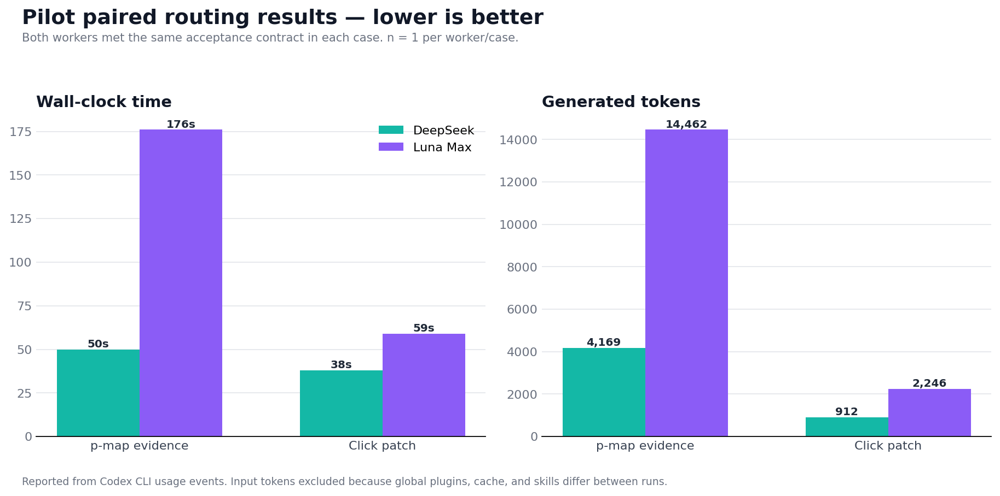

# 双 Worker 路由首轮报告

日期：2026-08-09（Asia/Shanghai）
目的：验证“Sol 直做 / DeepSeek 证据 lane / Luna 执行 lane”的最小路由规则，而不是宣称模型普遍优劣。

## 方法与边界

- 案例来自公开 GitHub 固定引用，均在一次性临时工作树运行；未读取、修改或执行任何用户项目。
- B1、B3 对两个 Worker 使用等价的目标、路径、验收、验证和停止条件。Sol 在结果返回后独立核对。
- 墙钟时间从发出任务到终态；`generated_tokens = output_tokens + reasoning_output_tokens`，仅用于同一客户端内的工作量代理。
- 不报告本地美元成本。Codex CLI 载入的插件、Skill、缓存和输入上下文不同，`input_tokens` 既不可比，也不是用户账单。
- 样本量为两组配对任务、每组一次；结论只适用于这些“证据/机械”工作单元。
- 客户端为 `codex-cli 0.147.0-alpha.6.5`。DeepSeek 调用完成，但客户端对该自定义模型显示 metadata fallback / 模型列表警告；结果因此证明基本调用，不证明所有客户端特性兼容。

## 可复核案例

| 案例 | 固定来源 | Worker 验收 |
|---|---|---|
| B1：p-map 只读事实 | [`66b039b`](https://github.com/sindresorhus/p-map/tree/66b039b20d362c3d508f15b11dd867638b02f75b) | 两者均确认 `pMapIterable` 不在 v6.0.0，并通过 `[10,30]` Node 断言，零文件改动 |
| B3：Click 机械补丁 | [`04ef3a6`](https://github.com/pallets/click/commit/04ef3a6f473deb2499721a8d11f92a7d2c0912f2) → [PR #3238](https://github.com/pallets/click/pull/3238) | 两者仅改 `tests/test_utils.py`，均通过 60 个目标用例和 `git diff --check` |
| B4：HTTPX 代码审查 | [`3350d7e`](https://github.com/encode/httpx/commit/3350d7e6831e2d942f68653b2f58cfa5ecb0bacd) | Luna 完成范围内审查；其中 Trio 取消清理的候选 finding 因临时环境缺少 Trio 而**未独立确认**，不计入正确率 |

## 实测数据

| 配对案例 | Worker | 验收 | 墙钟 | 输出 | 推理 | 生成 token |
|---|---:|---:|---:|---:|---:|---:|
| B1：p-map 证据 | DeepSeek | 通过 | 50s | 2,894 | 1,275 | 4,169 |
| B1：p-map 证据 | Luna Max | 通过 | 176s | 8,128 | 6,334 | 14,462 |
| B3：Click 补丁 | DeepSeek | 通过 | 38s | 814 | 98 | 912 |
| B3：Click 补丁 | Luna Max | 通过 | 59s | 1,565 | 681 | 2,246 |

若这两项都按旧的“全部交 Luna”策略处理，Worker 合计为 235 秒、16,708 生成 token；按新路由交给 DeepSeek，则为 88 秒、5,081 生成 token。该首轮配对样本中，质量合同均通过，墙钟减少 **147 秒（62.6%）**，生成 token 减少 **11,627（69.6%）**。

这不是总任务成本：Sol 的拆分和整合成本在两种策略下都存在，GUI 子代理调度开销、缓存命中和模型服务排队也会随账号与时间变化。它足以支持一个有限结论：对来源固定、可机械验收的证据和小补丁，DeepSeek lane 值得成为优先候选；它不足以证明 DeepSeek 应接管模糊诊断、架构或最终判断。

## 外部成本证据与路由含义

[DeepSWE v1.1 成本榜](https://deepswe.datacurve.ai/) 在 2026-08-07 的页面快照中，`deepseek-v4-flash[max]` 为 53%±4%、平均 $0.10/任务；`gpt-5.6-luna[max]` 为 67%±4%、平均 $0.61/任务。前者的报告成本低约 83.6%，但成功率低 14 个百分点，而且榜单是长程工程任务，不是本报告的本地账单或质量保证。

因此路由按任务性质而不是按“更便宜”决定：可固定证据和机械验收进入 DeepSeek；需要跨文件语义、修复判断、实现取舍或审查判断的有界任务仍进入 Luna；模糊、耦合、共享状态和最终决策留在 Sol。

## 要不要把成本探针放进 Skill？

结论：**不做常驻探针。** Skill 是提示词合同，不能可靠地截获所有调用；每次额外记录 token、价格和时间会增加上下文、工具调用和隐私面，也可能重演“为了测量而扩张流程”的问题。

建议只提供一个将来的可选诊断模式，由 Sol 在用户明确要求成本评估或运行基准时启用：

1. 记录 worker 名称、模型/推理强度、开始/结束时间、终态和验收结果。
2. 只在客户端原生提供时记录 usage；缺失即标记未知，不从自述推断。
3. 不记录源码内容、密钥、完整对话或臆测美元账单。
4. 输出一份短 JSON/CSV，由 Sol 决定是否进入报告。

普通任务只保留结果、验证和风险的回传合同。这样测量仍可用，但不会变成新的工作流目标。
