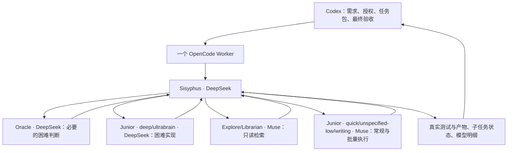

# 方案 2：DeepSeek 主导、Muse 批量执行的 OMO 编排方案

日期：2026-09-10。状态：**设计稿，未实施、未应用配置。**

## 决策摘要

采用一个 OpenCode Worker 入口，模型分工集中放在 OMO 的用户配置中。第一版按用户明确的策略设计：**DeepSeek V4.1 Flash 负责困难判断、关键规划与困难实现；Muse Spark 1.3 Contributor 负责高频检索、文档与方案明确的批量实现。**

默认主控从此前建议的 Muse 调整为 DeepSeek。不会因为 DeepSeek 额度较少，就把尚未解决的难题交给 Muse；也不会因为一个任务涉及很多文件，就认定它简单。

“DeepSeek 显著更强、约 300 tok/s”是用户提供的使用判断与速度观察，本方案据此优先编排 DeepSeek。已有独立测试证明 V4.1 通道和实际请求身份，没有测量复杂编码质量或稳态生成速度，因此这两个性能判断不是本项目已完成的基准结论。

第一版的交付目标是：Codex 派发一个开发任务，Sisyphus 能实际调动不同模型的子代理，全部受原任务边界约束；Codex 收到真实的角色、分类、模型、结果与未完成事项。不是只修改显示名称，也不是新建两个模型插件。

**推理能力统一使用所选模型当前支持的最高档，不按角色、分类或任务难度降低：DeepSeek 为 `max`，Muse 为 `xhigh`。此要求也覆盖主控、子代理和 title/summary/compaction 等辅助调用。** 分类名中的 high/low 只表示任务分类，不表示本方案的推理档位。

## 1. 当前状态与设计依据

- OpenCode：1.18.29；当前安装的 oh-my-openagent：4.19.4；独立 Worker 插件：0.2.0。
- 日常 OMO 的 11 个核心角色和 8 个分类目前配置为 Muse；当前生效源是 `~/.omo/omo.jsonc`。旧 `oh-my-openagent.json` 是历史/迁移来源，不应作为新的维护入口。
- Worker 的 `core.ts` 固定 `MODEL/PROVIDER/TARGET`，`runtime.ts` 固定主/辅助模型，`runner.ts` 固定提交与验收身份；`guard-policy.ts` 拒绝委派。仅改 OMO 配置不能实现本方案。
- 最近独立探针使用 `opencode-go/deepseek-flash`，目录名称为 DeepSeek V4.1 Flash；实际请求和 Go 响应均为 `deepseek-flash`，没有 Muse 请求。但探针禁止子代理，所以多代理链路仍待实现和验收。[探针记录](2026-09-10-deepseek-v41-flash-probe.md)
- 公开 dev 文档与本机版本存在差异。能力限制、字段和模型优先级以本机 4.19.4 的实现为准，实施时固定这个基线，不顺手升级 OMO。

## 2. OMO 的角色与分类不能混为一谈

OMO 有四个主要入口角色和七个核心子代理。**Sisyphus、Prometheus、Atlas 不是必须逐一调用的流水线。** 常规任务直接进 Sisyphus；只有明确需要补充规划或执行已有计划时，才选另一个入口。[官方编排说明](https://github.com/code-yeongyu/oh-my-openagent/blob/dev/docs/guide/orchestration.md)

| 层次 | 角色 | 实际职责 | 本方案选择 |
|---|---|---|---|
| 主入口 | Sisyphus | 包内拆解、选择专家/分类、整合执行结果 | **DeepSeek / max**，默认入口 |
| 规划入口 | Prometheus | 澄清与生成计划，不承担常规代码实现 | **DeepSeek / max**，仅在确有规划需求时使用 |
| 计划执行入口 | Atlas | 按既有计划组织执行和收尾 | **DeepSeek / max**，后续按需开放 |
| 深度自主入口 | Hephaestus | 面向特定 GPT 模型的自主深度实现 | **第一版禁用**，不强行绑定 DeepSeek/Muse |
| 顾问 | Oracle | 只读架构、根因和复杂技术判断 | **DeepSeek / max**，按问题调用 |
| 规划辅助 | Metis | 规划前发现缺口、歧义、遗漏 | **DeepSeek / max**，不作每个任务的固定步骤 |
| 计划审查 | Momus | 检查计划是否清楚、可执行、有阻断问题 | **DeepSeek / max**，不是默认代码审查员 |
| 检索 | Explore | 仓库内检索、寻找模式、定位调用关系 | **Muse / xhigh** |
| 资料 | Librarian | 查阅文档、参考实现和资料证据 | **Muse / xhigh**；困难结论仍回交 DeepSeek |
| 多模态读取 | Multimodal Looker | 读取图像/文档等内容，不负责修改 | **Muse / xhigh**；先利用现有较广输入能力 |
| 分类执行者 | Sisyphus-Junior | 承接 category 任务，实际实现工作 | 默认 **Muse / xhigh**；明确分类优先选择对应模型 |

**关键限制：**本机 `isHephaestusSupportedModel()` 只接受 GPT-5.3 Codex、5.4、5.5、5.6 系列。当前把它写成 Muse，不代表这个角色真的注册成功；DeepSeek 也不能直接替换进去。困难实现放到 `deep` / `ultrabrain` 的 Junior 路径即可，不修改 OMO 来绕过 Hephaestus 的限制。

Oracle、Explore、Librarian 等具有不同工具边界；例如 Oracle 是只读顾问，不应让它承担“修代码”的验收。[角色与工具说明](https://github.com/code-yeongyu/oh-my-openagent/blob/dev/docs/reference/features.md)

### 分类映射：决定 Junior 实际用谁写代码

| category | 模型 / reasoning | 应交给它的工作 |
|---|---|---|
| `deep` | **DeepSeek / max** | 有明确目标的困难实现、跨模块逻辑、并发/恢复问题 |
| `ultrabrain` | **DeepSeek / max** | 高推理强度问题、复杂算法、不易分解的技术约束 |
| `unspecified-high` | **DeepSeek / max** | 无法归入其他分类但复杂度高的实现 |
| `visual-engineering` | **DeepSeek / max** | UI 状态、交互、前端结构与设计敏感实现 |
| `artistry` | **DeepSeek / max** | 需要创造性方案或非常规处理的任务 |
| `quick` | **Muse / xhigh** | 小范围、明确、可快速验收的修订 |
| `unspecified-low` | **Muse / xhigh** | 方案已定、机械可核验的批量代码与测试修改 |
| `writing` | **Muse / xhigh** | 基于已确认事实和结构整理文档、说明和常规文字 |

不新增一组平行的分类系统。批量实现使用 `unspecified-low`，通过 description 明确适用范围。

当前本机分类解析顺序为：**明确的 category 模型 → Junior 默认模型 → 分类/系统默认值**。因此 Junior 默认 Muse，不妨碍 `deep` 实际启动 DeepSeek。`task(subagent_type="oracle")` 则走指定角色；同一次调用不同时填写 category 和 subagent_type。

`deep` 虽有 GPT 默认可用性检查，本机实现允许显式配置其他模型，且为非 GPT 使用通用深度提示词。因此配置 DeepSeek 的 `deep` 与修改 Hephaestus 是两件不同的事。这个分类路径仍须用真实子会话验收，不能只凭静态解析宣布可用。

本机最近的 Provider 元数据提供 DeepSeek `low/high/max`，Muse `minimal/low/medium/high/xhigh`。按用户补充要求，草案统一选各自最高档：DeepSeek `max`、Muse `xhigh`；不因名称不同而将它们视为不同的能力策略，也不把不受支持的字面量 `max` 强塞给 Muse。元数据可用不等于所有参数已经实测。[上次模型研究](2026-09-10-opencode-go-deepseek-v41-vs-muse13.md)

## 3. 正常执行流程



### 例一：并发 bug 加上大量调用点修改

1. Codex 交付问题、边界与验收，不把未授权的架构变更交给 OMO自行决定。
2. Sisyphus 用 Muse Explore 找调用点和相关证据；需要时让 DeepSeek Oracle 分析根因。
3. 核心并发修复交 DeepSeek `deep` 实现。
4. 根因和接口决定已确定后，批量调用点、机械测试样例和文档交 Muse。
5. 执行相关测试，Sisyphus 整合；只有还有真实疑点才调用额外顾问，最后由 Codex 验收。

### 例二：大量相似文件的格式迁移

若转换规则、例外和检查方式已经确定，Muse 直接承担批量工作。若途中发现语义不一致，回交 DeepSeek 处理这个决定，再继续剩余工作；不因为文件多，就让 Muse自行猜测规则。

### 例三：很小的明确修改

允许 Sisyphus 直接完成，或让 Codex 直接处理。委派只有在收益超过准备、等待和检查成本时才发生，不为了维持角色分工而制造往返。

### 规划与审查不设常驻流水线

Codex 已经给出完整开发包时，不自动再跑 Prometheus → Metis → Momus → Oracle。计划生成、计划审查、根因咨询分别解决不同问题；同一个 DeepSeek 模型换几个角色重复赞同，也不构成额外的独立证据。普通测试失败先看失败本身，简单遗漏可让原 Muse 任务修正；同一未解决根因反复出现或超出包内决策边界时，回到 DeepSeek/主代理判断。

## 4. 配置只维护一个来源

建议在 **`~/.omo/omo.jsonc` 中新增 `profiles.codex-worker`**。Worker 专属进程固定选择 `OMO_PROFILE=codex-worker`。日常不选择该 profile 的 OpenCode 保持原配置；如果后续也希望日常使用同编排，可显式选择此 profile。

Profile 内只定义两个模型别名：

- `hard` → `opencode-go/deepseek-flash`，reasoning=`max`
- `bulk` → `opencode-go/muse-spark-1.3-contributor`，reasoning=`xhigh`

角色和分类引用这两个别名。以后替换模型或调整某个角色，主要改此处；reasoning 必须选择新模型支持的最高档，并同步清除角色/分类中遗留的低档覆盖。插件不再维护第二份硬编码的角色→模型表。

**[配置草案](2026-09-10-omo-codex-worker-profile.draft.jsonc)是合并片段，不可覆盖整个用户配置。** 保留现有偏好、其他 profile 和迁移记录。

官方规则中，项目层可以覆盖用户层，同名 profile 缺失时还可能回落到基础配置。这正是“计划混编、最后又全是 Muse”的现实风险。因此插件必须确认 profile 存在，并把本次有效解析结果与预期 profile 对照；若项目覆盖或缺失导致变化，先报告差异，不默默运行。[配置层级与 profile 规则](https://github.com/code-yeongyu/oh-my-openagent/blob/dev/docs/reference/configuration.md)

主模型、`small_model`、title/summary/compaction 不能继续在插件里固定为 Muse 或全部改成 DeepSeek。主入口由选中角色决定；辅助工作默认使用同一模型目录中的 `bulk`，同样传递其最高推理档 `xhigh`，不能因是辅助调用而降档。若某条辅助调用无法传递该档位，须报告适配缺口，不宣称统一最高档已生效。这是适配层要做的转换，不能只把草案放进现有插件就宣布完成。

草案已经做 JSON 解析、安装版 OpenCode 配置块的 Schema 检查，以及 18 个角色/分类 reasoning 标签核对。Schema 导出形式要求的默认值只在校验副本中补全，没有写进用户配置。统一 profile 实际解析、辅助模型转换和真实子代理派发尚未执行。

## 5. 第一版运行边界

### 并行

继续一次只有一个 Codex 外部任务。OMO 内部默认最多两个子任务，深度为一层；`team_mode` 保持关闭。

第一版**只读检索可以并行，代码写入串行**。category 写任务以前台方式执行，同一时刻只允许一个写执行者，主控在它结束前不同时改文件。配置中的并发数本身不能保证文件所有权，适配层须检查这个边界。无需第一版就增加多 worktree、团队通信或多写者合并机制。

### 权限

子任务的权限不得超过 Codex 原任务的路径和精确命令范围。保留当前 read/glob/grep、受限 write/edit、白名单前台命令的保护，增加必要的 task/background 查询与取消，以及局部任务状态工具。

不能把 guard 中“禁止委派”的一行删除就视为完成。必须把子会话登记为本任务所有，检查其角色、分类、有效权限和目录。只开放本方案需要的核心角色/分类；既有大量通用专业角色不会被清理，但不能因出现在 `/agent` 列表就自动取得这个 Worker 的权限。第一版不一并开放 Team Mode、任意 MCP、后台 shell 服务和未经选择的技能链。

Momus/Metis 在本入口内也不继续委派；配置草案显式关闭其委派和写工具。原生限制、会话权限与 guard 共同执行边界，不只依赖提示词。

### 完成、取消与返工

- Sisyphus 回答完成，不代表整个任务完成。根会话、子会话和正在执行的受控命令都收尾后，才释放文件所有权。
- 出现未结束或无法确认的子任务时，保留当前任务的占用，返回可诊断状态；不派发重叠写任务。
- 取消要覆盖本任务全部子会话与其专属运行进程，保留已有修改，确认停止后再安排下一执行者。
- 返工保留原任务权限和模型映射。配置变化面向新任务生效；不能在旧任务返工时悄悄换模型。
- DeepSeek 限额/不可用时，不自动把困难任务切到 Muse。默认关闭跨模型 fallback；记录实际错误，由 Codex决定等待、调整任务或经用户既有授权采用另一条路径。

### 数据条件

这是一条混编链路：Sisyphus 用 DeepSeek，不代表任务数据不会交给 Muse Contributor。含 Muse 的任务仍受 Contributor 训练条件影响。不能接受此条件的任务应选择全 DeepSeek 的严格模式或保留在当前主代理，不使用混编 profile。

严格单模型模式应作为同一入口的显式选项保留，用于身份验收和相应的数据边界；第一版先完成混编主线，不复制第二套插件。

## 6. 插件需要改什么

以下是后续实施包，不是本轮已修改内容：

| 位置 | 要解决的具体问题 |
|---|---|
| `src/core.ts` | 去掉固定模型身份假设；任务记录加入选中 profile、入口角色、有效角色/分类映射和子任务身份记录 |
| `src/runtime.ts` | 启动专属实例时使用选定 OMO profile；处理主/辅助模型转换；读取实际角色和 Provider 目录，阻止基础 Muse 配置或项目覆盖被误用 |
| `src/guard-policy.ts`、`src/guard.ts` | 在保留现有路径/命令保护的前提下，允许受限委派与状态回收；对子会话继承权限、归属和单写者边界进行核验 |
| `src/runner.ts` | 提交给真实入口角色；收集根/子会话工具错误和模型身份；等待整棵任务树；取消整棵任务树 |
| `src/store.ts` | 保留当前单任务、去重与同会话返工；持久化子会话关系及原模型映射，恢复时不把未知当完成 |
| `src/mcp.ts` 与插件 Skill | 保持一个 `run` 入口及现有 wait/followup/cancel；去掉仅 Muse 和完全禁止子代理的过期合同 |
| 本仓库路由 Skill 与说明 | Codex 交付一个有边界的任务包，OMO 在包内编排；主代理保留范围、授权和最终验收 |

有效配置读取优先复用 OMO 原有解析能力。若本机版本缺少可用的稳定接口，先在适配层验证这个固定 profile 的读取与实际回读，不照搬整个 OMO fallback 引擎，也不新增一套独立模型路由服务。

旧任务保留原有记录和模型身份，不批量改写历史；缺少多代理记录的旧任务不能被当成新的混编任务恢复。版本更新与实际安装是后续独立步骤，本轮没有修改插件源码、缓存或用户配置。

## 7. 必须看得到的执行回执

每个任务至少回传：入口角色/模型、每个实际子会话的父关系、role 或 category、请求模型、实际 assistant 模型、reasoning、工具错误、完成状态。能取得提供方返回的模型字段时一并记录；若仅有 Go 别名，明确其版本映射边界。

回执应能直接表达，例如：

```text
Sisyphus / DeepSeek V4.1 Flash
  Explore / Muse 1.3 Contributor / 完成
  Junior(category=deep) / DeepSeek V4.1 Flash / 完成
  Junior(category=writing) / Muse 1.3 Contributor / 完成
任务树已结束；测试结果……；仍需主代理确认的事项……
```

不能因为子代理界面都叫 Sisyphus-Junior，就认为它们用了相同模型；也不能只记录请求参数而遗漏实际响应。连通性验收时沿用前次的请求/响应观察方法，生产运行不因此常驻一套额外代理服务。

## 8. 分阶段落地与验收

### 阶段 A：有效配置与单入口改造

先完成 profile 读取、主/辅助模型映射、实际目录回读。默认入口只开放 Sisyphus；Atlas/Prometheus 的映射保留，但它们是可选主入口，不伪装成普通子代理。检查 profile 缺失、项目覆盖和模型不可用时是否明确停止。

### 阶段 B：有限委派与任务树收尾

开放需要的 `task` 两条路径和后台只读任务。完成父子身份、权限、写串行、等待、取消与返工状态。不因收到父回复就提前返回完成。

### 阶段 C：真实路由验收

| 场景 | 需要看到的结果 |
|---|---|
| 配置检查 | 10 个配置角色、1 个明确禁用角色、8 个分类与草案一致；辅助模型走 bulk；所有角色、分类及辅助调用均使用各自最高推理档 |
| Sisyphus → Explore | 主控 DeepSeek，真实只读子会话 Muse，读取合成文件成功 |
| Sisyphus → `quick` | Junior 实际为 Muse，完成允许路径的小修改 |
| Sisyphus → `deep` | Junior 实际为 V4.1 Flash，完成可独立验证的实现 |
| Sisyphus → Oracle | 实际为 V4.1 Flash，保持只读；不能用“顾问正确”代替代码实现 |
| 越界、嵌套或第二写者 | 被拒绝，边界外的合成文件不变；可读到拒绝原因 |
| 根完成但子任务仍在跑、以及取消 | 不提前释放；取消后没有延迟写入，也不影响用户日常 OpenCode 服务 |
| 模型回退、配额错误、配置漂移 | 不静默换模型，保留错误和未完成状态；这类故障可优先用模拟测试，不为触发真实限额烧额度 |

然后选一个真实困难任务和一个量大的已定方案任务，验证这套分工是否减少总时间和 Codex 补救工作。不要继续拿求和测试作为编码能力证明。

速度分别记录：模型生成速率、包含工具/等待的任务墙钟时间、验收通过所需的整棵任务树 tokens/额度。300 tok/s 不是整个任务的吞吐承诺。DeepSeek 的关键工作量保持优先；若发现某个分类表现不合适，在 OMO 映射中调整，不通过黑箱 fallback 掩盖。

## 9. 社区研究的实际启示

1. **按角色而非“全员最强”分配模型**是维护者指南的核心方向。指南也提醒，持续编排和重复审查会消耗稀缺额度。我们遵循用户的 DeepSeek 主导偏好，但把机械执行与检索真正下放，而不自动增加所有规划/审查环节。[模型匹配指南](https://github.com/code-yeongyu/oh-my-openagent/blob/dev/docs/guide/agent-model-matching.md)
2. **分类优先级确实出过 bug。** #1469 是旧版 Junior 默认模型覆盖 category 的问题，已经关闭；本机 4.19.4 源码顺序已修正。启示是实际启动 `quick` 与 `deep` 各验一条，不把历史 bug 直接认定为当前故障。[Issue #1469](https://github.com/code-yeongyu/oh-my-openagent/issues/1469)
3. **界面名称不足以判断模型路由。** #6854 讨论分类派发都显示为 Junior 的可见性问题。回执要记录 category 与真实模型，不再只汇报角色名。[Issue #6854](https://github.com/code-yeongyu/oh-my-openagent/issues/6854)
4. **子任务权限不能只看配置。** #5182 记录过 category 工具限制没有进入子会话的问题，已关闭；当前本机代码已能看到权限传入路径，但仍应在我们的适配链路做负向验收。[Issue #5182](https://github.com/code-yeongyu/oh-my-openagent/issues/5182)
5. **困难规划加便宜执行有社区先例。** #6831 提议 V4 Pro 规划/验证、旧 V4 Flash 执行，并把真实失败反馈给规划者。这支持分工模式，不证明本次 V4.1/Muse 配方的效果，也不意味着其尚未合并的额外循环/调参机制值得照搬。[Issue #6831](https://github.com/code-yeongyu/oh-my-openagent/issues/6831)

没有取得可以直接照搬、又同时验证 V4.1 Flash 与 Muse 1.3 的成熟社区配方。本方案是根据当前 OMO 实现、已完成身份探针和用户优先级作出的具体设计，而不是伪称社区已有共识。

## 10. 本轮交付与下一步

本轮仅新增本方案、配置草案及静态检查记录。[静态检查记录](2026-09-10-omo-orchestration-plan-evidence.json)

建议后续按 A → B → C 实施，第一版不增加自动挑模型、评分快照系统、动态重试编排服务或 Team Mode。验收通过后再安排安装和启用；提交、推送与发布另按用户授权处理。之前的安装器修复与其他工作区修改保持不变。

### 本机源码核对点

安装包 `oh-my-openagent/dist/index.js`（4.19.4）：`resolveCategoryConfig`、`resolveCategoryExecution`、`isHephaestusSupportedModel`、`maybeCreateHephaestusConfig`、`resolveOmoConfigPaths`、`resolveOmoConfigView`、`resolveSubagentSpawnContext`。这些源码核对不等于已经执行多代理验证；公开 dev 文档中的默认模型变化也不自动改变本机已安装版本。
