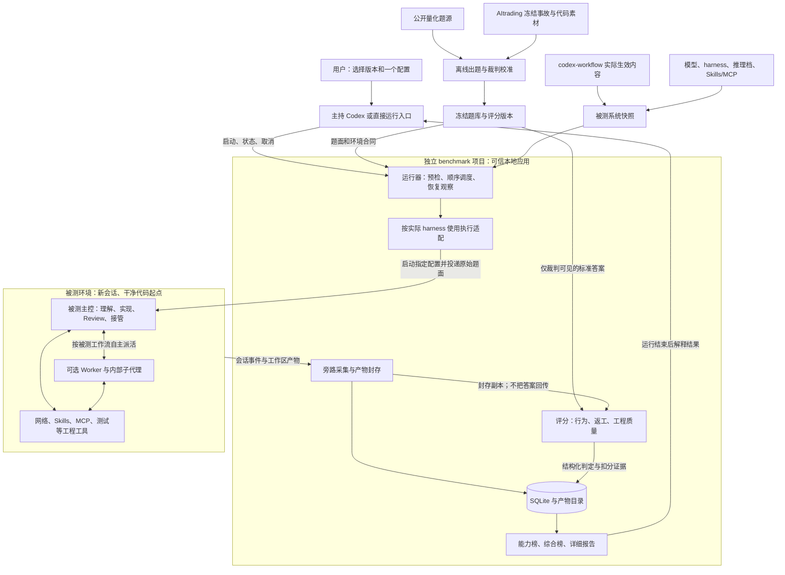
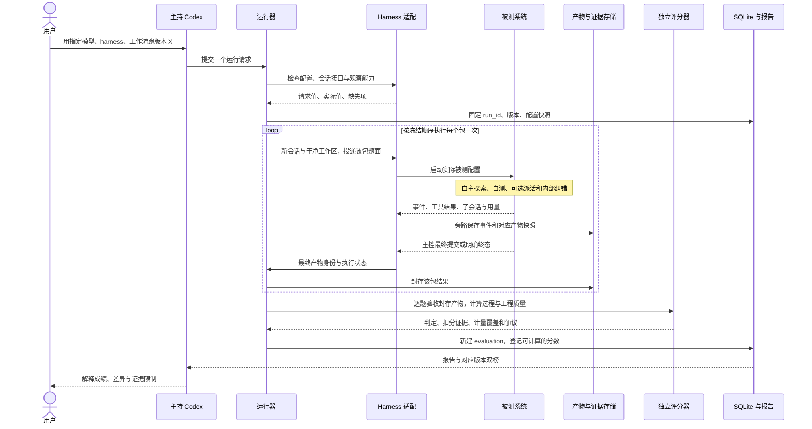
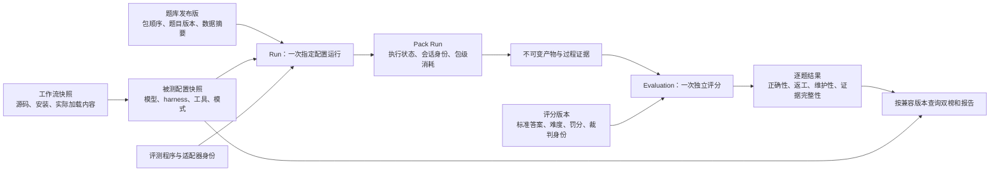

# 量化 Agent Benchmark 架构 v0.1

日期：2026-09-11。基于 [方案 v0.5](quant-agent-routing-benchmark-design-v0.5.md)与[方法研究](benchmark-methodology-research-2026-09-11.md)。这是可供讨论和实现分解的逻辑架构，不代表组件已存在、隔离已验证或四个 harness 已接通。

## 1. 复核结论

需求已足够画首版架构。保留独立项目、精简题包、指定配置单次顺序运行、开放工程工具、工作流作为被测维度、题目级最终错误零分、分级返工、难度奖励、工程质量与双榜。无需先决定全部题目和分值，也无需再增加业务模块。

本次补齐四处具体边界，并同步修正方案：

| 问题 | 处理 |
| --- | --- |
| “同样行为应同分”与维护性差异矛盾 | 功能正确性判定相同；工程质量、返工和总分可以不同 |
| 执行完成容易被写成通过或可排名 | 运行状态、逐题判定、证据完整性、各榜资格分别记录 |
| 主持或工具断线可能触发重复执行 | 恢复观察原 run/session，不自动创建第二次试验；未知状态不当终态 |
| 同包共享会话的消耗无法准确逐题分摊 | 保留包级资源，用冻结汇总规则计分；题目独立判对错 |

具体权重、难度分值和罚分上限属于评分版本；harness 的启动/采集与隔离能力属于后续技术验证。这些尚未确定，但不阻塞组件边界和数据流设计。

## 2. 项目与执行架构

图中框表示职责边界，不表示每个框都要部署成一个服务。首版是一个本地应用，外加受隔离的参赛进程和评分执行进程。

核心边界：主持只管理试验；被测主控按其工作流完成真实工作；外部裁判决定成绩。三个角色可以使用同一家模型，但不能共用带答案的会话和文件权限。

出题阶段将公开来源和事故提炼成冻结包，运行时不挂载整个 AItrading 或工作流开发仓库。加载的是必要题面、代码起点和实际工作流规则，避免将未来修复和其他试验结果带入。

## 3. 一次运行的时序

用户取消、明确候选错误或设施故障由同一运行记录表达，不另建一套复杂异常系统。主持失联时运行器保留原会话身份；恢复后接着观察，不能仅因一个等待窗口结束就重复启动。

不会把独立评分的错误反馈给仍在考试的 Agent。单代理自纠或内部主控纠正 Worker 都发生在最终提交之前，属于被测工作流；运行结束后因隐藏评分而修复是另一次用户发起的运行。

## 4. 核心数据关系

以下是逻辑关系。实现时可将版本元数据和配置保存为 SQLite 的结构化记录/JSON，不要求每个逻辑节点独立建表。

同一份封存产物可以产生多次独立评分记录，例如改权重后的离线重算，保留原分。重新跑新工作流则必须新建 Run，不能通过重算旧产物模拟工作流升级。

每次报告都能回查：哪个题库、哪个裁判、哪个模型和 harness、加载哪个工作流、哪些 Worker 实际参与、原始产物在哪里。工作流版本变化允许在同一题库榜比较；题库或评分规则变化则分版本展示。

## 5. 关键合同

### 5.1 包、题与提交

首版按包启动会话、按题判断正确性。一个包内可以有几道共享上下文的题，但每题必须有独立必要验收。题内检查点不是另一次试验。

包的最终主控提交作为该包所有题的最终产物边界；不把 Worker 的“完成”当最终交付，也不让评分器自行挑选早先更好的补丁。共享代码按最后封存状态分别验各题。

如果未来某题需要单独会话或阶段提交，在题包版本中明确定义；不由主持临场更改。

### 5.2 不把四种状态混成一个通过标记

| 维度 | 说明 |
| --- | --- |
| 执行 | 已提交、候选明确失败、取消、设施故障或仍在运行 |
| 正确性 | 每题必要验收通过/失败；裁判故障则尚无有效判定 |
| 证据 | 用量、身份、返工、维护性各自完整/部分/未知 |
| 排名资格 | 依据各榜必需字段确定可排名、暂定或仅展示分项 |

最终错误题零分，仍是有效的失败成绩；不能因为题目没做对就从排行榜样本中删掉。相反，裁判坏了不等于模型零分。返工采不到不等于从未返工。

完整能力榜需要可信的返工与质量判定，综合榜还需要用量和时间。缺项时保留所有可确定结果，不补零、不临时改变公式。具体裁判不确定情况须在发布规则中定义处理方式。

### 5.3 观察完整性是适配验收项

适配验收要证明能区分主控/Worker 结束、关联子会话、抓取最终工作区、记录真实用量来源。对不支持过程快照的 harness，先披露观察限制，不声称完整支持分级返工评分。

旁路采集尽量使用已有事件和原始日志；不新增一个模型去不停问“你做完了吗”。编译次数、编辑次数和失败测试行数不直接作为返工。只有与可评价产物关联的已证实错误才进入分级判定。

### 5.4 可信评分与执行候选代码分开

封存产物仍是不可信输入。候选代码需要执行时，在受限测试进程/环境中执行；标准预期、评分数据库与最终计分由外部可信部分控制。不能将候选和整个答案库作为同权限程序一起运行。

维护性 Reviewer 只读封存代码，输入明确标为被评材料，不按代码注释中的指令修改规则或分数。输出按固定 rubric 校验，保留证据；对评分争议可以标暂定，不假装完全确定。

允许互联网和正常 Skills/MCP；环境隔离仅保护答案、其他试验解法、成绩与用户无关私密状态。具体操作系统隔离方式需实测，图中的隔离框不是已取得的安全证明。

### 5.5 稳定留存与恢复

产物先写完并记录内容摘要，再登记相应记录；同一个提交事件去重。断线不自动重跑，新 Run 必须对应真实新试验。评分、报告生成失败可用已封存产物恢复，不重新消耗模型解题。

正式配置漂移、人工提示干预和评分规则变更留在记录中，不覆盖历史。数据库和引用的产物一起备份。

## 6. 最小实现边界与待验证项

首版只有四个代码职责：运行与适配、题库与评分、证据存储、报告查询。它们可以处于同一个程序和仓库，不先拆微服务、消息队列、插件商城或自动模型组合搜索。

Harbor、已有 Agent 适配和轨迹格式是复用候选。先用一个实际环境验证其能否保留工作流、Skills/MCP 和认证语义；能保留就复用，不能保留则只补必要适配，不同时维护两套完整运行系统。

进入可用实现前仍需完成：

- 冻结首版题面、标准行为及校准实现，保证错解被拒、合法替代解通过。
- 校准难度奖励、错误罚分、工程质量及效率权重，验证相对排序。
- 验证一个实际 harness 的身份、提交、用量、返工证据和读写隔离。

这些是下一阶段工程工作。当前架构已经可据此分解实现，不需要用户再决定数据库细表或底层调度方式；也不代表正式 benchmark 已具备出分条件。
